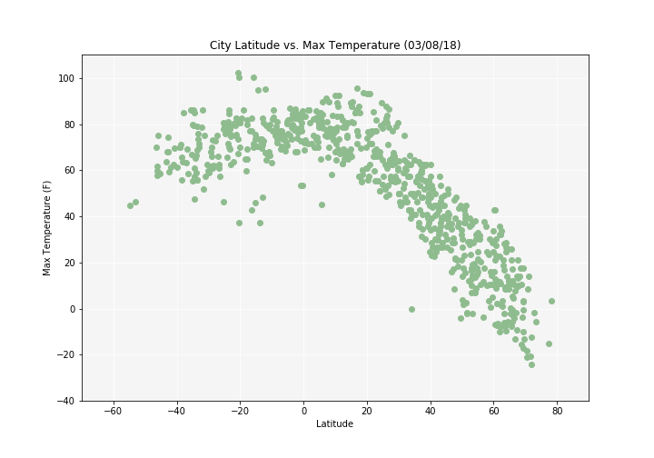
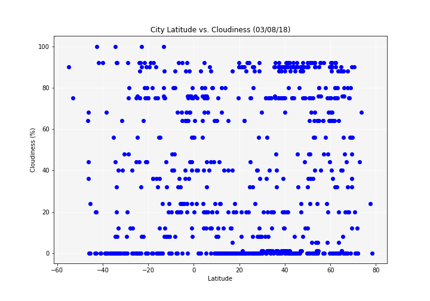

```python
# Dependencies
import random
import json
from pprint import pprint
import requests
from citipy import citipy
from config import api_key
import pandas as pd
import matplotlib.pyplot as plt
```

# Generate Cities List


```python
# Create coordinates list to populate with random coordinates
coordinates = []
coordinate_count = input("How many coordinates do you want to use? ")
# Generate random coordinates and append to coordinates list
for x in range(int(coordinate_count)):
    coordinates.append((random.randint(-90, 91), random.randint(-180, 181)))

# print(coordinates)
```

    How many coordinates do you want to use? 100
    


```python
cities = []
for coordinate_pair in coordinates:
    lat, lon = coordinate_pair
    city_obj = citipy.nearest_city(lat, lon)
    city = city_obj.city_name
    
    # Want unique cities
    if city not in cities:
        cities.append(city)

# print(cities)
print(f"Unique cities found based on lat/lon out of {coordinate_count} coordinate pairs: {len(cities)}")
```

    Unique cities found based on lat/lon out of 100 coordinate pairs: 76
    

# Perform API Calls


```python
# Save config information
url = "http://api.openweathermap.org/data/2.5/weather?"
units = "imperial"

# Build partial query URL
query_url = f"{url}appid={api_key}&units={units}&q="
```


```python
# Set up lists to hold reponse information
name = []
cloudiness = []
country = []
date = []
humidity = []
lat = []
lon = []
max_temp = []
wind_speed = []

# Loop through the list of cities and perform a request for data on each
for i, city in enumerate(cities):
    print(f"Processing Record {i + 1} | {city}")
    
    # Replace spaces in cities names of more than one word
    city_name = city.replace(" ", "+")
    
    # Print each query
    full_query_url = query_url + city_name
    print(full_query_url)
    
    # Retrieve data as json
    response = requests.get(full_query_url).json()
    
    # Append data to lists
    try:
        name.append(response['name'])
        cloudiness.append(response['clouds']['all'])
        country.append(response['sys']['country'])
        date.append(response['dt'])
        humidity.append(response['main']['humidity'])
        lat.append(response['coord']['lat'])
        lon.append(response['coord']['lon'])
        max_temp.append(response['main']['temp_max'])
        wind_speed.append(response['wind']['speed'])
    except KeyError:
        print(f"*City Not Found ({city})")
    except:
        raise
        
# print(name)
print(f"Number of cities successfully queried out of {len(cities)}: {len(name)}")
```

    Processing Record 1 | kapaa
    http://api.openweathermap.org/data/2.5/weather?appid=b9d7939379e121fce5e79c1c83d5fb95&units=imperial&q=kapaa
    Processing Record 2 | qaanaaq
    http://api.openweathermap.org/data/2.5/weather?appid=b9d7939379e121fce5e79c1c83d5fb95&units=imperial&q=qaanaaq
    Processing Record 3 | lavrentiya
    http://api.openweathermap.org/data/2.5/weather?appid=b9d7939379e121fce5e79c1c83d5fb95&units=imperial&q=lavrentiya
    Processing Record 4 | faanui
    http://api.openweathermap.org/data/2.5/weather?appid=b9d7939379e121fce5e79c1c83d5fb95&units=imperial&q=faanui
    Processing Record 5 | longview
    http://api.openweathermap.org/data/2.5/weather?appid=b9d7939379e121fce5e79c1c83d5fb95&units=imperial&q=longview
    Processing Record 6 | houma
    http://api.openweathermap.org/data/2.5/weather?appid=b9d7939379e121fce5e79c1c83d5fb95&units=imperial&q=houma
    Processing Record 7 | souillac
    http://api.openweathermap.org/data/2.5/weather?appid=b9d7939379e121fce5e79c1c83d5fb95&units=imperial&q=souillac
    Processing Record 8 | guerrero negro
    http://api.openweathermap.org/data/2.5/weather?appid=b9d7939379e121fce5e79c1c83d5fb95&units=imperial&q=guerrero+negro
    Processing Record 9 | warqla
    http://api.openweathermap.org/data/2.5/weather?appid=b9d7939379e121fce5e79c1c83d5fb95&units=imperial&q=warqla
    *City Not Found (warqla)
    Processing Record 10 | butaritari
    http://api.openweathermap.org/data/2.5/weather?appid=b9d7939379e121fce5e79c1c83d5fb95&units=imperial&q=butaritari
    Processing Record 11 | volokolamsk
    http://api.openweathermap.org/data/2.5/weather?appid=b9d7939379e121fce5e79c1c83d5fb95&units=imperial&q=volokolamsk
    Processing Record 12 | ilulissat
    http://api.openweathermap.org/data/2.5/weather?appid=b9d7939379e121fce5e79c1c83d5fb95&units=imperial&q=ilulissat
    Processing Record 13 | prince rupert
    http://api.openweathermap.org/data/2.5/weather?appid=b9d7939379e121fce5e79c1c83d5fb95&units=imperial&q=prince+rupert
    Processing Record 14 | east london
    http://api.openweathermap.org/data/2.5/weather?appid=b9d7939379e121fce5e79c1c83d5fb95&units=imperial&q=east+london
    Processing Record 15 | nikolskoye
    http://api.openweathermap.org/data/2.5/weather?appid=b9d7939379e121fce5e79c1c83d5fb95&units=imperial&q=nikolskoye
    Processing Record 16 | port alfred
    http://api.openweathermap.org/data/2.5/weather?appid=b9d7939379e121fce5e79c1c83d5fb95&units=imperial&q=port+alfred
    Processing Record 17 | rikitea
    http://api.openweathermap.org/data/2.5/weather?appid=b9d7939379e121fce5e79c1c83d5fb95&units=imperial&q=rikitea
    Processing Record 18 | bluff
    http://api.openweathermap.org/data/2.5/weather?appid=b9d7939379e121fce5e79c1c83d5fb95&units=imperial&q=bluff
    Processing Record 19 | forbes
    http://api.openweathermap.org/data/2.5/weather?appid=b9d7939379e121fce5e79c1c83d5fb95&units=imperial&q=forbes
    Processing Record 20 | punta arenas
    http://api.openweathermap.org/data/2.5/weather?appid=b9d7939379e121fce5e79c1c83d5fb95&units=imperial&q=punta+arenas
    Processing Record 21 | nemuro
    http://api.openweathermap.org/data/2.5/weather?appid=b9d7939379e121fce5e79c1c83d5fb95&units=imperial&q=nemuro
    Processing Record 22 | dwarka
    http://api.openweathermap.org/data/2.5/weather?appid=b9d7939379e121fce5e79c1c83d5fb95&units=imperial&q=dwarka
    Processing Record 23 | taolanaro
    http://api.openweathermap.org/data/2.5/weather?appid=b9d7939379e121fce5e79c1c83d5fb95&units=imperial&q=taolanaro
    *City Not Found (taolanaro)
    Processing Record 24 | hermanus
    http://api.openweathermap.org/data/2.5/weather?appid=b9d7939379e121fce5e79c1c83d5fb95&units=imperial&q=hermanus
    Processing Record 25 | svetlogorsk
    http://api.openweathermap.org/data/2.5/weather?appid=b9d7939379e121fce5e79c1c83d5fb95&units=imperial&q=svetlogorsk
    Processing Record 26 | lasa
    http://api.openweathermap.org/data/2.5/weather?appid=b9d7939379e121fce5e79c1c83d5fb95&units=imperial&q=lasa
    Processing Record 27 | georgetown
    http://api.openweathermap.org/data/2.5/weather?appid=b9d7939379e121fce5e79c1c83d5fb95&units=imperial&q=georgetown
    Processing Record 28 | tingi
    http://api.openweathermap.org/data/2.5/weather?appid=b9d7939379e121fce5e79c1c83d5fb95&units=imperial&q=tingi
    Processing Record 29 | arraial do cabo
    http://api.openweathermap.org/data/2.5/weather?appid=b9d7939379e121fce5e79c1c83d5fb95&units=imperial&q=arraial+do+cabo
    Processing Record 30 | rawson
    http://api.openweathermap.org/data/2.5/weather?appid=b9d7939379e121fce5e79c1c83d5fb95&units=imperial&q=rawson
    Processing Record 31 | mananjary
    http://api.openweathermap.org/data/2.5/weather?appid=b9d7939379e121fce5e79c1c83d5fb95&units=imperial&q=mananjary
    Processing Record 32 | mataura
    http://api.openweathermap.org/data/2.5/weather?appid=b9d7939379e121fce5e79c1c83d5fb95&units=imperial&q=mataura
    Processing Record 33 | bambous virieux
    http://api.openweathermap.org/data/2.5/weather?appid=b9d7939379e121fce5e79c1c83d5fb95&units=imperial&q=bambous+virieux
    Processing Record 34 | illoqqortoormiut
    http://api.openweathermap.org/data/2.5/weather?appid=b9d7939379e121fce5e79c1c83d5fb95&units=imperial&q=illoqqortoormiut
    *City Not Found (illoqqortoormiut)
    Processing Record 35 | kazalinsk
    http://api.openweathermap.org/data/2.5/weather?appid=b9d7939379e121fce5e79c1c83d5fb95&units=imperial&q=kazalinsk
    *City Not Found (kazalinsk)
    Processing Record 36 | klaksvik
    http://api.openweathermap.org/data/2.5/weather?appid=b9d7939379e121fce5e79c1c83d5fb95&units=imperial&q=klaksvik
    Processing Record 37 | ugoofaaru
    http://api.openweathermap.org/data/2.5/weather?appid=b9d7939379e121fce5e79c1c83d5fb95&units=imperial&q=ugoofaaru
    Processing Record 38 | sept-iles
    http://api.openweathermap.org/data/2.5/weather?appid=b9d7939379e121fce5e79c1c83d5fb95&units=imperial&q=sept-iles
    Processing Record 39 | belushya guba
    http://api.openweathermap.org/data/2.5/weather?appid=b9d7939379e121fce5e79c1c83d5fb95&units=imperial&q=belushya+guba
    *City Not Found (belushya guba)
    Processing Record 40 | atuona
    http://api.openweathermap.org/data/2.5/weather?appid=b9d7939379e121fce5e79c1c83d5fb95&units=imperial&q=atuona
    Processing Record 41 | aguimes
    http://api.openweathermap.org/data/2.5/weather?appid=b9d7939379e121fce5e79c1c83d5fb95&units=imperial&q=aguimes
    Processing Record 42 | kodiak
    http://api.openweathermap.org/data/2.5/weather?appid=b9d7939379e121fce5e79c1c83d5fb95&units=imperial&q=kodiak
    Processing Record 43 | iisalmi
    http://api.openweathermap.org/data/2.5/weather?appid=b9d7939379e121fce5e79c1c83d5fb95&units=imperial&q=iisalmi
    Processing Record 44 | plouzane
    http://api.openweathermap.org/data/2.5/weather?appid=b9d7939379e121fce5e79c1c83d5fb95&units=imperial&q=plouzane
    Processing Record 45 | palivere
    http://api.openweathermap.org/data/2.5/weather?appid=b9d7939379e121fce5e79c1c83d5fb95&units=imperial&q=palivere
    Processing Record 46 | sechura
    http://api.openweathermap.org/data/2.5/weather?appid=b9d7939379e121fce5e79c1c83d5fb95&units=imperial&q=sechura
    Processing Record 47 | jamestown
    http://api.openweathermap.org/data/2.5/weather?appid=b9d7939379e121fce5e79c1c83d5fb95&units=imperial&q=jamestown
    Processing Record 48 | yellowknife
    http://api.openweathermap.org/data/2.5/weather?appid=b9d7939379e121fce5e79c1c83d5fb95&units=imperial&q=yellowknife
    Processing Record 49 | axim
    http://api.openweathermap.org/data/2.5/weather?appid=b9d7939379e121fce5e79c1c83d5fb95&units=imperial&q=axim
    Processing Record 50 | caravelas
    http://api.openweathermap.org/data/2.5/weather?appid=b9d7939379e121fce5e79c1c83d5fb95&units=imperial&q=caravelas
    Processing Record 51 | narsaq
    http://api.openweathermap.org/data/2.5/weather?appid=b9d7939379e121fce5e79c1c83d5fb95&units=imperial&q=narsaq
    Processing Record 52 | vaitupu
    http://api.openweathermap.org/data/2.5/weather?appid=b9d7939379e121fce5e79c1c83d5fb95&units=imperial&q=vaitupu
    *City Not Found (vaitupu)
    Processing Record 53 | regen
    http://api.openweathermap.org/data/2.5/weather?appid=b9d7939379e121fce5e79c1c83d5fb95&units=imperial&q=regen
    Processing Record 54 | hobart
    http://api.openweathermap.org/data/2.5/weather?appid=b9d7939379e121fce5e79c1c83d5fb95&units=imperial&q=hobart
    Processing Record 55 | pacific grove
    http://api.openweathermap.org/data/2.5/weather?appid=b9d7939379e121fce5e79c1c83d5fb95&units=imperial&q=pacific+grove
    Processing Record 56 | gimbi
    http://api.openweathermap.org/data/2.5/weather?appid=b9d7939379e121fce5e79c1c83d5fb95&units=imperial&q=gimbi
    Processing Record 57 | longyearbyen
    http://api.openweathermap.org/data/2.5/weather?appid=b9d7939379e121fce5e79c1c83d5fb95&units=imperial&q=longyearbyen
    Processing Record 58 | fairbanks
    http://api.openweathermap.org/data/2.5/weather?appid=b9d7939379e121fce5e79c1c83d5fb95&units=imperial&q=fairbanks
    Processing Record 59 | toliary
    http://api.openweathermap.org/data/2.5/weather?appid=b9d7939379e121fce5e79c1c83d5fb95&units=imperial&q=toliary
    *City Not Found (toliary)
    Processing Record 60 | barbar
    http://api.openweathermap.org/data/2.5/weather?appid=b9d7939379e121fce5e79c1c83d5fb95&units=imperial&q=barbar
    *City Not Found (barbar)
    Processing Record 61 | mandalgovi
    http://api.openweathermap.org/data/2.5/weather?appid=b9d7939379e121fce5e79c1c83d5fb95&units=imperial&q=mandalgovi
    Processing Record 62 | matam
    http://api.openweathermap.org/data/2.5/weather?appid=b9d7939379e121fce5e79c1c83d5fb95&units=imperial&q=matam
    Processing Record 63 | ushuaia
    http://api.openweathermap.org/data/2.5/weather?appid=b9d7939379e121fce5e79c1c83d5fb95&units=imperial&q=ushuaia
    Processing Record 64 | tanout
    http://api.openweathermap.org/data/2.5/weather?appid=b9d7939379e121fce5e79c1c83d5fb95&units=imperial&q=tanout
    Processing Record 65 | cabo san lucas
    http://api.openweathermap.org/data/2.5/weather?appid=b9d7939379e121fce5e79c1c83d5fb95&units=imperial&q=cabo+san+lucas
    Processing Record 66 | busselton
    http://api.openweathermap.org/data/2.5/weather?appid=b9d7939379e121fce5e79c1c83d5fb95&units=imperial&q=busselton
    Processing Record 67 | pangody
    http://api.openweathermap.org/data/2.5/weather?appid=b9d7939379e121fce5e79c1c83d5fb95&units=imperial&q=pangody
    Processing Record 68 | tautira
    http://api.openweathermap.org/data/2.5/weather?appid=b9d7939379e121fce5e79c1c83d5fb95&units=imperial&q=tautira
    Processing Record 69 | alice town
    http://api.openweathermap.org/data/2.5/weather?appid=b9d7939379e121fce5e79c1c83d5fb95&units=imperial&q=alice+town
    Processing Record 70 | cape town
    http://api.openweathermap.org/data/2.5/weather?appid=b9d7939379e121fce5e79c1c83d5fb95&units=imperial&q=cape+town
    Processing Record 71 | takoradi
    http://api.openweathermap.org/data/2.5/weather?appid=b9d7939379e121fce5e79c1c83d5fb95&units=imperial&q=takoradi
    Processing Record 72 | ilhabela
    http://api.openweathermap.org/data/2.5/weather?appid=b9d7939379e121fce5e79c1c83d5fb95&units=imperial&q=ilhabela
    Processing Record 73 | nhulunbuy
    http://api.openweathermap.org/data/2.5/weather?appid=b9d7939379e121fce5e79c1c83d5fb95&units=imperial&q=nhulunbuy
    Processing Record 74 | livramento
    http://api.openweathermap.org/data/2.5/weather?appid=b9d7939379e121fce5e79c1c83d5fb95&units=imperial&q=livramento
    Processing Record 75 | ribeira grande
    http://api.openweathermap.org/data/2.5/weather?appid=b9d7939379e121fce5e79c1c83d5fb95&units=imperial&q=ribeira+grande
    Processing Record 76 | poltavka
    http://api.openweathermap.org/data/2.5/weather?appid=b9d7939379e121fce5e79c1c83d5fb95&units=imperial&q=poltavka
    Number of cities successfully queried out of 76: 68
    


```python
cities_data_df = pd.DataFrame({'City': name, 
                               'Cloudiness': cloudiness, 
                               'Country': country, 
                               'Date': date, 
                               'Humidity': humidity, 
                               'Lat': lat, 
                               'Lon': lon, 
                               'Max Temp': max_temp, 
                               'Wind Speed': wind_speed})

cities_data_df
```


<div>
<style>
    .dataframe thead tr:only-child th {
        text-align: right;
    }

    .dataframe thead th {
        text-align: left;
    }

    .dataframe tbody tr th {
        vertical-align: top;
    }
</style>
<table border="1" class="dataframe">
  <thead>
    <tr style="text-align: right;">
      <th></th>
      <th>City</th>
      <th>Cloudiness</th>
      <th>Country</th>
      <th>Date</th>
      <th>Humidity</th>
      <th>Lat</th>
      <th>Lon</th>
      <th>Max Temp</th>
      <th>Wind Speed</th>
    </tr>
  </thead>
  <tbody>
    <tr>
      <th>0</th>
      <td>Kapaa</td>
      <td>40</td>
      <td>US</td>
      <td>1520283360</td>
      <td>69</td>
      <td>22.08</td>
      <td>-159.32</td>
      <td>77.00</td>
      <td>16.11</td>
    </tr>
    <tr>
      <th>1</th>
      <td>Qaanaaq</td>
      <td>68</td>
      <td>GL</td>
      <td>1520285956</td>
      <td>86</td>
      <td>77.48</td>
      <td>-69.36</td>
      <td>2.42</td>
      <td>8.19</td>
    </tr>
    <tr>
      <th>2</th>
      <td>Lavrentiya</td>
      <td>56</td>
      <td>RU</td>
      <td>1520286174</td>
      <td>100</td>
      <td>65.58</td>
      <td>-170.99</td>
      <td>22.09</td>
      <td>7.85</td>
    </tr>
    <tr>
      <th>3</th>
      <td>Faanui</td>
      <td>88</td>
      <td>PF</td>
      <td>1520286175</td>
      <td>100</td>
      <td>-16.48</td>
      <td>-151.75</td>
      <td>80.77</td>
      <td>12.88</td>
    </tr>
    <tr>
      <th>4</th>
      <td>Longview</td>
      <td>1</td>
      <td>US</td>
      <td>1520285700</td>
      <td>35</td>
      <td>32.50</td>
      <td>-94.74</td>
      <td>73.40</td>
      <td>8.05</td>
    </tr>
    <tr>
      <th>5</th>
      <td>Houma</td>
      <td>92</td>
      <td>CN</td>
      <td>1520286176</td>
      <td>76</td>
      <td>35.63</td>
      <td>111.36</td>
      <td>33.79</td>
      <td>2.71</td>
    </tr>
    <tr>
      <th>6</th>
      <td>Souillac</td>
      <td>0</td>
      <td>FR</td>
      <td>1520283600</td>
      <td>87</td>
      <td>45.60</td>
      <td>-0.60</td>
      <td>48.20</td>
      <td>4.70</td>
    </tr>
    <tr>
      <th>7</th>
      <td>Guerrero Negro</td>
      <td>0</td>
      <td>MX</td>
      <td>1520286177</td>
      <td>44</td>
      <td>27.97</td>
      <td>-114.04</td>
      <td>73.39</td>
      <td>3.49</td>
    </tr>
    <tr>
      <th>8</th>
      <td>Butaritari</td>
      <td>44</td>
      <td>KI</td>
      <td>1520285987</td>
      <td>100</td>
      <td>3.07</td>
      <td>172.79</td>
      <td>82.61</td>
      <td>14.56</td>
    </tr>
    <tr>
      <th>9</th>
      <td>Volokolamsk</td>
      <td>12</td>
      <td>RU</td>
      <td>1520286178</td>
      <td>87</td>
      <td>56.03</td>
      <td>35.95</td>
      <td>8.27</td>
      <td>6.85</td>
    </tr>
    <tr>
      <th>10</th>
      <td>Ilulissat</td>
      <td>75</td>
      <td>GL</td>
      <td>1520283000</td>
      <td>72</td>
      <td>69.22</td>
      <td>-51.10</td>
      <td>10.40</td>
      <td>3.36</td>
    </tr>
    <tr>
      <th>11</th>
      <td>Prince Rupert</td>
      <td>90</td>
      <td>CA</td>
      <td>1520283600</td>
      <td>51</td>
      <td>54.32</td>
      <td>-130.32</td>
      <td>37.40</td>
      <td>4.70</td>
    </tr>
    <tr>
      <th>12</th>
      <td>East London</td>
      <td>88</td>
      <td>ZA</td>
      <td>1520285959</td>
      <td>100</td>
      <td>-33.02</td>
      <td>27.91</td>
      <td>73.07</td>
      <td>3.49</td>
    </tr>
    <tr>
      <th>13</th>
      <td>Nikolskoye</td>
      <td>0</td>
      <td>RU</td>
      <td>1520283600</td>
      <td>77</td>
      <td>59.70</td>
      <td>30.79</td>
      <td>6.80</td>
      <td>6.71</td>
    </tr>
    <tr>
      <th>14</th>
      <td>Port Alfred</td>
      <td>20</td>
      <td>ZA</td>
      <td>1520285957</td>
      <td>95</td>
      <td>-33.59</td>
      <td>26.89</td>
      <td>66.82</td>
      <td>2.15</td>
    </tr>
    <tr>
      <th>15</th>
      <td>Rikitea</td>
      <td>56</td>
      <td>PF</td>
      <td>1520285986</td>
      <td>99</td>
      <td>-23.12</td>
      <td>-134.97</td>
      <td>80.95</td>
      <td>13.78</td>
    </tr>
    <tr>
      <th>16</th>
      <td>Bluff</td>
      <td>68</td>
      <td>AU</td>
      <td>1520285951</td>
      <td>78</td>
      <td>-23.58</td>
      <td>149.07</td>
      <td>76.76</td>
      <td>8.41</td>
    </tr>
    <tr>
      <th>17</th>
      <td>Forbes</td>
      <td>32</td>
      <td>AU</td>
      <td>1520286180</td>
      <td>72</td>
      <td>-33.38</td>
      <td>148.01</td>
      <td>62.09</td>
      <td>16.13</td>
    </tr>
    <tr>
      <th>18</th>
      <td>Punta Arenas</td>
      <td>0</td>
      <td>CL</td>
      <td>1520283600</td>
      <td>48</td>
      <td>-53.16</td>
      <td>-70.91</td>
      <td>62.60</td>
      <td>35.57</td>
    </tr>
    <tr>
      <th>19</th>
      <td>Nemuro</td>
      <td>76</td>
      <td>JP</td>
      <td>1520286181</td>
      <td>100</td>
      <td>43.32</td>
      <td>145.57</td>
      <td>27.76</td>
      <td>20.15</td>
    </tr>
    <tr>
      <th>20</th>
      <td>Dwarka</td>
      <td>0</td>
      <td>IN</td>
      <td>1520283600</td>
      <td>72</td>
      <td>28.58</td>
      <td>77.04</td>
      <td>64.40</td>
      <td>4.70</td>
    </tr>
    <tr>
      <th>21</th>
      <td>Hermanus</td>
      <td>68</td>
      <td>ZA</td>
      <td>1520285947</td>
      <td>83</td>
      <td>-34.42</td>
      <td>19.24</td>
      <td>64.97</td>
      <td>6.06</td>
    </tr>
    <tr>
      <th>22</th>
      <td>Svetlogorsk</td>
      <td>90</td>
      <td>RU</td>
      <td>1520283600</td>
      <td>92</td>
      <td>53.14</td>
      <td>59.15</td>
      <td>17.60</td>
      <td>2.24</td>
    </tr>
    <tr>
      <th>23</th>
      <td>Lasa</td>
      <td>64</td>
      <td>CY</td>
      <td>1520283600</td>
      <td>82</td>
      <td>34.92</td>
      <td>32.53</td>
      <td>64.40</td>
      <td>6.93</td>
    </tr>
    <tr>
      <th>24</th>
      <td>Georgetown</td>
      <td>40</td>
      <td>GY</td>
      <td>1520283600</td>
      <td>70</td>
      <td>6.80</td>
      <td>-58.16</td>
      <td>86.00</td>
      <td>16.11</td>
    </tr>
    <tr>
      <th>25</th>
      <td>Tingi</td>
      <td>36</td>
      <td>TZ</td>
      <td>1520286184</td>
      <td>100</td>
      <td>-11.30</td>
      <td>35.03</td>
      <td>78.25</td>
      <td>8.30</td>
    </tr>
    <tr>
      <th>26</th>
      <td>Arraial do Cabo</td>
      <td>75</td>
      <td>BR</td>
      <td>1520283600</td>
      <td>89</td>
      <td>-22.97</td>
      <td>-42.02</td>
      <td>84.20</td>
      <td>9.17</td>
    </tr>
    <tr>
      <th>27</th>
      <td>Rawson</td>
      <td>0</td>
      <td>AR</td>
      <td>1520286184</td>
      <td>27</td>
      <td>-43.30</td>
      <td>-65.11</td>
      <td>73.84</td>
      <td>9.64</td>
    </tr>
    <tr>
      <th>28</th>
      <td>Mananjary</td>
      <td>92</td>
      <td>MG</td>
      <td>1520286185</td>
      <td>98</td>
      <td>-19.16</td>
      <td>46.80</td>
      <td>62.72</td>
      <td>0.69</td>
    </tr>
    <tr>
      <th>29</th>
      <td>Mataura</td>
      <td>92</td>
      <td>NZ</td>
      <td>1520285968</td>
      <td>100</td>
      <td>-46.19</td>
      <td>168.86</td>
      <td>52.24</td>
      <td>8.63</td>
    </tr>
    <tr>
      <th>...</th>
      <td>...</td>
      <td>...</td>
      <td>...</td>
      <td>...</td>
      <td>...</td>
      <td>...</td>
      <td>...</td>
      <td>...</td>
      <td>...</td>
    </tr>
    <tr>
      <th>38</th>
      <td>Plouzane</td>
      <td>40</td>
      <td>FR</td>
      <td>1520283600</td>
      <td>93</td>
      <td>48.38</td>
      <td>-4.62</td>
      <td>42.80</td>
      <td>6.93</td>
    </tr>
    <tr>
      <th>39</th>
      <td>Palivere</td>
      <td>80</td>
      <td>EE</td>
      <td>1520286190</td>
      <td>81</td>
      <td>58.97</td>
      <td>23.89</td>
      <td>12.10</td>
      <td>11.54</td>
    </tr>
    <tr>
      <th>40</th>
      <td>Sechura</td>
      <td>0</td>
      <td>PE</td>
      <td>1520286190</td>
      <td>63</td>
      <td>-5.56</td>
      <td>-80.82</td>
      <td>81.04</td>
      <td>13.22</td>
    </tr>
    <tr>
      <th>41</th>
      <td>Jamestown</td>
      <td>0</td>
      <td>AU</td>
      <td>1520285993</td>
      <td>79</td>
      <td>-33.21</td>
      <td>138.60</td>
      <td>51.74</td>
      <td>13.22</td>
    </tr>
    <tr>
      <th>42</th>
      <td>Yellowknife</td>
      <td>75</td>
      <td>CA</td>
      <td>1520283600</td>
      <td>67</td>
      <td>62.45</td>
      <td>-114.38</td>
      <td>17.60</td>
      <td>5.73</td>
    </tr>
    <tr>
      <th>43</th>
      <td>Axim</td>
      <td>0</td>
      <td>GH</td>
      <td>1520285993</td>
      <td>97</td>
      <td>4.87</td>
      <td>-2.24</td>
      <td>82.07</td>
      <td>10.31</td>
    </tr>
    <tr>
      <th>44</th>
      <td>Caravelas</td>
      <td>24</td>
      <td>BR</td>
      <td>1520286191</td>
      <td>100</td>
      <td>-17.73</td>
      <td>-39.27</td>
      <td>81.94</td>
      <td>21.94</td>
    </tr>
    <tr>
      <th>45</th>
      <td>Narsaq</td>
      <td>5</td>
      <td>GL</td>
      <td>1520283000</td>
      <td>73</td>
      <td>60.91</td>
      <td>-46.05</td>
      <td>23.00</td>
      <td>2.24</td>
    </tr>
    <tr>
      <th>46</th>
      <td>Regen</td>
      <td>44</td>
      <td>DE</td>
      <td>1520286192</td>
      <td>94</td>
      <td>48.97</td>
      <td>13.13</td>
      <td>25.78</td>
      <td>2.37</td>
    </tr>
    <tr>
      <th>47</th>
      <td>Hobart</td>
      <td>20</td>
      <td>AU</td>
      <td>1520283600</td>
      <td>81</td>
      <td>-42.88</td>
      <td>147.33</td>
      <td>50.00</td>
      <td>8.05</td>
    </tr>
    <tr>
      <th>48</th>
      <td>Pacific Grove</td>
      <td>1</td>
      <td>US</td>
      <td>1520283300</td>
      <td>27</td>
      <td>36.62</td>
      <td>-121.92</td>
      <td>64.40</td>
      <td>8.05</td>
    </tr>
    <tr>
      <th>49</th>
      <td>Gimbi</td>
      <td>80</td>
      <td>ET</td>
      <td>1520286193</td>
      <td>79</td>
      <td>8.81</td>
      <td>37.79</td>
      <td>53.72</td>
      <td>2.15</td>
    </tr>
    <tr>
      <th>50</th>
      <td>Longyearbyen</td>
      <td>20</td>
      <td>NO</td>
      <td>1520283000</td>
      <td>77</td>
      <td>78.22</td>
      <td>15.63</td>
      <td>6.80</td>
      <td>12.75</td>
    </tr>
    <tr>
      <th>51</th>
      <td>Fairbanks</td>
      <td>90</td>
      <td>US</td>
      <td>1520284020</td>
      <td>78</td>
      <td>64.84</td>
      <td>-147.72</td>
      <td>15.80</td>
      <td>2.93</td>
    </tr>
    <tr>
      <th>52</th>
      <td>Mandalgovi</td>
      <td>64</td>
      <td>MN</td>
      <td>1520286195</td>
      <td>64</td>
      <td>45.76</td>
      <td>106.27</td>
      <td>13.72</td>
      <td>7.07</td>
    </tr>
    <tr>
      <th>53</th>
      <td>Matam</td>
      <td>0</td>
      <td>SN</td>
      <td>1520283600</td>
      <td>31</td>
      <td>15.66</td>
      <td>-13.26</td>
      <td>89.60</td>
      <td>10.87</td>
    </tr>
    <tr>
      <th>54</th>
      <td>Ushuaia</td>
      <td>75</td>
      <td>AR</td>
      <td>1520280000</td>
      <td>76</td>
      <td>-54.81</td>
      <td>-68.31</td>
      <td>57.20</td>
      <td>14.99</td>
    </tr>
    <tr>
      <th>55</th>
      <td>Tanout</td>
      <td>0</td>
      <td>NE</td>
      <td>1520286196</td>
      <td>26</td>
      <td>14.97</td>
      <td>8.88</td>
      <td>68.71</td>
      <td>2.48</td>
    </tr>
    <tr>
      <th>56</th>
      <td>Cabo San Lucas</td>
      <td>20</td>
      <td>MX</td>
      <td>1520283000</td>
      <td>56</td>
      <td>22.89</td>
      <td>-109.91</td>
      <td>80.60</td>
      <td>12.75</td>
    </tr>
    <tr>
      <th>57</th>
      <td>Busselton</td>
      <td>32</td>
      <td>AU</td>
      <td>1520285965</td>
      <td>90</td>
      <td>-33.64</td>
      <td>115.35</td>
      <td>73.07</td>
      <td>12.77</td>
    </tr>
    <tr>
      <th>58</th>
      <td>Pangody</td>
      <td>64</td>
      <td>RU</td>
      <td>1520286197</td>
      <td>81</td>
      <td>65.85</td>
      <td>74.49</td>
      <td>8.14</td>
      <td>11.21</td>
    </tr>
    <tr>
      <th>59</th>
      <td>Tautira</td>
      <td>40</td>
      <td>PF</td>
      <td>1520283600</td>
      <td>62</td>
      <td>-17.73</td>
      <td>-149.15</td>
      <td>87.80</td>
      <td>4.70</td>
    </tr>
    <tr>
      <th>60</th>
      <td>Alice Town</td>
      <td>0</td>
      <td>BS</td>
      <td>1520286198</td>
      <td>100</td>
      <td>25.72</td>
      <td>-79.30</td>
      <td>70.87</td>
      <td>5.39</td>
    </tr>
    <tr>
      <th>61</th>
      <td>Cape Town</td>
      <td>0</td>
      <td>ZA</td>
      <td>1520280000</td>
      <td>82</td>
      <td>-33.93</td>
      <td>18.42</td>
      <td>68.00</td>
      <td>18.34</td>
    </tr>
    <tr>
      <th>62</th>
      <td>Takoradi</td>
      <td>0</td>
      <td>GH</td>
      <td>1520286198</td>
      <td>100</td>
      <td>4.89</td>
      <td>-1.75</td>
      <td>80.41</td>
      <td>8.63</td>
    </tr>
    <tr>
      <th>63</th>
      <td>Ilhabela</td>
      <td>8</td>
      <td>BR</td>
      <td>1520285946</td>
      <td>100</td>
      <td>-23.78</td>
      <td>-45.36</td>
      <td>79.87</td>
      <td>6.51</td>
    </tr>
    <tr>
      <th>64</th>
      <td>Nhulunbuy</td>
      <td>68</td>
      <td>AU</td>
      <td>1520283600</td>
      <td>94</td>
      <td>-12.18</td>
      <td>136.78</td>
      <td>77.00</td>
      <td>5.82</td>
    </tr>
    <tr>
      <th>65</th>
      <td>Livramento</td>
      <td>20</td>
      <td>BR</td>
      <td>1520283600</td>
      <td>74</td>
      <td>-3.03</td>
      <td>-60.18</td>
      <td>86.00</td>
      <td>5.82</td>
    </tr>
    <tr>
      <th>66</th>
      <td>Ribeira Grande</td>
      <td>75</td>
      <td>PT</td>
      <td>1520283600</td>
      <td>88</td>
      <td>38.52</td>
      <td>-28.70</td>
      <td>62.60</td>
      <td>4.70</td>
    </tr>
    <tr>
      <th>67</th>
      <td>Poltavka</td>
      <td>100</td>
      <td>RU</td>
      <td>1520286200</td>
      <td>88</td>
      <td>54.36</td>
      <td>71.76</td>
      <td>16.06</td>
      <td>11.32</td>
    </tr>
  </tbody>
</table>
<p>68 rows × 9 columns</p>
</div>


# Latitude vs. Temperature Plot


```python
# Set figure size
plt.figure(figsize=(8, 5))

# Create scatter plot
plt.scatter(cities_data_df['Lat'], cities_data_df['Max Temp'], marker='o', color='b')

# Label title and axes
plt.title('City Latitude vs. Max Temperature')
plt.xlabel('Latitude')
plt.ylabel('Max Temperature (F)')

# Latitude vs. Temperature Plot
plt.savefig('images/LatVsTemp.png')
plt.show()
```





# Latitude vs. Humidity Plot


```python
# Set figure size
plt.figure(figsize=(8, 5))

# Create scatter plot
plt.scatter(cities_data_df['Lat'], cities_data_df['Humidity'], marker='o', color='b')

# Label title and axes
plt.title('City Latitude vs. Humidity')
plt.xlabel('Latitude')
plt.ylabel('Humidity (%)')

# Latitude vs. Humidity Plot
plt.savefig('images/LatVsHumidity.png')
plt.show()
```


# Latitude vs. Cloudiness Plot


```python
# Set figure size
plt.figure(figsize=(8, 5))

# Create scatter plot
plt.scatter(cities_data_df['Lat'], cities_data_df['Cloudiness'], marker='o', color='b')

# Label title and axes
plt.title('City Latitude vs. Cloudiness')
plt.xlabel('Latitude')
plt.ylabel('Cloudiness (%)')

# Latitude vs. Cloudiness Plot
plt.savefig('images/LatVsCloudiness.png')
plt.show()
```





# Latitude vs. Wind Speed Plot


```python
# Set figure size
plt.figure(figsize=(8, 5))

# Create scatter plot
plt.scatter(cities_data_df['Lat'], cities_data_df['Wind Speed'], marker='o', color='b')

# Label title and axes
plt.title('City Latitude vs. Wind Speed')
plt.xlabel('Latitude')
plt.ylabel('Wind Speed (mph)')

# Latitude vs. Wind Speed Plot
plt.savefig('images/LatVsWindSpd.png')
plt.show()
```


