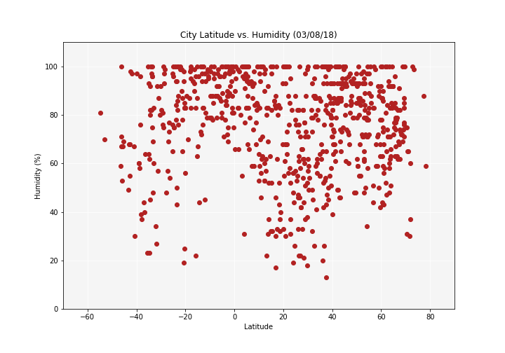

# Weatherpy Analysis

##### Observable Trends:
###### 1. As you go closer to the equator, it gets hotter. Highest temperatures range between -20 and +20 degrees lattitude. On the other hand, there is a dramatic decrease in max temperature as you reach higher latitudes.
###### 2. Cities close to the equator have high humidity, generally no less than 70% humidity. Most cities at -10 degrees latitude have humidity ranging from 80 to 100%.
###### 3. In general, cities near the equator have lower wind speeds than those not near the equator. Most aggregrate at wind speeds up to 10 mph.


```python
# Dependencies
import random
import json
from pprint import pprint
import requests
from citipy import citipy
from config import api_key
import pandas as pd
import matplotlib.pyplot as plt
```

# Generate Cities From Coordinates


```python
# Function to generate 1000 random coordinates
def randCoord():
    for x in range(1000):
        coordinates.append((random.randint(-90, 91), random.randint(-180, 181)))

# randCoord()
# print(coordinates)
```


```python
# Function to find unique cities based on generated coordinates
def findCity():
    for coordinate_pair in coordinates:
        lat, lon = coordinate_pair
        city_obj = citipy.nearest_city(lat, lon)
        city = city_obj.city_name
        
        # Want unique cities only
        if city not in cities:
            cities.append(city)

# findCity()
# print(cities)
# print(f"Unique cities found based on lat/lon out of {coordinate_count} coordinate pairs: {len(cities)}")
```

# Perform API Calls


```python
# Ask how many cities to analyze
how_many_cities = input("How many cities do you want to analyze? ")
```

    How many cities do you want to analyze? 750
    


```python
# Save config information
url = "http://api.openweathermap.org/data/2.5/weather?"
units = "imperial"

# Build partial query URL
query_url = f"{url}appid={api_key}&units={units}&q="
```


```python
# Hold generated coordinates and unique cities
coordinates = []
cities = []

# Set up lists to hold reponse information
name = []
cloudiness = []
country = []
date = []
humidity = []
lat = []
lon = []
max_temp = []
wind_speed = []

# Make counters
counter = 0
randCoord_count = 0

while len(name) < int(how_many_cities):
    
    # Generate coordinate pairs
    randCoord()
    
    # Count how many times randCoord ran
    randCoord_count += 1
    
    # Look up unique nearby cities
    findCity()
    
    # Loop through the list of cities and perform a request for data on each
    # *Need to start for loop at where it ended
    for city in cities[counter:]:
        
        # Increment counter
        counter += 1
        print(f"Processing Record {counter} | {city}")
        
        # Replace spaces in cities names of more than one word
        city_name = city.replace(" ", "+")
        
        # Print each query
        full_query_url = query_url + city_name
        print(full_query_url)
        
        # Retrieve data as json
        response = requests.get(full_query_url).json()
        
        # Append data to lists
        try:
            citi = response['name']
            if len(name) == int(how_many_cities):
                break            
            elif citi not in name:
                name.append(response['name'])
                cloudiness.append(response['clouds']['all'])
                country.append(response['sys']['country'])
                date.append(response['dt'])
                humidity.append(response['main']['humidity'])
                lat.append(response['coord']['lat'])
                lon.append(response['coord']['lon'])
                max_temp.append(response['main']['temp_max'])
                wind_speed.append(response['wind']['speed'])
        except KeyError:
            print(f"*City Not Found ({city})")
        except:
            pass
            # raise
```

    Processing Record 1 | shaoguan
    http://api.openweathermap.org/data/2.5/weather?appid=b9d7939379e121fce5e79c1c83d5fb95&units=imperial&q=shaoguan
    Processing Record 2 | bouna
    http://api.openweathermap.org/data/2.5/weather?appid=b9d7939379e121fce5e79c1c83d5fb95&units=imperial&q=bouna
    Processing Record 3 | waipawa
    http://api.openweathermap.org/data/2.5/weather?appid=b9d7939379e121fce5e79c1c83d5fb95&units=imperial&q=waipawa
    Processing Record 4 | esperance
    http://api.openweathermap.org/data/2.5/weather?appid=b9d7939379e121fce5e79c1c83d5fb95&units=imperial&q=esperance
    Processing Record 5 | mahebourg
    http://api.openweathermap.org/data/2.5/weather?appid=b9d7939379e121fce5e79c1c83d5fb95&units=imperial&q=mahebourg
    Processing Record 6 | port alfred
    http://api.openweathermap.org/data/2.5/weather?appid=b9d7939379e121fce5e79c1c83d5fb95&units=imperial&q=port+alfred
    Processing Record 7 | bluff
    http://api.openweathermap.org/data/2.5/weather?appid=b9d7939379e121fce5e79c1c83d5fb95&units=imperial&q=bluff
    Processing Record 8 | laguna
    http://api.openweathermap.org/data/2.5/weather?appid=b9d7939379e121fce5e79c1c83d5fb95&units=imperial&q=laguna
    Processing Record 9 | warrington
    http://api.openweathermap.org/data/2.5/weather?appid=b9d7939379e121fce5e79c1c83d5fb95&units=imperial&q=warrington
    Processing Record 10 | rikitea
    http://api.openweathermap.org/data/2.5/weather?appid=b9d7939379e121fce5e79c1c83d5fb95&units=imperial&q=rikitea
    Processing Record 11 | vila franca do campo
    http://api.openweathermap.org/data/2.5/weather?appid=b9d7939379e121fce5e79c1c83d5fb95&units=imperial&q=vila+franca+do+campo
    Processing Record 12 | dikson
    http://api.openweathermap.org/data/2.5/weather?appid=b9d7939379e121fce5e79c1c83d5fb95&units=imperial&q=dikson
    Processing Record 13 | mount gambier
    http://api.openweathermap.org/data/2.5/weather?appid=b9d7939379e121fce5e79c1c83d5fb95&units=imperial&q=mount+gambier
    Processing Record 14 | port elizabeth
    http://api.openweathermap.org/data/2.5/weather?appid=b9d7939379e121fce5e79c1c83d5fb95&units=imperial&q=port+elizabeth
    Processing Record 15 | hilo
    http://api.openweathermap.org/data/2.5/weather?appid=b9d7939379e121fce5e79c1c83d5fb95&units=imperial&q=hilo
    Processing Record 16 | itaituba
    http://api.openweathermap.org/data/2.5/weather?appid=b9d7939379e121fce5e79c1c83d5fb95&units=imperial&q=itaituba
    Processing Record 17 | khatanga
    http://api.openweathermap.org/data/2.5/weather?appid=b9d7939379e121fce5e79c1c83d5fb95&units=imperial&q=khatanga
    Processing Record 18 | nemuro
    http://api.openweathermap.org/data/2.5/weather?appid=b9d7939379e121fce5e79c1c83d5fb95&units=imperial&q=nemuro
    Processing Record 19 | ushuaia
    http://api.openweathermap.org/data/2.5/weather?appid=b9d7939379e121fce5e79c1c83d5fb95&units=imperial&q=ushuaia
    Processing Record 20 | victor harbor
    http://api.openweathermap.org/data/2.5/weather?appid=b9d7939379e121fce5e79c1c83d5fb95&units=imperial&q=victor+harbor
    Processing Record 21 | castries
    http://api.openweathermap.org/data/2.5/weather?appid=b9d7939379e121fce5e79c1c83d5fb95&units=imperial&q=castries
    Processing Record 22 | adrar
    http://api.openweathermap.org/data/2.5/weather?appid=b9d7939379e121fce5e79c1c83d5fb95&units=imperial&q=adrar
    Processing Record 23 | caravelas
    http://api.openweathermap.org/data/2.5/weather?appid=b9d7939379e121fce5e79c1c83d5fb95&units=imperial&q=caravelas
    Processing Record 24 | vaini
    http://api.openweathermap.org/data/2.5/weather?appid=b9d7939379e121fce5e79c1c83d5fb95&units=imperial&q=vaini
    Processing Record 25 | jamestown
    http://api.openweathermap.org/data/2.5/weather?appid=b9d7939379e121fce5e79c1c83d5fb95&units=imperial&q=jamestown
    Processing Record 26 | port blair
    http://api.openweathermap.org/data/2.5/weather?appid=b9d7939379e121fce5e79c1c83d5fb95&units=imperial&q=port+blair
    Processing Record 27 | kapaa
    http://api.openweathermap.org/data/2.5/weather?appid=b9d7939379e121fce5e79c1c83d5fb95&units=imperial&q=kapaa
    Processing Record 28 | atuona
    http://api.openweathermap.org/data/2.5/weather?appid=b9d7939379e121fce5e79c1c83d5fb95&units=imperial&q=atuona
    Processing Record 29 | vostok
    http://api.openweathermap.org/data/2.5/weather?appid=b9d7939379e121fce5e79c1c83d5fb95&units=imperial&q=vostok
    Processing Record 30 | nouadhibou
    http://api.openweathermap.org/data/2.5/weather?appid=b9d7939379e121fce5e79c1c83d5fb95&units=imperial&q=nouadhibou
    Processing Record 31 | bahia blanca
    http://api.openweathermap.org/data/2.5/weather?appid=b9d7939379e121fce5e79c1c83d5fb95&units=imperial&q=bahia+blanca
    Processing Record 32 | moba
    http://api.openweathermap.org/data/2.5/weather?appid=b9d7939379e121fce5e79c1c83d5fb95&units=imperial&q=moba
    Processing Record 33 | bethel
    http://api.openweathermap.org/data/2.5/weather?appid=b9d7939379e121fce5e79c1c83d5fb95&units=imperial&q=bethel
    Processing Record 34 | sao joao da barra
    http://api.openweathermap.org/data/2.5/weather?appid=b9d7939379e121fce5e79c1c83d5fb95&units=imperial&q=sao+joao+da+barra
    Processing Record 35 | barrow
    http://api.openweathermap.org/data/2.5/weather?appid=b9d7939379e121fce5e79c1c83d5fb95&units=imperial&q=barrow
    Processing Record 36 | busselton
    http://api.openweathermap.org/data/2.5/weather?appid=b9d7939379e121fce5e79c1c83d5fb95&units=imperial&q=busselton
    Processing Record 37 | hermanus
    http://api.openweathermap.org/data/2.5/weather?appid=b9d7939379e121fce5e79c1c83d5fb95&units=imperial&q=hermanus
    Processing Record 38 | sola
    http://api.openweathermap.org/data/2.5/weather?appid=b9d7939379e121fce5e79c1c83d5fb95&units=imperial&q=sola
    Processing Record 39 | carnarvon
    http://api.openweathermap.org/data/2.5/weather?appid=b9d7939379e121fce5e79c1c83d5fb95&units=imperial&q=carnarvon
    Processing Record 40 | saint george
    http://api.openweathermap.org/data/2.5/weather?appid=b9d7939379e121fce5e79c1c83d5fb95&units=imperial&q=saint+george
    Processing Record 41 | avarua
    http://api.openweathermap.org/data/2.5/weather?appid=b9d7939379e121fce5e79c1c83d5fb95&units=imperial&q=avarua
    Processing Record 42 | lavrentiya
    http://api.openweathermap.org/data/2.5/weather?appid=b9d7939379e121fce5e79c1c83d5fb95&units=imperial&q=lavrentiya
    Processing Record 43 | mataura
    http://api.openweathermap.org/data/2.5/weather?appid=b9d7939379e121fce5e79c1c83d5fb95&units=imperial&q=mataura
    Processing Record 44 | seydisehir
    http://api.openweathermap.org/data/2.5/weather?appid=b9d7939379e121fce5e79c1c83d5fb95&units=imperial&q=seydisehir
    Processing Record 45 | mizdah
    http://api.openweathermap.org/data/2.5/weather?appid=b9d7939379e121fce5e79c1c83d5fb95&units=imperial&q=mizdah
    Processing Record 46 | fort nelson
    http://api.openweathermap.org/data/2.5/weather?appid=b9d7939379e121fce5e79c1c83d5fb95&units=imperial&q=fort+nelson
    Processing Record 47 | mergui
    http://api.openweathermap.org/data/2.5/weather?appid=b9d7939379e121fce5e79c1c83d5fb95&units=imperial&q=mergui
    *City Not Found (mergui)
    Processing Record 48 | poum
    http://api.openweathermap.org/data/2.5/weather?appid=b9d7939379e121fce5e79c1c83d5fb95&units=imperial&q=poum
    Processing Record 49 | ancud
    http://api.openweathermap.org/data/2.5/weather?appid=b9d7939379e121fce5e79c1c83d5fb95&units=imperial&q=ancud
    Processing Record 50 | thompson
    http://api.openweathermap.org/data/2.5/weather?appid=b9d7939379e121fce5e79c1c83d5fb95&units=imperial&q=thompson
    Processing Record 51 | port hedland
    http://api.openweathermap.org/data/2.5/weather?appid=b9d7939379e121fce5e79c1c83d5fb95&units=imperial&q=port+hedland
    Processing Record 52 | guerrero negro
    http://api.openweathermap.org/data/2.5/weather?appid=b9d7939379e121fce5e79c1c83d5fb95&units=imperial&q=guerrero+negro
    Processing Record 53 | saint-pierre
    http://api.openweathermap.org/data/2.5/weather?appid=b9d7939379e121fce5e79c1c83d5fb95&units=imperial&q=saint-pierre
    Processing Record 54 | lolua
    http://api.openweathermap.org/data/2.5/weather?appid=b9d7939379e121fce5e79c1c83d5fb95&units=imperial&q=lolua
    *City Not Found (lolua)
    Processing Record 55 | lusambo
    http://api.openweathermap.org/data/2.5/weather?appid=b9d7939379e121fce5e79c1c83d5fb95&units=imperial&q=lusambo
    Processing Record 56 | sabla
    http://api.openweathermap.org/data/2.5/weather?appid=b9d7939379e121fce5e79c1c83d5fb95&units=imperial&q=sabla
    Processing Record 57 | punta arenas
    http://api.openweathermap.org/data/2.5/weather?appid=b9d7939379e121fce5e79c1c83d5fb95&units=imperial&q=punta+arenas
    Processing Record 58 | cape town
    http://api.openweathermap.org/data/2.5/weather?appid=b9d7939379e121fce5e79c1c83d5fb95&units=imperial&q=cape+town
    Processing Record 59 | raudeberg
    http://api.openweathermap.org/data/2.5/weather?appid=b9d7939379e121fce5e79c1c83d5fb95&units=imperial&q=raudeberg
    Processing Record 60 | hobart
    http://api.openweathermap.org/data/2.5/weather?appid=b9d7939379e121fce5e79c1c83d5fb95&units=imperial&q=hobart
    Processing Record 61 | roald
    http://api.openweathermap.org/data/2.5/weather?appid=b9d7939379e121fce5e79c1c83d5fb95&units=imperial&q=roald
    Processing Record 62 | henderson
    http://api.openweathermap.org/data/2.5/weather?appid=b9d7939379e121fce5e79c1c83d5fb95&units=imperial&q=henderson
    Processing Record 63 | tasiilaq
    http://api.openweathermap.org/data/2.5/weather?appid=b9d7939379e121fce5e79c1c83d5fb95&units=imperial&q=tasiilaq
    Processing Record 64 | narsaq
    http://api.openweathermap.org/data/2.5/weather?appid=b9d7939379e121fce5e79c1c83d5fb95&units=imperial&q=narsaq
    Processing Record 65 | kodiak
    http://api.openweathermap.org/data/2.5/weather?appid=b9d7939379e121fce5e79c1c83d5fb95&units=imperial&q=kodiak
    Processing Record 66 | jibuti
    http://api.openweathermap.org/data/2.5/weather?appid=b9d7939379e121fce5e79c1c83d5fb95&units=imperial&q=jibuti
    *City Not Found (jibuti)
    Processing Record 67 | bambous virieux
    http://api.openweathermap.org/data/2.5/weather?appid=b9d7939379e121fce5e79c1c83d5fb95&units=imperial&q=bambous+virieux
    Processing Record 68 | puerto escondido
    http://api.openweathermap.org/data/2.5/weather?appid=b9d7939379e121fce5e79c1c83d5fb95&units=imperial&q=puerto+escondido
    Processing Record 69 | tuktoyaktuk
    http://api.openweathermap.org/data/2.5/weather?appid=b9d7939379e121fce5e79c1c83d5fb95&units=imperial&q=tuktoyaktuk
    Processing Record 70 | tamandare
    http://api.openweathermap.org/data/2.5/weather?appid=b9d7939379e121fce5e79c1c83d5fb95&units=imperial&q=tamandare
    Processing Record 71 | belyy yar
    http://api.openweathermap.org/data/2.5/weather?appid=b9d7939379e121fce5e79c1c83d5fb95&units=imperial&q=belyy+yar
    Processing Record 72 | henties bay
    http://api.openweathermap.org/data/2.5/weather?appid=b9d7939379e121fce5e79c1c83d5fb95&units=imperial&q=henties+bay
    Processing Record 73 | bengkulu
    http://api.openweathermap.org/data/2.5/weather?appid=b9d7939379e121fce5e79c1c83d5fb95&units=imperial&q=bengkulu
    *City Not Found (bengkulu)
    Processing Record 74 | cherskiy
    http://api.openweathermap.org/data/2.5/weather?appid=b9d7939379e121fce5e79c1c83d5fb95&units=imperial&q=cherskiy
    Processing Record 75 | butaritari
    http://api.openweathermap.org/data/2.5/weather?appid=b9d7939379e121fce5e79c1c83d5fb95&units=imperial&q=butaritari
    Processing Record 76 | puerto ayora
    http://api.openweathermap.org/data/2.5/weather?appid=b9d7939379e121fce5e79c1c83d5fb95&units=imperial&q=puerto+ayora
    Processing Record 77 | mehamn
    http://api.openweathermap.org/data/2.5/weather?appid=b9d7939379e121fce5e79c1c83d5fb95&units=imperial&q=mehamn
    Processing Record 78 | tumannyy
    http://api.openweathermap.org/data/2.5/weather?appid=b9d7939379e121fce5e79c1c83d5fb95&units=imperial&q=tumannyy
    *City Not Found (tumannyy)
    Processing Record 79 | namatanai
    http://api.openweathermap.org/data/2.5/weather?appid=b9d7939379e121fce5e79c1c83d5fb95&units=imperial&q=namatanai
    Processing Record 80 | albany
    http://api.openweathermap.org/data/2.5/weather?appid=b9d7939379e121fce5e79c1c83d5fb95&units=imperial&q=albany
    Processing Record 81 | pathein
    http://api.openweathermap.org/data/2.5/weather?appid=b9d7939379e121fce5e79c1c83d5fb95&units=imperial&q=pathein
    Processing Record 82 | dawlatabad
    http://api.openweathermap.org/data/2.5/weather?appid=b9d7939379e121fce5e79c1c83d5fb95&units=imperial&q=dawlatabad
    Processing Record 83 | tolaga bay
    http://api.openweathermap.org/data/2.5/weather?appid=b9d7939379e121fce5e79c1c83d5fb95&units=imperial&q=tolaga+bay
    Processing Record 84 | saleaula
    http://api.openweathermap.org/data/2.5/weather?appid=b9d7939379e121fce5e79c1c83d5fb95&units=imperial&q=saleaula
    *City Not Found (saleaula)
    Processing Record 85 | jimma
    http://api.openweathermap.org/data/2.5/weather?appid=b9d7939379e121fce5e79c1c83d5fb95&units=imperial&q=jimma
    Processing Record 86 | basco
    http://api.openweathermap.org/data/2.5/weather?appid=b9d7939379e121fce5e79c1c83d5fb95&units=imperial&q=basco
    Processing Record 87 | ribeira grande
    http://api.openweathermap.org/data/2.5/weather?appid=b9d7939379e121fce5e79c1c83d5fb95&units=imperial&q=ribeira+grande
    Processing Record 88 | belushya guba
    http://api.openweathermap.org/data/2.5/weather?appid=b9d7939379e121fce5e79c1c83d5fb95&units=imperial&q=belushya+guba
    *City Not Found (belushya guba)
    Processing Record 89 | pocone
    http://api.openweathermap.org/data/2.5/weather?appid=b9d7939379e121fce5e79c1c83d5fb95&units=imperial&q=pocone
    Processing Record 90 | hithadhoo
    http://api.openweathermap.org/data/2.5/weather?appid=b9d7939379e121fce5e79c1c83d5fb95&units=imperial&q=hithadhoo
    Processing Record 91 | hami
    http://api.openweathermap.org/data/2.5/weather?appid=b9d7939379e121fce5e79c1c83d5fb95&units=imperial&q=hami
    Processing Record 92 | sao filipe
    http://api.openweathermap.org/data/2.5/weather?appid=b9d7939379e121fce5e79c1c83d5fb95&units=imperial&q=sao+filipe
    Processing Record 93 | lagoa
    http://api.openweathermap.org/data/2.5/weather?appid=b9d7939379e121fce5e79c1c83d5fb95&units=imperial&q=lagoa
    Processing Record 94 | berlevag
    http://api.openweathermap.org/data/2.5/weather?appid=b9d7939379e121fce5e79c1c83d5fb95&units=imperial&q=berlevag
    Processing Record 95 | touros
    http://api.openweathermap.org/data/2.5/weather?appid=b9d7939379e121fce5e79c1c83d5fb95&units=imperial&q=touros
    Processing Record 96 | alugan
    http://api.openweathermap.org/data/2.5/weather?appid=b9d7939379e121fce5e79c1c83d5fb95&units=imperial&q=alugan
    Processing Record 97 | gladstone
    http://api.openweathermap.org/data/2.5/weather?appid=b9d7939379e121fce5e79c1c83d5fb95&units=imperial&q=gladstone
    Processing Record 98 | calvinia
    http://api.openweathermap.org/data/2.5/weather?appid=b9d7939379e121fce5e79c1c83d5fb95&units=imperial&q=calvinia
    Processing Record 99 | nanyamba
    http://api.openweathermap.org/data/2.5/weather?appid=b9d7939379e121fce5e79c1c83d5fb95&units=imperial&q=nanyamba
    Processing Record 100 | ostrovnoy
    http://api.openweathermap.org/data/2.5/weather?appid=b9d7939379e121fce5e79c1c83d5fb95&units=imperial&q=ostrovnoy
    Processing Record 101 | husavik
    http://api.openweathermap.org/data/2.5/weather?appid=b9d7939379e121fce5e79c1c83d5fb95&units=imperial&q=husavik
    Processing Record 102 | zatoka
    http://api.openweathermap.org/data/2.5/weather?appid=b9d7939379e121fce5e79c1c83d5fb95&units=imperial&q=zatoka
    Processing Record 103 | perleberg
    http://api.openweathermap.org/data/2.5/weather?appid=b9d7939379e121fce5e79c1c83d5fb95&units=imperial&q=perleberg
    Processing Record 104 | ati
    http://api.openweathermap.org/data/2.5/weather?appid=b9d7939379e121fce5e79c1c83d5fb95&units=imperial&q=ati
    Processing Record 105 | san vicente
    http://api.openweathermap.org/data/2.5/weather?appid=b9d7939379e121fce5e79c1c83d5fb95&units=imperial&q=san+vicente
    Processing Record 106 | outlook
    http://api.openweathermap.org/data/2.5/weather?appid=b9d7939379e121fce5e79c1c83d5fb95&units=imperial&q=outlook
    Processing Record 107 | ponta do sol
    http://api.openweathermap.org/data/2.5/weather?appid=b9d7939379e121fce5e79c1c83d5fb95&units=imperial&q=ponta+do+sol
    Processing Record 108 | taolanaro
    http://api.openweathermap.org/data/2.5/weather?appid=b9d7939379e121fce5e79c1c83d5fb95&units=imperial&q=taolanaro
    *City Not Found (taolanaro)
    Processing Record 109 | tari
    http://api.openweathermap.org/data/2.5/weather?appid=b9d7939379e121fce5e79c1c83d5fb95&units=imperial&q=tari
    Processing Record 110 | katsuura
    http://api.openweathermap.org/data/2.5/weather?appid=b9d7939379e121fce5e79c1c83d5fb95&units=imperial&q=katsuura
    Processing Record 111 | saldanha
    http://api.openweathermap.org/data/2.5/weather?appid=b9d7939379e121fce5e79c1c83d5fb95&units=imperial&q=saldanha
    Processing Record 112 | qaanaaq
    http://api.openweathermap.org/data/2.5/weather?appid=b9d7939379e121fce5e79c1c83d5fb95&units=imperial&q=qaanaaq
    Processing Record 113 | marcona
    http://api.openweathermap.org/data/2.5/weather?appid=b9d7939379e121fce5e79c1c83d5fb95&units=imperial&q=marcona
    *City Not Found (marcona)
    Processing Record 114 | stranraer
    http://api.openweathermap.org/data/2.5/weather?appid=b9d7939379e121fce5e79c1c83d5fb95&units=imperial&q=stranraer
    Processing Record 115 | sentyabrskiy
    http://api.openweathermap.org/data/2.5/weather?appid=b9d7939379e121fce5e79c1c83d5fb95&units=imperial&q=sentyabrskiy
    *City Not Found (sentyabrskiy)
    Processing Record 116 | dutlwe
    http://api.openweathermap.org/data/2.5/weather?appid=b9d7939379e121fce5e79c1c83d5fb95&units=imperial&q=dutlwe
    Processing Record 117 | rocha
    http://api.openweathermap.org/data/2.5/weather?appid=b9d7939379e121fce5e79c1c83d5fb95&units=imperial&q=rocha
    Processing Record 118 | kruisfontein
    http://api.openweathermap.org/data/2.5/weather?appid=b9d7939379e121fce5e79c1c83d5fb95&units=imperial&q=kruisfontein
    Processing Record 119 | geraldton
    http://api.openweathermap.org/data/2.5/weather?appid=b9d7939379e121fce5e79c1c83d5fb95&units=imperial&q=geraldton
    Processing Record 120 | new norfolk
    http://api.openweathermap.org/data/2.5/weather?appid=b9d7939379e121fce5e79c1c83d5fb95&units=imperial&q=new+norfolk
    Processing Record 121 | cap malheureux
    http://api.openweathermap.org/data/2.5/weather?appid=b9d7939379e121fce5e79c1c83d5fb95&units=imperial&q=cap+malheureux
    Processing Record 122 | bogo
    http://api.openweathermap.org/data/2.5/weather?appid=b9d7939379e121fce5e79c1c83d5fb95&units=imperial&q=bogo
    Processing Record 123 | sofiysk
    http://api.openweathermap.org/data/2.5/weather?appid=b9d7939379e121fce5e79c1c83d5fb95&units=imperial&q=sofiysk
    *City Not Found (sofiysk)
    Processing Record 124 | arraial do cabo
    http://api.openweathermap.org/data/2.5/weather?appid=b9d7939379e121fce5e79c1c83d5fb95&units=imperial&q=arraial+do+cabo
    Processing Record 125 | kem
    http://api.openweathermap.org/data/2.5/weather?appid=b9d7939379e121fce5e79c1c83d5fb95&units=imperial&q=kem
    Processing Record 126 | lorengau
    http://api.openweathermap.org/data/2.5/weather?appid=b9d7939379e121fce5e79c1c83d5fb95&units=imperial&q=lorengau
    Processing Record 127 | vanimo
    http://api.openweathermap.org/data/2.5/weather?appid=b9d7939379e121fce5e79c1c83d5fb95&units=imperial&q=vanimo
    Processing Record 128 | yenisea
    http://api.openweathermap.org/data/2.5/weather?appid=b9d7939379e121fce5e79c1c83d5fb95&units=imperial&q=yenisea
    *City Not Found (yenisea)
    Processing Record 129 | luderitz
    http://api.openweathermap.org/data/2.5/weather?appid=b9d7939379e121fce5e79c1c83d5fb95&units=imperial&q=luderitz
    Processing Record 130 | mys shmidta
    http://api.openweathermap.org/data/2.5/weather?appid=b9d7939379e121fce5e79c1c83d5fb95&units=imperial&q=mys+shmidta
    *City Not Found (mys shmidta)
    Processing Record 131 | georgetown
    http://api.openweathermap.org/data/2.5/weather?appid=b9d7939379e121fce5e79c1c83d5fb95&units=imperial&q=georgetown
    Processing Record 132 | padang
    http://api.openweathermap.org/data/2.5/weather?appid=b9d7939379e121fce5e79c1c83d5fb95&units=imperial&q=padang
    Processing Record 133 | bandarbeyla
    http://api.openweathermap.org/data/2.5/weather?appid=b9d7939379e121fce5e79c1c83d5fb95&units=imperial&q=bandarbeyla
    Processing Record 134 | ambulu
    http://api.openweathermap.org/data/2.5/weather?appid=b9d7939379e121fce5e79c1c83d5fb95&units=imperial&q=ambulu
    Processing Record 135 | castro
    http://api.openweathermap.org/data/2.5/weather?appid=b9d7939379e121fce5e79c1c83d5fb95&units=imperial&q=castro
    Processing Record 136 | margate
    http://api.openweathermap.org/data/2.5/weather?appid=b9d7939379e121fce5e79c1c83d5fb95&units=imperial&q=margate
    Processing Record 137 | urdzhar
    http://api.openweathermap.org/data/2.5/weather?appid=b9d7939379e121fce5e79c1c83d5fb95&units=imperial&q=urdzhar
    *City Not Found (urdzhar)
    Processing Record 138 | hualmay
    http://api.openweathermap.org/data/2.5/weather?appid=b9d7939379e121fce5e79c1c83d5fb95&units=imperial&q=hualmay
    Processing Record 139 | saint-augustin
    http://api.openweathermap.org/data/2.5/weather?appid=b9d7939379e121fce5e79c1c83d5fb95&units=imperial&q=saint-augustin
    Processing Record 140 | lichinga
    http://api.openweathermap.org/data/2.5/weather?appid=b9d7939379e121fce5e79c1c83d5fb95&units=imperial&q=lichinga
    Processing Record 141 | samalaeulu
    http://api.openweathermap.org/data/2.5/weather?appid=b9d7939379e121fce5e79c1c83d5fb95&units=imperial&q=samalaeulu
    *City Not Found (samalaeulu)
    Processing Record 142 | dabhol
    http://api.openweathermap.org/data/2.5/weather?appid=b9d7939379e121fce5e79c1c83d5fb95&units=imperial&q=dabhol
    Processing Record 143 | vila velha
    http://api.openweathermap.org/data/2.5/weather?appid=b9d7939379e121fce5e79c1c83d5fb95&units=imperial&q=vila+velha
    Processing Record 144 | mandalgovi
    http://api.openweathermap.org/data/2.5/weather?appid=b9d7939379e121fce5e79c1c83d5fb95&units=imperial&q=mandalgovi
    Processing Record 145 | yanan
    http://api.openweathermap.org/data/2.5/weather?appid=b9d7939379e121fce5e79c1c83d5fb95&units=imperial&q=yanan
    *City Not Found (yanan)
    Processing Record 146 | coihaique
    http://api.openweathermap.org/data/2.5/weather?appid=b9d7939379e121fce5e79c1c83d5fb95&units=imperial&q=coihaique
    Processing Record 147 | tongzi
    http://api.openweathermap.org/data/2.5/weather?appid=b9d7939379e121fce5e79c1c83d5fb95&units=imperial&q=tongzi
    Processing Record 148 | dandong
    http://api.openweathermap.org/data/2.5/weather?appid=b9d7939379e121fce5e79c1c83d5fb95&units=imperial&q=dandong
    Processing Record 149 | halalo
    http://api.openweathermap.org/data/2.5/weather?appid=b9d7939379e121fce5e79c1c83d5fb95&units=imperial&q=halalo
    *City Not Found (halalo)
    Processing Record 150 | klaksvik
    http://api.openweathermap.org/data/2.5/weather?appid=b9d7939379e121fce5e79c1c83d5fb95&units=imperial&q=klaksvik
    Processing Record 151 | acapulco
    http://api.openweathermap.org/data/2.5/weather?appid=b9d7939379e121fce5e79c1c83d5fb95&units=imperial&q=acapulco
    Processing Record 152 | pangnirtung
    http://api.openweathermap.org/data/2.5/weather?appid=b9d7939379e121fce5e79c1c83d5fb95&units=imperial&q=pangnirtung
    Processing Record 153 | boffa
    http://api.openweathermap.org/data/2.5/weather?appid=b9d7939379e121fce5e79c1c83d5fb95&units=imperial&q=boffa
    Processing Record 154 | mabaruma
    http://api.openweathermap.org/data/2.5/weather?appid=b9d7939379e121fce5e79c1c83d5fb95&units=imperial&q=mabaruma
    Processing Record 155 | tshikapa
    http://api.openweathermap.org/data/2.5/weather?appid=b9d7939379e121fce5e79c1c83d5fb95&units=imperial&q=tshikapa
    Processing Record 156 | severo-kurilsk
    http://api.openweathermap.org/data/2.5/weather?appid=b9d7939379e121fce5e79c1c83d5fb95&units=imperial&q=severo-kurilsk
    Processing Record 157 | tezu
    http://api.openweathermap.org/data/2.5/weather?appid=b9d7939379e121fce5e79c1c83d5fb95&units=imperial&q=tezu
    Processing Record 158 | hobyo
    http://api.openweathermap.org/data/2.5/weather?appid=b9d7939379e121fce5e79c1c83d5fb95&units=imperial&q=hobyo
    Processing Record 159 | galle
    http://api.openweathermap.org/data/2.5/weather?appid=b9d7939379e121fce5e79c1c83d5fb95&units=imperial&q=galle
    Processing Record 160 | manokwari
    http://api.openweathermap.org/data/2.5/weather?appid=b9d7939379e121fce5e79c1c83d5fb95&units=imperial&q=manokwari
    Processing Record 161 | bulolo
    http://api.openweathermap.org/data/2.5/weather?appid=b9d7939379e121fce5e79c1c83d5fb95&units=imperial&q=bulolo
    Processing Record 162 | bredasdorp
    http://api.openweathermap.org/data/2.5/weather?appid=b9d7939379e121fce5e79c1c83d5fb95&units=imperial&q=bredasdorp
    Processing Record 163 | berdigestyakh
    http://api.openweathermap.org/data/2.5/weather?appid=b9d7939379e121fce5e79c1c83d5fb95&units=imperial&q=berdigestyakh
    Processing Record 164 | khash
    http://api.openweathermap.org/data/2.5/weather?appid=b9d7939379e121fce5e79c1c83d5fb95&units=imperial&q=khash
    Processing Record 165 | chokurdakh
    http://api.openweathermap.org/data/2.5/weather?appid=b9d7939379e121fce5e79c1c83d5fb95&units=imperial&q=chokurdakh
    Processing Record 166 | san narciso
    http://api.openweathermap.org/data/2.5/weather?appid=b9d7939379e121fce5e79c1c83d5fb95&units=imperial&q=san+narciso
    Processing Record 167 | morros
    http://api.openweathermap.org/data/2.5/weather?appid=b9d7939379e121fce5e79c1c83d5fb95&units=imperial&q=morros
    Processing Record 168 | luena
    http://api.openweathermap.org/data/2.5/weather?appid=b9d7939379e121fce5e79c1c83d5fb95&units=imperial&q=luena
    Processing Record 169 | torbay
    http://api.openweathermap.org/data/2.5/weather?appid=b9d7939379e121fce5e79c1c83d5fb95&units=imperial&q=torbay
    Processing Record 170 | beringovskiy
    http://api.openweathermap.org/data/2.5/weather?appid=b9d7939379e121fce5e79c1c83d5fb95&units=imperial&q=beringovskiy
    Processing Record 171 | faya
    http://api.openweathermap.org/data/2.5/weather?appid=b9d7939379e121fce5e79c1c83d5fb95&units=imperial&q=faya
    Processing Record 172 | kaitangata
    http://api.openweathermap.org/data/2.5/weather?appid=b9d7939379e121fce5e79c1c83d5fb95&units=imperial&q=kaitangata
    Processing Record 173 | duz
    http://api.openweathermap.org/data/2.5/weather?appid=b9d7939379e121fce5e79c1c83d5fb95&units=imperial&q=duz
    *City Not Found (duz)
    Processing Record 174 | hansi
    http://api.openweathermap.org/data/2.5/weather?appid=b9d7939379e121fce5e79c1c83d5fb95&units=imperial&q=hansi
    Processing Record 175 | nikolskoye
    http://api.openweathermap.org/data/2.5/weather?appid=b9d7939379e121fce5e79c1c83d5fb95&units=imperial&q=nikolskoye
    Processing Record 176 | komsomolskiy
    http://api.openweathermap.org/data/2.5/weather?appid=b9d7939379e121fce5e79c1c83d5fb95&units=imperial&q=komsomolskiy
    Processing Record 177 | half moon bay
    http://api.openweathermap.org/data/2.5/weather?appid=b9d7939379e121fce5e79c1c83d5fb95&units=imperial&q=half+moon+bay
    Processing Record 178 | los llanos de aridane
    http://api.openweathermap.org/data/2.5/weather?appid=b9d7939379e121fce5e79c1c83d5fb95&units=imperial&q=los+llanos+de+aridane
    Processing Record 179 | ahipara
    http://api.openweathermap.org/data/2.5/weather?appid=b9d7939379e121fce5e79c1c83d5fb95&units=imperial&q=ahipara
    Processing Record 180 | acajutla
    http://api.openweathermap.org/data/2.5/weather?appid=b9d7939379e121fce5e79c1c83d5fb95&units=imperial&q=acajutla
    Processing Record 181 | saint-philippe
    http://api.openweathermap.org/data/2.5/weather?appid=b9d7939379e121fce5e79c1c83d5fb95&units=imperial&q=saint-philippe
    Processing Record 182 | tommot
    http://api.openweathermap.org/data/2.5/weather?appid=b9d7939379e121fce5e79c1c83d5fb95&units=imperial&q=tommot
    Processing Record 183 | huilong
    http://api.openweathermap.org/data/2.5/weather?appid=b9d7939379e121fce5e79c1c83d5fb95&units=imperial&q=huilong
    Processing Record 184 | yaan
    http://api.openweathermap.org/data/2.5/weather?appid=b9d7939379e121fce5e79c1c83d5fb95&units=imperial&q=yaan
    Processing Record 185 | sultanpur
    http://api.openweathermap.org/data/2.5/weather?appid=b9d7939379e121fce5e79c1c83d5fb95&units=imperial&q=sultanpur
    Processing Record 186 | mayo
    http://api.openweathermap.org/data/2.5/weather?appid=b9d7939379e121fce5e79c1c83d5fb95&units=imperial&q=mayo
    Processing Record 187 | yulara
    http://api.openweathermap.org/data/2.5/weather?appid=b9d7939379e121fce5e79c1c83d5fb95&units=imperial&q=yulara
    Processing Record 188 | souillac
    http://api.openweathermap.org/data/2.5/weather?appid=b9d7939379e121fce5e79c1c83d5fb95&units=imperial&q=souillac
    Processing Record 189 | dongying
    http://api.openweathermap.org/data/2.5/weather?appid=b9d7939379e121fce5e79c1c83d5fb95&units=imperial&q=dongying
    Processing Record 190 | umm lajj
    http://api.openweathermap.org/data/2.5/weather?appid=b9d7939379e121fce5e79c1c83d5fb95&units=imperial&q=umm+lajj
    Processing Record 191 | mar del plata
    http://api.openweathermap.org/data/2.5/weather?appid=b9d7939379e121fce5e79c1c83d5fb95&units=imperial&q=mar+del+plata
    Processing Record 192 | paradwip
    http://api.openweathermap.org/data/2.5/weather?appid=b9d7939379e121fce5e79c1c83d5fb95&units=imperial&q=paradwip
    *City Not Found (paradwip)
    Processing Record 193 | seminole
    http://api.openweathermap.org/data/2.5/weather?appid=b9d7939379e121fce5e79c1c83d5fb95&units=imperial&q=seminole
    Processing Record 194 | puerto gaitan
    http://api.openweathermap.org/data/2.5/weather?appid=b9d7939379e121fce5e79c1c83d5fb95&units=imperial&q=puerto+gaitan
    *City Not Found (puerto gaitan)
    Processing Record 195 | camacha
    http://api.openweathermap.org/data/2.5/weather?appid=b9d7939379e121fce5e79c1c83d5fb95&units=imperial&q=camacha
    Processing Record 196 | kavieng
    http://api.openweathermap.org/data/2.5/weather?appid=b9d7939379e121fce5e79c1c83d5fb95&units=imperial&q=kavieng
    Processing Record 197 | urusha
    http://api.openweathermap.org/data/2.5/weather?appid=b9d7939379e121fce5e79c1c83d5fb95&units=imperial&q=urusha
    Processing Record 198 | northam
    http://api.openweathermap.org/data/2.5/weather?appid=b9d7939379e121fce5e79c1c83d5fb95&units=imperial&q=northam
    Processing Record 199 | illoqqortoormiut
    http://api.openweathermap.org/data/2.5/weather?appid=b9d7939379e121fce5e79c1c83d5fb95&units=imperial&q=illoqqortoormiut
    *City Not Found (illoqqortoormiut)
    Processing Record 200 | sitka
    http://api.openweathermap.org/data/2.5/weather?appid=b9d7939379e121fce5e79c1c83d5fb95&units=imperial&q=sitka
    Processing Record 201 | kota tinggi
    http://api.openweathermap.org/data/2.5/weather?appid=b9d7939379e121fce5e79c1c83d5fb95&units=imperial&q=kota+tinggi
    Processing Record 202 | ambilobe
    http://api.openweathermap.org/data/2.5/weather?appid=b9d7939379e121fce5e79c1c83d5fb95&units=imperial&q=ambilobe
    Processing Record 203 | arman
    http://api.openweathermap.org/data/2.5/weather?appid=b9d7939379e121fce5e79c1c83d5fb95&units=imperial&q=arman
    Processing Record 204 | lebu
    http://api.openweathermap.org/data/2.5/weather?appid=b9d7939379e121fce5e79c1c83d5fb95&units=imperial&q=lebu
    Processing Record 205 | chuy
    http://api.openweathermap.org/data/2.5/weather?appid=b9d7939379e121fce5e79c1c83d5fb95&units=imperial&q=chuy
    Processing Record 206 | chai badan
    http://api.openweathermap.org/data/2.5/weather?appid=b9d7939379e121fce5e79c1c83d5fb95&units=imperial&q=chai+badan
    Processing Record 207 | marathon
    http://api.openweathermap.org/data/2.5/weather?appid=b9d7939379e121fce5e79c1c83d5fb95&units=imperial&q=marathon
    Processing Record 208 | yellowknife
    http://api.openweathermap.org/data/2.5/weather?appid=b9d7939379e121fce5e79c1c83d5fb95&units=imperial&q=yellowknife
    Processing Record 209 | japura
    http://api.openweathermap.org/data/2.5/weather?appid=b9d7939379e121fce5e79c1c83d5fb95&units=imperial&q=japura
    Processing Record 210 | san cristobal
    http://api.openweathermap.org/data/2.5/weather?appid=b9d7939379e121fce5e79c1c83d5fb95&units=imperial&q=san+cristobal
    Processing Record 211 | cayenne
    http://api.openweathermap.org/data/2.5/weather?appid=b9d7939379e121fce5e79c1c83d5fb95&units=imperial&q=cayenne
    Processing Record 212 | nome
    http://api.openweathermap.org/data/2.5/weather?appid=b9d7939379e121fce5e79c1c83d5fb95&units=imperial&q=nome
    Processing Record 213 | guozhen
    http://api.openweathermap.org/data/2.5/weather?appid=b9d7939379e121fce5e79c1c83d5fb95&units=imperial&q=guozhen
    Processing Record 214 | grand river south east
    http://api.openweathermap.org/data/2.5/weather?appid=b9d7939379e121fce5e79c1c83d5fb95&units=imperial&q=grand+river+south+east
    *City Not Found (grand river south east)
    Processing Record 215 | tsihombe
    http://api.openweathermap.org/data/2.5/weather?appid=b9d7939379e121fce5e79c1c83d5fb95&units=imperial&q=tsihombe
    *City Not Found (tsihombe)
    Processing Record 216 | cidreira
    http://api.openweathermap.org/data/2.5/weather?appid=b9d7939379e121fce5e79c1c83d5fb95&units=imperial&q=cidreira
    Processing Record 217 | zhicheng
    http://api.openweathermap.org/data/2.5/weather?appid=b9d7939379e121fce5e79c1c83d5fb95&units=imperial&q=zhicheng
    Processing Record 218 | te anau
    http://api.openweathermap.org/data/2.5/weather?appid=b9d7939379e121fce5e79c1c83d5fb95&units=imperial&q=te+anau
    Processing Record 219 | tiksi
    http://api.openweathermap.org/data/2.5/weather?appid=b9d7939379e121fce5e79c1c83d5fb95&units=imperial&q=tiksi
    Processing Record 220 | iquique
    http://api.openweathermap.org/data/2.5/weather?appid=b9d7939379e121fce5e79c1c83d5fb95&units=imperial&q=iquique
    Processing Record 221 | attawapiskat
    http://api.openweathermap.org/data/2.5/weather?appid=b9d7939379e121fce5e79c1c83d5fb95&units=imperial&q=attawapiskat
    *City Not Found (attawapiskat)
    Processing Record 222 | general roca
    http://api.openweathermap.org/data/2.5/weather?appid=b9d7939379e121fce5e79c1c83d5fb95&units=imperial&q=general+roca
    Processing Record 223 | neyshabur
    http://api.openweathermap.org/data/2.5/weather?appid=b9d7939379e121fce5e79c1c83d5fb95&units=imperial&q=neyshabur
    Processing Record 224 | beloha
    http://api.openweathermap.org/data/2.5/weather?appid=b9d7939379e121fce5e79c1c83d5fb95&units=imperial&q=beloha
    Processing Record 225 | kumba
    http://api.openweathermap.org/data/2.5/weather?appid=b9d7939379e121fce5e79c1c83d5fb95&units=imperial&q=kumba
    Processing Record 226 | jaque
    http://api.openweathermap.org/data/2.5/weather?appid=b9d7939379e121fce5e79c1c83d5fb95&units=imperial&q=jaque
    *City Not Found (jaque)
    Processing Record 227 | dalby
    http://api.openweathermap.org/data/2.5/weather?appid=b9d7939379e121fce5e79c1c83d5fb95&units=imperial&q=dalby
    Processing Record 228 | meulaboh
    http://api.openweathermap.org/data/2.5/weather?appid=b9d7939379e121fce5e79c1c83d5fb95&units=imperial&q=meulaboh
    Processing Record 229 | college
    http://api.openweathermap.org/data/2.5/weather?appid=b9d7939379e121fce5e79c1c83d5fb95&units=imperial&q=college
    Processing Record 230 | dingle
    http://api.openweathermap.org/data/2.5/weather?appid=b9d7939379e121fce5e79c1c83d5fb95&units=imperial&q=dingle
    Processing Record 231 | havre-saint-pierre
    http://api.openweathermap.org/data/2.5/weather?appid=b9d7939379e121fce5e79c1c83d5fb95&units=imperial&q=havre-saint-pierre
    Processing Record 232 | uyuni
    http://api.openweathermap.org/data/2.5/weather?appid=b9d7939379e121fce5e79c1c83d5fb95&units=imperial&q=uyuni
    Processing Record 233 | meyungs
    http://api.openweathermap.org/data/2.5/weather?appid=b9d7939379e121fce5e79c1c83d5fb95&units=imperial&q=meyungs
    *City Not Found (meyungs)
    Processing Record 234 | kamphaeng phet
    http://api.openweathermap.org/data/2.5/weather?appid=b9d7939379e121fce5e79c1c83d5fb95&units=imperial&q=kamphaeng+phet
    Processing Record 235 | cabo san lucas
    http://api.openweathermap.org/data/2.5/weather?appid=b9d7939379e121fce5e79c1c83d5fb95&units=imperial&q=cabo+san+lucas
    Processing Record 236 | kota kinabalu
    http://api.openweathermap.org/data/2.5/weather?appid=b9d7939379e121fce5e79c1c83d5fb95&units=imperial&q=kota+kinabalu
    Processing Record 237 | la ronge
    http://api.openweathermap.org/data/2.5/weather?appid=b9d7939379e121fce5e79c1c83d5fb95&units=imperial&q=la+ronge
    Processing Record 238 | taguatinga
    http://api.openweathermap.org/data/2.5/weather?appid=b9d7939379e121fce5e79c1c83d5fb95&units=imperial&q=taguatinga
    Processing Record 239 | mbigou
    http://api.openweathermap.org/data/2.5/weather?appid=b9d7939379e121fce5e79c1c83d5fb95&units=imperial&q=mbigou
    Processing Record 240 | kijang
    http://api.openweathermap.org/data/2.5/weather?appid=b9d7939379e121fce5e79c1c83d5fb95&units=imperial&q=kijang
    Processing Record 241 | saskylakh
    http://api.openweathermap.org/data/2.5/weather?appid=b9d7939379e121fce5e79c1c83d5fb95&units=imperial&q=saskylakh
    Processing Record 242 | thunder bay
    http://api.openweathermap.org/data/2.5/weather?appid=b9d7939379e121fce5e79c1c83d5fb95&units=imperial&q=thunder+bay
    Processing Record 243 | sao felix do xingu
    http://api.openweathermap.org/data/2.5/weather?appid=b9d7939379e121fce5e79c1c83d5fb95&units=imperial&q=sao+felix+do+xingu
    Processing Record 244 | aswan
    http://api.openweathermap.org/data/2.5/weather?appid=b9d7939379e121fce5e79c1c83d5fb95&units=imperial&q=aswan
    Processing Record 245 | sakaiminato
    http://api.openweathermap.org/data/2.5/weather?appid=b9d7939379e121fce5e79c1c83d5fb95&units=imperial&q=sakaiminato
    Processing Record 246 | port moresby
    http://api.openweathermap.org/data/2.5/weather?appid=b9d7939379e121fce5e79c1c83d5fb95&units=imperial&q=port+moresby
    Processing Record 247 | manggar
    http://api.openweathermap.org/data/2.5/weather?appid=b9d7939379e121fce5e79c1c83d5fb95&units=imperial&q=manggar
    Processing Record 248 | iqaluit
    http://api.openweathermap.org/data/2.5/weather?appid=b9d7939379e121fce5e79c1c83d5fb95&units=imperial&q=iqaluit
    Processing Record 249 | dejen
    http://api.openweathermap.org/data/2.5/weather?appid=b9d7939379e121fce5e79c1c83d5fb95&units=imperial&q=dejen
    Processing Record 250 | karpogory
    http://api.openweathermap.org/data/2.5/weather?appid=b9d7939379e121fce5e79c1c83d5fb95&units=imperial&q=karpogory
    Processing Record 251 | upernavik
    http://api.openweathermap.org/data/2.5/weather?appid=b9d7939379e121fce5e79c1c83d5fb95&units=imperial&q=upernavik
    Processing Record 252 | barentsburg
    http://api.openweathermap.org/data/2.5/weather?appid=b9d7939379e121fce5e79c1c83d5fb95&units=imperial&q=barentsburg
    *City Not Found (barentsburg)
    Processing Record 253 | san quintin
    http://api.openweathermap.org/data/2.5/weather?appid=b9d7939379e121fce5e79c1c83d5fb95&units=imperial&q=san+quintin
    Processing Record 254 | pangody
    http://api.openweathermap.org/data/2.5/weather?appid=b9d7939379e121fce5e79c1c83d5fb95&units=imperial&q=pangody
    Processing Record 255 | norman wells
    http://api.openweathermap.org/data/2.5/weather?appid=b9d7939379e121fce5e79c1c83d5fb95&units=imperial&q=norman+wells
    Processing Record 256 | maningrida
    http://api.openweathermap.org/data/2.5/weather?appid=b9d7939379e121fce5e79c1c83d5fb95&units=imperial&q=maningrida
    Processing Record 257 | saint anthony
    http://api.openweathermap.org/data/2.5/weather?appid=b9d7939379e121fce5e79c1c83d5fb95&units=imperial&q=saint+anthony
    Processing Record 258 | leh
    http://api.openweathermap.org/data/2.5/weather?appid=b9d7939379e121fce5e79c1c83d5fb95&units=imperial&q=leh
    Processing Record 259 | nizhneyansk
    http://api.openweathermap.org/data/2.5/weather?appid=b9d7939379e121fce5e79c1c83d5fb95&units=imperial&q=nizhneyansk
    *City Not Found (nizhneyansk)
    Processing Record 260 | pisco
    http://api.openweathermap.org/data/2.5/weather?appid=b9d7939379e121fce5e79c1c83d5fb95&units=imperial&q=pisco
    Processing Record 261 | karratha
    http://api.openweathermap.org/data/2.5/weather?appid=b9d7939379e121fce5e79c1c83d5fb95&units=imperial&q=karratha
    Processing Record 262 | comodoro rivadavia
    http://api.openweathermap.org/data/2.5/weather?appid=b9d7939379e121fce5e79c1c83d5fb95&units=imperial&q=comodoro+rivadavia
    Processing Record 263 | quimper
    http://api.openweathermap.org/data/2.5/weather?appid=b9d7939379e121fce5e79c1c83d5fb95&units=imperial&q=quimper
    Processing Record 264 | rawson
    http://api.openweathermap.org/data/2.5/weather?appid=b9d7939379e121fce5e79c1c83d5fb95&units=imperial&q=rawson
    Processing Record 265 | port macquarie
    http://api.openweathermap.org/data/2.5/weather?appid=b9d7939379e121fce5e79c1c83d5fb95&units=imperial&q=port+macquarie
    Processing Record 266 | isangel
    http://api.openweathermap.org/data/2.5/weather?appid=b9d7939379e121fce5e79c1c83d5fb95&units=imperial&q=isangel
    Processing Record 267 | mugur-aksy
    http://api.openweathermap.org/data/2.5/weather?appid=b9d7939379e121fce5e79c1c83d5fb95&units=imperial&q=mugur-aksy
    Processing Record 268 | helong
    http://api.openweathermap.org/data/2.5/weather?appid=b9d7939379e121fce5e79c1c83d5fb95&units=imperial&q=helong
    Processing Record 269 | kloulklubed
    http://api.openweathermap.org/data/2.5/weather?appid=b9d7939379e121fce5e79c1c83d5fb95&units=imperial&q=kloulklubed
    Processing Record 270 | buenavista
    http://api.openweathermap.org/data/2.5/weather?appid=b9d7939379e121fce5e79c1c83d5fb95&units=imperial&q=buenavista
    Processing Record 271 | namie
    http://api.openweathermap.org/data/2.5/weather?appid=b9d7939379e121fce5e79c1c83d5fb95&units=imperial&q=namie
    Processing Record 272 | oussouye
    http://api.openweathermap.org/data/2.5/weather?appid=b9d7939379e121fce5e79c1c83d5fb95&units=imperial&q=oussouye
    Processing Record 273 | puerto del rosario
    http://api.openweathermap.org/data/2.5/weather?appid=b9d7939379e121fce5e79c1c83d5fb95&units=imperial&q=puerto+del+rosario
    Processing Record 274 | airai
    http://api.openweathermap.org/data/2.5/weather?appid=b9d7939379e121fce5e79c1c83d5fb95&units=imperial&q=airai
    Processing Record 275 | toliary
    http://api.openweathermap.org/data/2.5/weather?appid=b9d7939379e121fce5e79c1c83d5fb95&units=imperial&q=toliary
    *City Not Found (toliary)
    Processing Record 276 | mitrofanovka
    http://api.openweathermap.org/data/2.5/weather?appid=b9d7939379e121fce5e79c1c83d5fb95&units=imperial&q=mitrofanovka
    Processing Record 277 | maneadero
    http://api.openweathermap.org/data/2.5/weather?appid=b9d7939379e121fce5e79c1c83d5fb95&units=imperial&q=maneadero
    *City Not Found (maneadero)
    Processing Record 278 | kysyl-syr
    http://api.openweathermap.org/data/2.5/weather?appid=b9d7939379e121fce5e79c1c83d5fb95&units=imperial&q=kysyl-syr
    Processing Record 279 | maceio
    http://api.openweathermap.org/data/2.5/weather?appid=b9d7939379e121fce5e79c1c83d5fb95&units=imperial&q=maceio
    Processing Record 280 | sur
    http://api.openweathermap.org/data/2.5/weather?appid=b9d7939379e121fce5e79c1c83d5fb95&units=imperial&q=sur
    Processing Record 281 | cockburn harbour
    http://api.openweathermap.org/data/2.5/weather?appid=b9d7939379e121fce5e79c1c83d5fb95&units=imperial&q=cockburn+harbour
    *City Not Found (cockburn harbour)
    Processing Record 282 | nizwa
    http://api.openweathermap.org/data/2.5/weather?appid=b9d7939379e121fce5e79c1c83d5fb95&units=imperial&q=nizwa
    Processing Record 283 | oktyabrskoye
    http://api.openweathermap.org/data/2.5/weather?appid=b9d7939379e121fce5e79c1c83d5fb95&units=imperial&q=oktyabrskoye
    Processing Record 284 | muros
    http://api.openweathermap.org/data/2.5/weather?appid=b9d7939379e121fce5e79c1c83d5fb95&units=imperial&q=muros
    Processing Record 285 | bonthe
    http://api.openweathermap.org/data/2.5/weather?appid=b9d7939379e121fce5e79c1c83d5fb95&units=imperial&q=bonthe
    Processing Record 286 | manakara
    http://api.openweathermap.org/data/2.5/weather?appid=b9d7939379e121fce5e79c1c83d5fb95&units=imperial&q=manakara
    Processing Record 287 | bethanien
    http://api.openweathermap.org/data/2.5/weather?appid=b9d7939379e121fce5e79c1c83d5fb95&units=imperial&q=bethanien
    Processing Record 288 | ruteng
    http://api.openweathermap.org/data/2.5/weather?appid=b9d7939379e121fce5e79c1c83d5fb95&units=imperial&q=ruteng
    Processing Record 289 | vardo
    http://api.openweathermap.org/data/2.5/weather?appid=b9d7939379e121fce5e79c1c83d5fb95&units=imperial&q=vardo
    Processing Record 290 | san carlos de bariloche
    http://api.openweathermap.org/data/2.5/weather?appid=b9d7939379e121fce5e79c1c83d5fb95&units=imperial&q=san+carlos+de+bariloche
    Processing Record 291 | kadykchan
    http://api.openweathermap.org/data/2.5/weather?appid=b9d7939379e121fce5e79c1c83d5fb95&units=imperial&q=kadykchan
    *City Not Found (kadykchan)
    Processing Record 292 | canakkale
    http://api.openweathermap.org/data/2.5/weather?appid=b9d7939379e121fce5e79c1c83d5fb95&units=imperial&q=canakkale
    Processing Record 293 | longonjo
    http://api.openweathermap.org/data/2.5/weather?appid=b9d7939379e121fce5e79c1c83d5fb95&units=imperial&q=longonjo
    Processing Record 294 | nizhniy odes
    http://api.openweathermap.org/data/2.5/weather?appid=b9d7939379e121fce5e79c1c83d5fb95&units=imperial&q=nizhniy+odes
    Processing Record 295 | igarape-miri
    http://api.openweathermap.org/data/2.5/weather?appid=b9d7939379e121fce5e79c1c83d5fb95&units=imperial&q=igarape-miri
    *City Not Found (igarape-miri)
    Processing Record 296 | misratah
    http://api.openweathermap.org/data/2.5/weather?appid=b9d7939379e121fce5e79c1c83d5fb95&units=imperial&q=misratah
    Processing Record 297 | honiara
    http://api.openweathermap.org/data/2.5/weather?appid=b9d7939379e121fce5e79c1c83d5fb95&units=imperial&q=honiara
    Processing Record 298 | zyryanka
    http://api.openweathermap.org/data/2.5/weather?appid=b9d7939379e121fce5e79c1c83d5fb95&units=imperial&q=zyryanka
    Processing Record 299 | great bend
    http://api.openweathermap.org/data/2.5/weather?appid=b9d7939379e121fce5e79c1c83d5fb95&units=imperial&q=great+bend
    Processing Record 300 | nikolayevka
    http://api.openweathermap.org/data/2.5/weather?appid=b9d7939379e121fce5e79c1c83d5fb95&units=imperial&q=nikolayevka
    Processing Record 301 | dudinka
    http://api.openweathermap.org/data/2.5/weather?appid=b9d7939379e121fce5e79c1c83d5fb95&units=imperial&q=dudinka
    Processing Record 302 | kahului
    http://api.openweathermap.org/data/2.5/weather?appid=b9d7939379e121fce5e79c1c83d5fb95&units=imperial&q=kahului
    Processing Record 303 | gazanjyk
    http://api.openweathermap.org/data/2.5/weather?appid=b9d7939379e121fce5e79c1c83d5fb95&units=imperial&q=gazanjyk
    Processing Record 304 | san buenaventura
    http://api.openweathermap.org/data/2.5/weather?appid=b9d7939379e121fce5e79c1c83d5fb95&units=imperial&q=san+buenaventura
    Processing Record 305 | salalah
    http://api.openweathermap.org/data/2.5/weather?appid=b9d7939379e121fce5e79c1c83d5fb95&units=imperial&q=salalah
    Processing Record 306 | la rioja
    http://api.openweathermap.org/data/2.5/weather?appid=b9d7939379e121fce5e79c1c83d5fb95&units=imperial&q=la+rioja
    Processing Record 307 | dipkarpaz
    http://api.openweathermap.org/data/2.5/weather?appid=b9d7939379e121fce5e79c1c83d5fb95&units=imperial&q=dipkarpaz
    *City Not Found (dipkarpaz)
    Processing Record 308 | la paz
    http://api.openweathermap.org/data/2.5/weather?appid=b9d7939379e121fce5e79c1c83d5fb95&units=imperial&q=la+paz
    Processing Record 309 | faro
    http://api.openweathermap.org/data/2.5/weather?appid=b9d7939379e121fce5e79c1c83d5fb95&units=imperial&q=faro
    Processing Record 310 | lensk
    http://api.openweathermap.org/data/2.5/weather?appid=b9d7939379e121fce5e79c1c83d5fb95&units=imperial&q=lensk
    Processing Record 311 | butembo
    http://api.openweathermap.org/data/2.5/weather?appid=b9d7939379e121fce5e79c1c83d5fb95&units=imperial&q=butembo
    Processing Record 312 | kamenskoye
    http://api.openweathermap.org/data/2.5/weather?appid=b9d7939379e121fce5e79c1c83d5fb95&units=imperial&q=kamenskoye
    *City Not Found (kamenskoye)
    Processing Record 313 | shchelyayur
    http://api.openweathermap.org/data/2.5/weather?appid=b9d7939379e121fce5e79c1c83d5fb95&units=imperial&q=shchelyayur
    *City Not Found (shchelyayur)
    Processing Record 314 | faanui
    http://api.openweathermap.org/data/2.5/weather?appid=b9d7939379e121fce5e79c1c83d5fb95&units=imperial&q=faanui
    Processing Record 315 | zhigansk
    http://api.openweathermap.org/data/2.5/weather?appid=b9d7939379e121fce5e79c1c83d5fb95&units=imperial&q=zhigansk
    Processing Record 316 | churapcha
    http://api.openweathermap.org/data/2.5/weather?appid=b9d7939379e121fce5e79c1c83d5fb95&units=imperial&q=churapcha
    Processing Record 317 | cockburn town
    http://api.openweathermap.org/data/2.5/weather?appid=b9d7939379e121fce5e79c1c83d5fb95&units=imperial&q=cockburn+town
    Processing Record 318 | srednekolymsk
    http://api.openweathermap.org/data/2.5/weather?appid=b9d7939379e121fce5e79c1c83d5fb95&units=imperial&q=srednekolymsk
    Processing Record 319 | dukat
    http://api.openweathermap.org/data/2.5/weather?appid=b9d7939379e121fce5e79c1c83d5fb95&units=imperial&q=dukat
    Processing Record 320 | kuche
    http://api.openweathermap.org/data/2.5/weather?appid=b9d7939379e121fce5e79c1c83d5fb95&units=imperial&q=kuche
    *City Not Found (kuche)
    Processing Record 321 | limbang
    http://api.openweathermap.org/data/2.5/weather?appid=b9d7939379e121fce5e79c1c83d5fb95&units=imperial&q=limbang
    Processing Record 322 | quelimane
    http://api.openweathermap.org/data/2.5/weather?appid=b9d7939379e121fce5e79c1c83d5fb95&units=imperial&q=quelimane
    Processing Record 323 | guane
    http://api.openweathermap.org/data/2.5/weather?appid=b9d7939379e121fce5e79c1c83d5fb95&units=imperial&q=guane
    Processing Record 324 | soyo
    http://api.openweathermap.org/data/2.5/weather?appid=b9d7939379e121fce5e79c1c83d5fb95&units=imperial&q=soyo
    Processing Record 325 | okhotsk
    http://api.openweathermap.org/data/2.5/weather?appid=b9d7939379e121fce5e79c1c83d5fb95&units=imperial&q=okhotsk
    Processing Record 326 | bubaque
    http://api.openweathermap.org/data/2.5/weather?appid=b9d7939379e121fce5e79c1c83d5fb95&units=imperial&q=bubaque
    Processing Record 327 | stryn
    http://api.openweathermap.org/data/2.5/weather?appid=b9d7939379e121fce5e79c1c83d5fb95&units=imperial&q=stryn
    Processing Record 328 | that phanom
    http://api.openweathermap.org/data/2.5/weather?appid=b9d7939379e121fce5e79c1c83d5fb95&units=imperial&q=that+phanom
    Processing Record 329 | goure
    http://api.openweathermap.org/data/2.5/weather?appid=b9d7939379e121fce5e79c1c83d5fb95&units=imperial&q=goure
    Processing Record 330 | rusape
    http://api.openweathermap.org/data/2.5/weather?appid=b9d7939379e121fce5e79c1c83d5fb95&units=imperial&q=rusape
    Processing Record 331 | muroto
    http://api.openweathermap.org/data/2.5/weather?appid=b9d7939379e121fce5e79c1c83d5fb95&units=imperial&q=muroto
    Processing Record 332 | baruun-urt
    http://api.openweathermap.org/data/2.5/weather?appid=b9d7939379e121fce5e79c1c83d5fb95&units=imperial&q=baruun-urt
    Processing Record 333 | pokhara
    http://api.openweathermap.org/data/2.5/weather?appid=b9d7939379e121fce5e79c1c83d5fb95&units=imperial&q=pokhara
    Processing Record 334 | mokhsogollokh
    http://api.openweathermap.org/data/2.5/weather?appid=b9d7939379e121fce5e79c1c83d5fb95&units=imperial&q=mokhsogollokh
    Processing Record 335 | kaka
    http://api.openweathermap.org/data/2.5/weather?appid=b9d7939379e121fce5e79c1c83d5fb95&units=imperial&q=kaka
    Processing Record 336 | kurara
    http://api.openweathermap.org/data/2.5/weather?appid=b9d7939379e121fce5e79c1c83d5fb95&units=imperial&q=kurara
    Processing Record 337 | ayan
    http://api.openweathermap.org/data/2.5/weather?appid=b9d7939379e121fce5e79c1c83d5fb95&units=imperial&q=ayan
    Processing Record 338 | longyearbyen
    http://api.openweathermap.org/data/2.5/weather?appid=b9d7939379e121fce5e79c1c83d5fb95&units=imperial&q=longyearbyen
    Processing Record 339 | balingasay
    http://api.openweathermap.org/data/2.5/weather?appid=b9d7939379e121fce5e79c1c83d5fb95&units=imperial&q=balingasay
    Processing Record 340 | turukhansk
    http://api.openweathermap.org/data/2.5/weather?appid=b9d7939379e121fce5e79c1c83d5fb95&units=imperial&q=turukhansk
    Processing Record 341 | buraydah
    http://api.openweathermap.org/data/2.5/weather?appid=b9d7939379e121fce5e79c1c83d5fb95&units=imperial&q=buraydah
    Processing Record 342 | auki
    http://api.openweathermap.org/data/2.5/weather?appid=b9d7939379e121fce5e79c1c83d5fb95&units=imperial&q=auki
    Processing Record 343 | namibe
    http://api.openweathermap.org/data/2.5/weather?appid=b9d7939379e121fce5e79c1c83d5fb95&units=imperial&q=namibe
    Processing Record 344 | vila do maio
    http://api.openweathermap.org/data/2.5/weather?appid=b9d7939379e121fce5e79c1c83d5fb95&units=imperial&q=vila+do+maio
    Processing Record 345 | coahuayana
    http://api.openweathermap.org/data/2.5/weather?appid=b9d7939379e121fce5e79c1c83d5fb95&units=imperial&q=coahuayana
    Processing Record 346 | pacific grove
    http://api.openweathermap.org/data/2.5/weather?appid=b9d7939379e121fce5e79c1c83d5fb95&units=imperial&q=pacific+grove
    Processing Record 347 | tuatapere
    http://api.openweathermap.org/data/2.5/weather?appid=b9d7939379e121fce5e79c1c83d5fb95&units=imperial&q=tuatapere
    Processing Record 348 | gravdal
    http://api.openweathermap.org/data/2.5/weather?appid=b9d7939379e121fce5e79c1c83d5fb95&units=imperial&q=gravdal
    Processing Record 349 | lompoc
    http://api.openweathermap.org/data/2.5/weather?appid=b9d7939379e121fce5e79c1c83d5fb95&units=imperial&q=lompoc
    Processing Record 350 | kailua
    http://api.openweathermap.org/data/2.5/weather?appid=b9d7939379e121fce5e79c1c83d5fb95&units=imperial&q=kailua
    Processing Record 351 | huarmey
    http://api.openweathermap.org/data/2.5/weather?appid=b9d7939379e121fce5e79c1c83d5fb95&units=imperial&q=huarmey
    Processing Record 352 | porto novo
    http://api.openweathermap.org/data/2.5/weather?appid=b9d7939379e121fce5e79c1c83d5fb95&units=imperial&q=porto+novo
    Processing Record 353 | saint-joseph
    http://api.openweathermap.org/data/2.5/weather?appid=b9d7939379e121fce5e79c1c83d5fb95&units=imperial&q=saint-joseph
    Processing Record 354 | harpanahalli
    http://api.openweathermap.org/data/2.5/weather?appid=b9d7939379e121fce5e79c1c83d5fb95&units=imperial&q=harpanahalli
    Processing Record 355 | huanren
    http://api.openweathermap.org/data/2.5/weather?appid=b9d7939379e121fce5e79c1c83d5fb95&units=imperial&q=huanren
    Processing Record 356 | victoria
    http://api.openweathermap.org/data/2.5/weather?appid=b9d7939379e121fce5e79c1c83d5fb95&units=imperial&q=victoria
    Processing Record 357 | ormstown
    http://api.openweathermap.org/data/2.5/weather?appid=b9d7939379e121fce5e79c1c83d5fb95&units=imperial&q=ormstown
    Processing Record 358 | talnakh
    http://api.openweathermap.org/data/2.5/weather?appid=b9d7939379e121fce5e79c1c83d5fb95&units=imperial&q=talnakh
    Processing Record 359 | najran
    http://api.openweathermap.org/data/2.5/weather?appid=b9d7939379e121fce5e79c1c83d5fb95&units=imperial&q=najran
    Processing Record 360 | leningradskiy
    http://api.openweathermap.org/data/2.5/weather?appid=b9d7939379e121fce5e79c1c83d5fb95&units=imperial&q=leningradskiy
    Processing Record 361 | constantine
    http://api.openweathermap.org/data/2.5/weather?appid=b9d7939379e121fce5e79c1c83d5fb95&units=imperial&q=constantine
    Processing Record 362 | ukiah
    http://api.openweathermap.org/data/2.5/weather?appid=b9d7939379e121fce5e79c1c83d5fb95&units=imperial&q=ukiah
    Processing Record 363 | hendaye
    http://api.openweathermap.org/data/2.5/weather?appid=b9d7939379e121fce5e79c1c83d5fb95&units=imperial&q=hendaye
    Processing Record 364 | gazli
    http://api.openweathermap.org/data/2.5/weather?appid=b9d7939379e121fce5e79c1c83d5fb95&units=imperial&q=gazli
    Processing Record 365 | dubna
    http://api.openweathermap.org/data/2.5/weather?appid=b9d7939379e121fce5e79c1c83d5fb95&units=imperial&q=dubna
    Processing Record 366 | omura
    http://api.openweathermap.org/data/2.5/weather?appid=b9d7939379e121fce5e79c1c83d5fb95&units=imperial&q=omura
    Processing Record 367 | richards bay
    http://api.openweathermap.org/data/2.5/weather?appid=b9d7939379e121fce5e79c1c83d5fb95&units=imperial&q=richards+bay
    Processing Record 368 | magaria
    http://api.openweathermap.org/data/2.5/weather?appid=b9d7939379e121fce5e79c1c83d5fb95&units=imperial&q=magaria
    Processing Record 369 | yumen
    http://api.openweathermap.org/data/2.5/weather?appid=b9d7939379e121fce5e79c1c83d5fb95&units=imperial&q=yumen
    Processing Record 370 | yarmouth
    http://api.openweathermap.org/data/2.5/weather?appid=b9d7939379e121fce5e79c1c83d5fb95&units=imperial&q=yarmouth
    Processing Record 371 | sioux lookout
    http://api.openweathermap.org/data/2.5/weather?appid=b9d7939379e121fce5e79c1c83d5fb95&units=imperial&q=sioux+lookout
    Processing Record 372 | neuquen
    http://api.openweathermap.org/data/2.5/weather?appid=b9d7939379e121fce5e79c1c83d5fb95&units=imperial&q=neuquen
    Processing Record 373 | ayagoz
    http://api.openweathermap.org/data/2.5/weather?appid=b9d7939379e121fce5e79c1c83d5fb95&units=imperial&q=ayagoz
    Processing Record 374 | nykoping
    http://api.openweathermap.org/data/2.5/weather?appid=b9d7939379e121fce5e79c1c83d5fb95&units=imperial&q=nykoping
    Processing Record 375 | walvis bay
    http://api.openweathermap.org/data/2.5/weather?appid=b9d7939379e121fce5e79c1c83d5fb95&units=imperial&q=walvis+bay
    Processing Record 376 | grindavik
    http://api.openweathermap.org/data/2.5/weather?appid=b9d7939379e121fce5e79c1c83d5fb95&units=imperial&q=grindavik
    Processing Record 377 | prainha
    http://api.openweathermap.org/data/2.5/weather?appid=b9d7939379e121fce5e79c1c83d5fb95&units=imperial&q=prainha
    Processing Record 378 | whitehorse
    http://api.openweathermap.org/data/2.5/weather?appid=b9d7939379e121fce5e79c1c83d5fb95&units=imperial&q=whitehorse
    Processing Record 379 | nioaque
    http://api.openweathermap.org/data/2.5/weather?appid=b9d7939379e121fce5e79c1c83d5fb95&units=imperial&q=nioaque
    Processing Record 380 | provideniya
    http://api.openweathermap.org/data/2.5/weather?appid=b9d7939379e121fce5e79c1c83d5fb95&units=imperial&q=provideniya
    Processing Record 381 | parintins
    http://api.openweathermap.org/data/2.5/weather?appid=b9d7939379e121fce5e79c1c83d5fb95&units=imperial&q=parintins
    Processing Record 382 | north bend
    http://api.openweathermap.org/data/2.5/weather?appid=b9d7939379e121fce5e79c1c83d5fb95&units=imperial&q=north+bend
    Processing Record 383 | mairana
    http://api.openweathermap.org/data/2.5/weather?appid=b9d7939379e121fce5e79c1c83d5fb95&units=imperial&q=mairana
    Processing Record 384 | fort saint james
    http://api.openweathermap.org/data/2.5/weather?appid=b9d7939379e121fce5e79c1c83d5fb95&units=imperial&q=fort+saint+james
    Processing Record 385 | oranjemund
    http://api.openweathermap.org/data/2.5/weather?appid=b9d7939379e121fce5e79c1c83d5fb95&units=imperial&q=oranjemund
    Processing Record 386 | straumen
    http://api.openweathermap.org/data/2.5/weather?appid=b9d7939379e121fce5e79c1c83d5fb95&units=imperial&q=straumen
    Processing Record 387 | mana
    http://api.openweathermap.org/data/2.5/weather?appid=b9d7939379e121fce5e79c1c83d5fb95&units=imperial&q=mana
    Processing Record 388 | palu
    http://api.openweathermap.org/data/2.5/weather?appid=b9d7939379e121fce5e79c1c83d5fb95&units=imperial&q=palu
    Processing Record 389 | daru
    http://api.openweathermap.org/data/2.5/weather?appid=b9d7939379e121fce5e79c1c83d5fb95&units=imperial&q=daru
    Processing Record 390 | pevek
    http://api.openweathermap.org/data/2.5/weather?appid=b9d7939379e121fce5e79c1c83d5fb95&units=imperial&q=pevek
    Processing Record 391 | kalundborg
    http://api.openweathermap.org/data/2.5/weather?appid=b9d7939379e121fce5e79c1c83d5fb95&units=imperial&q=kalundborg
    Processing Record 392 | caraballeda
    http://api.openweathermap.org/data/2.5/weather?appid=b9d7939379e121fce5e79c1c83d5fb95&units=imperial&q=caraballeda
    Processing Record 393 | coquimbo
    http://api.openweathermap.org/data/2.5/weather?appid=b9d7939379e121fce5e79c1c83d5fb95&units=imperial&q=coquimbo
    Processing Record 394 | ugoofaaru
    http://api.openweathermap.org/data/2.5/weather?appid=b9d7939379e121fce5e79c1c83d5fb95&units=imperial&q=ugoofaaru
    Processing Record 395 | thinadhoo
    http://api.openweathermap.org/data/2.5/weather?appid=b9d7939379e121fce5e79c1c83d5fb95&units=imperial&q=thinadhoo
    Processing Record 396 | kisesa
    http://api.openweathermap.org/data/2.5/weather?appid=b9d7939379e121fce5e79c1c83d5fb95&units=imperial&q=kisesa
    Processing Record 397 | mujiayingzi
    http://api.openweathermap.org/data/2.5/weather?appid=b9d7939379e121fce5e79c1c83d5fb95&units=imperial&q=mujiayingzi
    Processing Record 398 | plettenberg bay
    http://api.openweathermap.org/data/2.5/weather?appid=b9d7939379e121fce5e79c1c83d5fb95&units=imperial&q=plettenberg+bay
    Processing Record 399 | kampot
    http://api.openweathermap.org/data/2.5/weather?appid=b9d7939379e121fce5e79c1c83d5fb95&units=imperial&q=kampot
    Processing Record 400 | santa cruz
    http://api.openweathermap.org/data/2.5/weather?appid=b9d7939379e121fce5e79c1c83d5fb95&units=imperial&q=santa+cruz
    Processing Record 401 | mallaig
    http://api.openweathermap.org/data/2.5/weather?appid=b9d7939379e121fce5e79c1c83d5fb95&units=imperial&q=mallaig
    Processing Record 402 | vao
    http://api.openweathermap.org/data/2.5/weather?appid=b9d7939379e121fce5e79c1c83d5fb95&units=imperial&q=vao
    Processing Record 403 | ust-omchug
    http://api.openweathermap.org/data/2.5/weather?appid=b9d7939379e121fce5e79c1c83d5fb95&units=imperial&q=ust-omchug
    Processing Record 404 | mogadishu
    http://api.openweathermap.org/data/2.5/weather?appid=b9d7939379e121fce5e79c1c83d5fb95&units=imperial&q=mogadishu
    Processing Record 405 | kidal
    http://api.openweathermap.org/data/2.5/weather?appid=b9d7939379e121fce5e79c1c83d5fb95&units=imperial&q=kidal
    Processing Record 406 | aykhal
    http://api.openweathermap.org/data/2.5/weather?appid=b9d7939379e121fce5e79c1c83d5fb95&units=imperial&q=aykhal
    Processing Record 407 | sisimiut
    http://api.openweathermap.org/data/2.5/weather?appid=b9d7939379e121fce5e79c1c83d5fb95&units=imperial&q=sisimiut
    Processing Record 408 | ilulissat
    http://api.openweathermap.org/data/2.5/weather?appid=b9d7939379e121fce5e79c1c83d5fb95&units=imperial&q=ilulissat
    Processing Record 409 | santa rosa
    http://api.openweathermap.org/data/2.5/weather?appid=b9d7939379e121fce5e79c1c83d5fb95&units=imperial&q=santa+rosa
    Processing Record 410 | nuuk
    http://api.openweathermap.org/data/2.5/weather?appid=b9d7939379e121fce5e79c1c83d5fb95&units=imperial&q=nuuk
    Processing Record 411 | toora-khem
    http://api.openweathermap.org/data/2.5/weather?appid=b9d7939379e121fce5e79c1c83d5fb95&units=imperial&q=toora-khem
    Processing Record 412 | amderma
    http://api.openweathermap.org/data/2.5/weather?appid=b9d7939379e121fce5e79c1c83d5fb95&units=imperial&q=amderma
    *City Not Found (amderma)
    Processing Record 413 | kikuchi
    http://api.openweathermap.org/data/2.5/weather?appid=b9d7939379e121fce5e79c1c83d5fb95&units=imperial&q=kikuchi
    Processing Record 414 | barpeta
    http://api.openweathermap.org/data/2.5/weather?appid=b9d7939379e121fce5e79c1c83d5fb95&units=imperial&q=barpeta
    Processing Record 415 | shar
    http://api.openweathermap.org/data/2.5/weather?appid=b9d7939379e121fce5e79c1c83d5fb95&units=imperial&q=shar
    Processing Record 416 | prince george
    http://api.openweathermap.org/data/2.5/weather?appid=b9d7939379e121fce5e79c1c83d5fb95&units=imperial&q=prince+george
    Processing Record 417 | kimberley
    http://api.openweathermap.org/data/2.5/weather?appid=b9d7939379e121fce5e79c1c83d5fb95&units=imperial&q=kimberley
    Processing Record 418 | santa vitoria do palmar
    http://api.openweathermap.org/data/2.5/weather?appid=b9d7939379e121fce5e79c1c83d5fb95&units=imperial&q=santa+vitoria+do+palmar
    Processing Record 419 | santa margherita ligure
    http://api.openweathermap.org/data/2.5/weather?appid=b9d7939379e121fce5e79c1c83d5fb95&units=imperial&q=santa+margherita+ligure
    Processing Record 420 | maua
    http://api.openweathermap.org/data/2.5/weather?appid=b9d7939379e121fce5e79c1c83d5fb95&units=imperial&q=maua
    Processing Record 421 | novyy urengoy
    http://api.openweathermap.org/data/2.5/weather?appid=b9d7939379e121fce5e79c1c83d5fb95&units=imperial&q=novyy+urengoy
    Processing Record 422 | clyde river
    http://api.openweathermap.org/data/2.5/weather?appid=b9d7939379e121fce5e79c1c83d5fb95&units=imperial&q=clyde+river
    Processing Record 423 | bafoulabe
    http://api.openweathermap.org/data/2.5/weather?appid=b9d7939379e121fce5e79c1c83d5fb95&units=imperial&q=bafoulabe
    Processing Record 424 | acacias
    http://api.openweathermap.org/data/2.5/weather?appid=b9d7939379e121fce5e79c1c83d5fb95&units=imperial&q=acacias
    Processing Record 425 | bargal
    http://api.openweathermap.org/data/2.5/weather?appid=b9d7939379e121fce5e79c1c83d5fb95&units=imperial&q=bargal
    *City Not Found (bargal)
    Processing Record 426 | louisbourg
    http://api.openweathermap.org/data/2.5/weather?appid=b9d7939379e121fce5e79c1c83d5fb95&units=imperial&q=louisbourg
    *City Not Found (louisbourg)
    Processing Record 427 | hovd
    http://api.openweathermap.org/data/2.5/weather?appid=b9d7939379e121fce5e79c1c83d5fb95&units=imperial&q=hovd
    Processing Record 428 | alliance
    http://api.openweathermap.org/data/2.5/weather?appid=b9d7939379e121fce5e79c1c83d5fb95&units=imperial&q=alliance
    Processing Record 429 | camana
    http://api.openweathermap.org/data/2.5/weather?appid=b9d7939379e121fce5e79c1c83d5fb95&units=imperial&q=camana
    *City Not Found (camana)
    Processing Record 430 | loanda
    http://api.openweathermap.org/data/2.5/weather?appid=b9d7939379e121fce5e79c1c83d5fb95&units=imperial&q=loanda
    Processing Record 431 | evensk
    http://api.openweathermap.org/data/2.5/weather?appid=b9d7939379e121fce5e79c1c83d5fb95&units=imperial&q=evensk
    Processing Record 432 | benguela
    http://api.openweathermap.org/data/2.5/weather?appid=b9d7939379e121fce5e79c1c83d5fb95&units=imperial&q=benguela
    Processing Record 433 | melilla
    http://api.openweathermap.org/data/2.5/weather?appid=b9d7939379e121fce5e79c1c83d5fb95&units=imperial&q=melilla
    Processing Record 434 | aasiaat
    http://api.openweathermap.org/data/2.5/weather?appid=b9d7939379e121fce5e79c1c83d5fb95&units=imperial&q=aasiaat
    Processing Record 435 | murray bridge
    http://api.openweathermap.org/data/2.5/weather?appid=b9d7939379e121fce5e79c1c83d5fb95&units=imperial&q=murray+bridge
    Processing Record 436 | krasnoselkup
    http://api.openweathermap.org/data/2.5/weather?appid=b9d7939379e121fce5e79c1c83d5fb95&units=imperial&q=krasnoselkup
    *City Not Found (krasnoselkup)
    Processing Record 437 | vangaindrano
    http://api.openweathermap.org/data/2.5/weather?appid=b9d7939379e121fce5e79c1c83d5fb95&units=imperial&q=vangaindrano
    Processing Record 438 | palmer
    http://api.openweathermap.org/data/2.5/weather?appid=b9d7939379e121fce5e79c1c83d5fb95&units=imperial&q=palmer
    Processing Record 439 | mahibadhoo
    http://api.openweathermap.org/data/2.5/weather?appid=b9d7939379e121fce5e79c1c83d5fb95&units=imperial&q=mahibadhoo
    Processing Record 440 | fujin
    http://api.openweathermap.org/data/2.5/weather?appid=b9d7939379e121fce5e79c1c83d5fb95&units=imperial&q=fujin
    Processing Record 441 | axim
    http://api.openweathermap.org/data/2.5/weather?appid=b9d7939379e121fce5e79c1c83d5fb95&units=imperial&q=axim
    Processing Record 442 | hengshan
    http://api.openweathermap.org/data/2.5/weather?appid=b9d7939379e121fce5e79c1c83d5fb95&units=imperial&q=hengshan
    Processing Record 443 | skelleftea
    http://api.openweathermap.org/data/2.5/weather?appid=b9d7939379e121fce5e79c1c83d5fb95&units=imperial&q=skelleftea
    Processing Record 444 | alice springs
    http://api.openweathermap.org/data/2.5/weather?appid=b9d7939379e121fce5e79c1c83d5fb95&units=imperial&q=alice+springs
    Processing Record 445 | portland
    http://api.openweathermap.org/data/2.5/weather?appid=b9d7939379e121fce5e79c1c83d5fb95&units=imperial&q=portland
    Processing Record 446 | brownsville
    http://api.openweathermap.org/data/2.5/weather?appid=b9d7939379e121fce5e79c1c83d5fb95&units=imperial&q=brownsville
    Processing Record 447 | armidale
    http://api.openweathermap.org/data/2.5/weather?appid=b9d7939379e121fce5e79c1c83d5fb95&units=imperial&q=armidale
    Processing Record 448 | vanavara
    http://api.openweathermap.org/data/2.5/weather?appid=b9d7939379e121fce5e79c1c83d5fb95&units=imperial&q=vanavara
    Processing Record 449 | warqla
    http://api.openweathermap.org/data/2.5/weather?appid=b9d7939379e121fce5e79c1c83d5fb95&units=imperial&q=warqla
    *City Not Found (warqla)
    Processing Record 450 | ambon
    http://api.openweathermap.org/data/2.5/weather?appid=b9d7939379e121fce5e79c1c83d5fb95&units=imperial&q=ambon
    Processing Record 451 | necochea
    http://api.openweathermap.org/data/2.5/weather?appid=b9d7939379e121fce5e79c1c83d5fb95&units=imperial&q=necochea
    Processing Record 452 | acayucan
    http://api.openweathermap.org/data/2.5/weather?appid=b9d7939379e121fce5e79c1c83d5fb95&units=imperial&q=acayucan
    Processing Record 453 | galesong
    http://api.openweathermap.org/data/2.5/weather?appid=b9d7939379e121fce5e79c1c83d5fb95&units=imperial&q=galesong
    Processing Record 454 | tessalit
    http://api.openweathermap.org/data/2.5/weather?appid=b9d7939379e121fce5e79c1c83d5fb95&units=imperial&q=tessalit
    Processing Record 455 | aksu
    http://api.openweathermap.org/data/2.5/weather?appid=b9d7939379e121fce5e79c1c83d5fb95&units=imperial&q=aksu
    Processing Record 456 | east london
    http://api.openweathermap.org/data/2.5/weather?appid=b9d7939379e121fce5e79c1c83d5fb95&units=imperial&q=east+london
    Processing Record 457 | broken hill
    http://api.openweathermap.org/data/2.5/weather?appid=b9d7939379e121fce5e79c1c83d5fb95&units=imperial&q=broken+hill
    Processing Record 458 | kotido
    http://api.openweathermap.org/data/2.5/weather?appid=b9d7939379e121fce5e79c1c83d5fb95&units=imperial&q=kotido
    Processing Record 459 | pinawa
    http://api.openweathermap.org/data/2.5/weather?appid=b9d7939379e121fce5e79c1c83d5fb95&units=imperial&q=pinawa
    Processing Record 460 | capitan bado
    http://api.openweathermap.org/data/2.5/weather?appid=b9d7939379e121fce5e79c1c83d5fb95&units=imperial&q=capitan+bado
    Processing Record 461 | taltal
    http://api.openweathermap.org/data/2.5/weather?appid=b9d7939379e121fce5e79c1c83d5fb95&units=imperial&q=taltal
    Processing Record 462 | kununurra
    http://api.openweathermap.org/data/2.5/weather?appid=b9d7939379e121fce5e79c1c83d5fb95&units=imperial&q=kununurra
    Processing Record 463 | assiniboia
    http://api.openweathermap.org/data/2.5/weather?appid=b9d7939379e121fce5e79c1c83d5fb95&units=imperial&q=assiniboia
    Processing Record 464 | camacari
    http://api.openweathermap.org/data/2.5/weather?appid=b9d7939379e121fce5e79c1c83d5fb95&units=imperial&q=camacari
    Processing Record 465 | dicabisagan
    http://api.openweathermap.org/data/2.5/weather?appid=b9d7939379e121fce5e79c1c83d5fb95&units=imperial&q=dicabisagan
    Processing Record 466 | port-gentil
    http://api.openweathermap.org/data/2.5/weather?appid=b9d7939379e121fce5e79c1c83d5fb95&units=imperial&q=port-gentil
    Processing Record 467 | barreiras
    http://api.openweathermap.org/data/2.5/weather?appid=b9d7939379e121fce5e79c1c83d5fb95&units=imperial&q=barreiras
    Processing Record 468 | taoudenni
    http://api.openweathermap.org/data/2.5/weather?appid=b9d7939379e121fce5e79c1c83d5fb95&units=imperial&q=taoudenni
    Processing Record 469 | bac lieu
    http://api.openweathermap.org/data/2.5/weather?appid=b9d7939379e121fce5e79c1c83d5fb95&units=imperial&q=bac+lieu
    *City Not Found (bac lieu)
    Processing Record 470 | woodward
    http://api.openweathermap.org/data/2.5/weather?appid=b9d7939379e121fce5e79c1c83d5fb95&units=imperial&q=woodward
    Processing Record 471 | bemidji
    http://api.openweathermap.org/data/2.5/weather?appid=b9d7939379e121fce5e79c1c83d5fb95&units=imperial&q=bemidji
    Processing Record 472 | pitimbu
    http://api.openweathermap.org/data/2.5/weather?appid=b9d7939379e121fce5e79c1c83d5fb95&units=imperial&q=pitimbu
    Processing Record 473 | takoradi
    http://api.openweathermap.org/data/2.5/weather?appid=b9d7939379e121fce5e79c1c83d5fb95&units=imperial&q=takoradi
    Processing Record 474 | surab
    http://api.openweathermap.org/data/2.5/weather?appid=b9d7939379e121fce5e79c1c83d5fb95&units=imperial&q=surab
    Processing Record 475 | westlock
    http://api.openweathermap.org/data/2.5/weather?appid=b9d7939379e121fce5e79c1c83d5fb95&units=imperial&q=westlock
    Processing Record 476 | calabozo
    http://api.openweathermap.org/data/2.5/weather?appid=b9d7939379e121fce5e79c1c83d5fb95&units=imperial&q=calabozo
    Processing Record 477 | usinsk
    http://api.openweathermap.org/data/2.5/weather?appid=b9d7939379e121fce5e79c1c83d5fb95&units=imperial&q=usinsk
    Processing Record 478 | chapleau
    http://api.openweathermap.org/data/2.5/weather?appid=b9d7939379e121fce5e79c1c83d5fb95&units=imperial&q=chapleau
    Processing Record 479 | dubbo
    http://api.openweathermap.org/data/2.5/weather?appid=b9d7939379e121fce5e79c1c83d5fb95&units=imperial&q=dubbo
    Processing Record 480 | jardim
    http://api.openweathermap.org/data/2.5/weather?appid=b9d7939379e121fce5e79c1c83d5fb95&units=imperial&q=jardim
    Processing Record 481 | pipri
    http://api.openweathermap.org/data/2.5/weather?appid=b9d7939379e121fce5e79c1c83d5fb95&units=imperial&q=pipri
    Processing Record 482 | high level
    http://api.openweathermap.org/data/2.5/weather?appid=b9d7939379e121fce5e79c1c83d5fb95&units=imperial&q=high+level
    Processing Record 483 | aporawan
    http://api.openweathermap.org/data/2.5/weather?appid=b9d7939379e121fce5e79c1c83d5fb95&units=imperial&q=aporawan
    *City Not Found (aporawan)
    Processing Record 484 | taicheng
    http://api.openweathermap.org/data/2.5/weather?appid=b9d7939379e121fce5e79c1c83d5fb95&units=imperial&q=taicheng
    Processing Record 485 | ust-maya
    http://api.openweathermap.org/data/2.5/weather?appid=b9d7939379e121fce5e79c1c83d5fb95&units=imperial&q=ust-maya
    Processing Record 486 | abnub
    http://api.openweathermap.org/data/2.5/weather?appid=b9d7939379e121fce5e79c1c83d5fb95&units=imperial&q=abnub
    Processing Record 487 | tonk
    http://api.openweathermap.org/data/2.5/weather?appid=b9d7939379e121fce5e79c1c83d5fb95&units=imperial&q=tonk
    Processing Record 488 | mandera
    http://api.openweathermap.org/data/2.5/weather?appid=b9d7939379e121fce5e79c1c83d5fb95&units=imperial&q=mandera
    Processing Record 489 | udachnyy
    http://api.openweathermap.org/data/2.5/weather?appid=b9d7939379e121fce5e79c1c83d5fb95&units=imperial&q=udachnyy
    Processing Record 490 | nawa
    http://api.openweathermap.org/data/2.5/weather?appid=b9d7939379e121fce5e79c1c83d5fb95&units=imperial&q=nawa
    Processing Record 491 | hagersville
    http://api.openweathermap.org/data/2.5/weather?appid=b9d7939379e121fce5e79c1c83d5fb95&units=imperial&q=hagersville
    Processing Record 492 | pingshan
    http://api.openweathermap.org/data/2.5/weather?appid=b9d7939379e121fce5e79c1c83d5fb95&units=imperial&q=pingshan
    Processing Record 493 | harper
    http://api.openweathermap.org/data/2.5/weather?appid=b9d7939379e121fce5e79c1c83d5fb95&units=imperial&q=harper
    Processing Record 494 | pacifica
    http://api.openweathermap.org/data/2.5/weather?appid=b9d7939379e121fce5e79c1c83d5fb95&units=imperial&q=pacifica
    Processing Record 495 | puerto madryn
    http://api.openweathermap.org/data/2.5/weather?appid=b9d7939379e121fce5e79c1c83d5fb95&units=imperial&q=puerto+madryn
    Processing Record 496 | tura
    http://api.openweathermap.org/data/2.5/weather?appid=b9d7939379e121fce5e79c1c83d5fb95&units=imperial&q=tura
    Processing Record 497 | port lincoln
    http://api.openweathermap.org/data/2.5/weather?appid=b9d7939379e121fce5e79c1c83d5fb95&units=imperial&q=port+lincoln
    Processing Record 498 | nanga eboko
    http://api.openweathermap.org/data/2.5/weather?appid=b9d7939379e121fce5e79c1c83d5fb95&units=imperial&q=nanga+eboko
    Processing Record 499 | jacqueville
    http://api.openweathermap.org/data/2.5/weather?appid=b9d7939379e121fce5e79c1c83d5fb95&units=imperial&q=jacqueville
    Processing Record 500 | asyut
    http://api.openweathermap.org/data/2.5/weather?appid=b9d7939379e121fce5e79c1c83d5fb95&units=imperial&q=asyut
    Processing Record 501 | halifax
    http://api.openweathermap.org/data/2.5/weather?appid=b9d7939379e121fce5e79c1c83d5fb95&units=imperial&q=halifax
    Processing Record 502 | erdenet
    http://api.openweathermap.org/data/2.5/weather?appid=b9d7939379e121fce5e79c1c83d5fb95&units=imperial&q=erdenet
    Processing Record 503 | samusu
    http://api.openweathermap.org/data/2.5/weather?appid=b9d7939379e121fce5e79c1c83d5fb95&units=imperial&q=samusu
    *City Not Found (samusu)
    Processing Record 504 | gat
    http://api.openweathermap.org/data/2.5/weather?appid=b9d7939379e121fce5e79c1c83d5fb95&units=imperial&q=gat
    Processing Record 505 | potsdam
    http://api.openweathermap.org/data/2.5/weather?appid=b9d7939379e121fce5e79c1c83d5fb95&units=imperial&q=potsdam
    Processing Record 506 | nkhotakota
    http://api.openweathermap.org/data/2.5/weather?appid=b9d7939379e121fce5e79c1c83d5fb95&units=imperial&q=nkhotakota
    Processing Record 507 | kavaratti
    http://api.openweathermap.org/data/2.5/weather?appid=b9d7939379e121fce5e79c1c83d5fb95&units=imperial&q=kavaratti
    Processing Record 508 | dongkan
    http://api.openweathermap.org/data/2.5/weather?appid=b9d7939379e121fce5e79c1c83d5fb95&units=imperial&q=dongkan
    Processing Record 509 | chifeng
    http://api.openweathermap.org/data/2.5/weather?appid=b9d7939379e121fce5e79c1c83d5fb95&units=imperial&q=chifeng
    Processing Record 510 | anjad
    http://api.openweathermap.org/data/2.5/weather?appid=b9d7939379e121fce5e79c1c83d5fb95&units=imperial&q=anjad
    Processing Record 511 | eureka
    http://api.openweathermap.org/data/2.5/weather?appid=b9d7939379e121fce5e79c1c83d5fb95&units=imperial&q=eureka
    Processing Record 512 | amantea
    http://api.openweathermap.org/data/2.5/weather?appid=b9d7939379e121fce5e79c1c83d5fb95&units=imperial&q=amantea
    Processing Record 513 | lerwick
    http://api.openweathermap.org/data/2.5/weather?appid=b9d7939379e121fce5e79c1c83d5fb95&units=imperial&q=lerwick
    Processing Record 514 | gizo
    http://api.openweathermap.org/data/2.5/weather?appid=b9d7939379e121fce5e79c1c83d5fb95&units=imperial&q=gizo
    Processing Record 515 | manono
    http://api.openweathermap.org/data/2.5/weather?appid=b9d7939379e121fce5e79c1c83d5fb95&units=imperial&q=manono
    Processing Record 516 | severodvinsk
    http://api.openweathermap.org/data/2.5/weather?appid=b9d7939379e121fce5e79c1c83d5fb95&units=imperial&q=severodvinsk
    Processing Record 517 | caborca
    http://api.openweathermap.org/data/2.5/weather?appid=b9d7939379e121fce5e79c1c83d5fb95&units=imperial&q=caborca
    Processing Record 518 | sangin
    http://api.openweathermap.org/data/2.5/weather?appid=b9d7939379e121fce5e79c1c83d5fb95&units=imperial&q=sangin
    Processing Record 519 | chipata
    http://api.openweathermap.org/data/2.5/weather?appid=b9d7939379e121fce5e79c1c83d5fb95&units=imperial&q=chipata
    Processing Record 520 | jalu
    http://api.openweathermap.org/data/2.5/weather?appid=b9d7939379e121fce5e79c1c83d5fb95&units=imperial&q=jalu
    Processing Record 521 | puerto rondon
    http://api.openweathermap.org/data/2.5/weather?appid=b9d7939379e121fce5e79c1c83d5fb95&units=imperial&q=puerto+rondon
    Processing Record 522 | katherine
    http://api.openweathermap.org/data/2.5/weather?appid=b9d7939379e121fce5e79c1c83d5fb95&units=imperial&q=katherine
    Processing Record 523 | jasper
    http://api.openweathermap.org/data/2.5/weather?appid=b9d7939379e121fce5e79c1c83d5fb95&units=imperial&q=jasper
    Processing Record 524 | vaitupu
    http://api.openweathermap.org/data/2.5/weather?appid=b9d7939379e121fce5e79c1c83d5fb95&units=imperial&q=vaitupu
    *City Not Found (vaitupu)
    Processing Record 525 | marsh harbour
    http://api.openweathermap.org/data/2.5/weather?appid=b9d7939379e121fce5e79c1c83d5fb95&units=imperial&q=marsh+harbour
    Processing Record 526 | bolungarvik
    http://api.openweathermap.org/data/2.5/weather?appid=b9d7939379e121fce5e79c1c83d5fb95&units=imperial&q=bolungarvik
    *City Not Found (bolungarvik)
    Processing Record 527 | jiazi
    http://api.openweathermap.org/data/2.5/weather?appid=b9d7939379e121fce5e79c1c83d5fb95&units=imperial&q=jiazi
    Processing Record 528 | naryan-mar
    http://api.openweathermap.org/data/2.5/weather?appid=b9d7939379e121fce5e79c1c83d5fb95&units=imperial&q=naryan-mar
    Processing Record 529 | port hardy
    http://api.openweathermap.org/data/2.5/weather?appid=b9d7939379e121fce5e79c1c83d5fb95&units=imperial&q=port+hardy
    Processing Record 530 | sechura
    http://api.openweathermap.org/data/2.5/weather?appid=b9d7939379e121fce5e79c1c83d5fb95&units=imperial&q=sechura
    Processing Record 531 | kozhva
    http://api.openweathermap.org/data/2.5/weather?appid=b9d7939379e121fce5e79c1c83d5fb95&units=imperial&q=kozhva
    Processing Record 532 | milkovo
    http://api.openweathermap.org/data/2.5/weather?appid=b9d7939379e121fce5e79c1c83d5fb95&units=imperial&q=milkovo
    Processing Record 533 | cheuskiny
    http://api.openweathermap.org/data/2.5/weather?appid=b9d7939379e121fce5e79c1c83d5fb95&units=imperial&q=cheuskiny
    *City Not Found (cheuskiny)
    Processing Record 534 | bundaberg
    http://api.openweathermap.org/data/2.5/weather?appid=b9d7939379e121fce5e79c1c83d5fb95&units=imperial&q=bundaberg
    Processing Record 535 | romitan
    http://api.openweathermap.org/data/2.5/weather?appid=b9d7939379e121fce5e79c1c83d5fb95&units=imperial&q=romitan
    Processing Record 536 | paraiso
    http://api.openweathermap.org/data/2.5/weather?appid=b9d7939379e121fce5e79c1c83d5fb95&units=imperial&q=paraiso
    Processing Record 537 | verkhnyaya inta
    http://api.openweathermap.org/data/2.5/weather?appid=b9d7939379e121fce5e79c1c83d5fb95&units=imperial&q=verkhnyaya+inta
    Processing Record 538 | constitucion
    http://api.openweathermap.org/data/2.5/weather?appid=b9d7939379e121fce5e79c1c83d5fb95&units=imperial&q=constitucion
    Processing Record 539 | paka
    http://api.openweathermap.org/data/2.5/weather?appid=b9d7939379e121fce5e79c1c83d5fb95&units=imperial&q=paka
    Processing Record 540 | wahran
    http://api.openweathermap.org/data/2.5/weather?appid=b9d7939379e121fce5e79c1c83d5fb95&units=imperial&q=wahran
    *City Not Found (wahran)
    Processing Record 541 | micheweni
    http://api.openweathermap.org/data/2.5/weather?appid=b9d7939379e121fce5e79c1c83d5fb95&units=imperial&q=micheweni
    Processing Record 542 | laguna de perlas
    http://api.openweathermap.org/data/2.5/weather?appid=b9d7939379e121fce5e79c1c83d5fb95&units=imperial&q=laguna+de+perlas
    Processing Record 543 | sungaipenuh
    http://api.openweathermap.org/data/2.5/weather?appid=b9d7939379e121fce5e79c1c83d5fb95&units=imperial&q=sungaipenuh
    Processing Record 544 | ujhani
    http://api.openweathermap.org/data/2.5/weather?appid=b9d7939379e121fce5e79c1c83d5fb95&units=imperial&q=ujhani
    Processing Record 545 | jawhar
    http://api.openweathermap.org/data/2.5/weather?appid=b9d7939379e121fce5e79c1c83d5fb95&units=imperial&q=jawhar
    Processing Record 546 | praia da vitoria
    http://api.openweathermap.org/data/2.5/weather?appid=b9d7939379e121fce5e79c1c83d5fb95&units=imperial&q=praia+da+vitoria
    Processing Record 547 | general bravo
    http://api.openweathermap.org/data/2.5/weather?appid=b9d7939379e121fce5e79c1c83d5fb95&units=imperial&q=general+bravo
    Processing Record 548 | kamaishi
    http://api.openweathermap.org/data/2.5/weather?appid=b9d7939379e121fce5e79c1c83d5fb95&units=imperial&q=kamaishi
    Processing Record 549 | bad wurzach
    http://api.openweathermap.org/data/2.5/weather?appid=b9d7939379e121fce5e79c1c83d5fb95&units=imperial&q=bad+wurzach
    Processing Record 550 | conde
    http://api.openweathermap.org/data/2.5/weather?appid=b9d7939379e121fce5e79c1c83d5fb95&units=imperial&q=conde
    Processing Record 551 | bathsheba
    http://api.openweathermap.org/data/2.5/weather?appid=b9d7939379e121fce5e79c1c83d5fb95&units=imperial&q=bathsheba
    Processing Record 552 | vestmannaeyjar
    http://api.openweathermap.org/data/2.5/weather?appid=b9d7939379e121fce5e79c1c83d5fb95&units=imperial&q=vestmannaeyjar
    Processing Record 553 | miramar
    http://api.openweathermap.org/data/2.5/weather?appid=b9d7939379e121fce5e79c1c83d5fb95&units=imperial&q=miramar
    Processing Record 554 | berbera
    http://api.openweathermap.org/data/2.5/weather?appid=b9d7939379e121fce5e79c1c83d5fb95&units=imperial&q=berbera
    *City Not Found (berbera)
    Processing Record 555 | russell
    http://api.openweathermap.org/data/2.5/weather?appid=b9d7939379e121fce5e79c1c83d5fb95&units=imperial&q=russell
    Processing Record 556 | sorland
    http://api.openweathermap.org/data/2.5/weather?appid=b9d7939379e121fce5e79c1c83d5fb95&units=imperial&q=sorland
    Processing Record 557 | kazalinsk
    http://api.openweathermap.org/data/2.5/weather?appid=b9d7939379e121fce5e79c1c83d5fb95&units=imperial&q=kazalinsk
    *City Not Found (kazalinsk)
    Processing Record 558 | azimur
    http://api.openweathermap.org/data/2.5/weather?appid=b9d7939379e121fce5e79c1c83d5fb95&units=imperial&q=azimur
    *City Not Found (azimur)
    Processing Record 559 | siguiri
    http://api.openweathermap.org/data/2.5/weather?appid=b9d7939379e121fce5e79c1c83d5fb95&units=imperial&q=siguiri
    Processing Record 560 | lingao
    http://api.openweathermap.org/data/2.5/weather?appid=b9d7939379e121fce5e79c1c83d5fb95&units=imperial&q=lingao
    Processing Record 561 | aklavik
    http://api.openweathermap.org/data/2.5/weather?appid=b9d7939379e121fce5e79c1c83d5fb95&units=imperial&q=aklavik
    Processing Record 562 | rungata
    http://api.openweathermap.org/data/2.5/weather?appid=b9d7939379e121fce5e79c1c83d5fb95&units=imperial&q=rungata
    *City Not Found (rungata)
    Processing Record 563 | tra vinh
    http://api.openweathermap.org/data/2.5/weather?appid=b9d7939379e121fce5e79c1c83d5fb95&units=imperial&q=tra+vinh
    Processing Record 564 | harqalah
    http://api.openweathermap.org/data/2.5/weather?appid=b9d7939379e121fce5e79c1c83d5fb95&units=imperial&q=harqalah
    Processing Record 565 | beyneu
    http://api.openweathermap.org/data/2.5/weather?appid=b9d7939379e121fce5e79c1c83d5fb95&units=imperial&q=beyneu
    Processing Record 566 | agadez
    http://api.openweathermap.org/data/2.5/weather?appid=b9d7939379e121fce5e79c1c83d5fb95&units=imperial&q=agadez
    Processing Record 567 | sao miguel do araguaia
    http://api.openweathermap.org/data/2.5/weather?appid=b9d7939379e121fce5e79c1c83d5fb95&units=imperial&q=sao+miguel+do+araguaia
    Processing Record 568 | sita road
    http://api.openweathermap.org/data/2.5/weather?appid=b9d7939379e121fce5e79c1c83d5fb95&units=imperial&q=sita+road
    Processing Record 569 | kaz
    http://api.openweathermap.org/data/2.5/weather?appid=b9d7939379e121fce5e79c1c83d5fb95&units=imperial&q=kaz
    Processing Record 570 | tabou
    http://api.openweathermap.org/data/2.5/weather?appid=b9d7939379e121fce5e79c1c83d5fb95&units=imperial&q=tabou
    Processing Record 571 | qaqortoq
    http://api.openweathermap.org/data/2.5/weather?appid=b9d7939379e121fce5e79c1c83d5fb95&units=imperial&q=qaqortoq
    Processing Record 572 | karakendzha
    http://api.openweathermap.org/data/2.5/weather?appid=b9d7939379e121fce5e79c1c83d5fb95&units=imperial&q=karakendzha
    *City Not Found (karakendzha)
    Processing Record 573 | hasaki
    http://api.openweathermap.org/data/2.5/weather?appid=b9d7939379e121fce5e79c1c83d5fb95&units=imperial&q=hasaki
    Processing Record 574 | stoyba
    http://api.openweathermap.org/data/2.5/weather?appid=b9d7939379e121fce5e79c1c83d5fb95&units=imperial&q=stoyba
    *City Not Found (stoyba)
    Processing Record 575 | tuy hoa
    http://api.openweathermap.org/data/2.5/weather?appid=b9d7939379e121fce5e79c1c83d5fb95&units=imperial&q=tuy+hoa
    Processing Record 576 | quatre cocos
    http://api.openweathermap.org/data/2.5/weather?appid=b9d7939379e121fce5e79c1c83d5fb95&units=imperial&q=quatre+cocos
    Processing Record 577 | ostersund
    http://api.openweathermap.org/data/2.5/weather?appid=b9d7939379e121fce5e79c1c83d5fb95&units=imperial&q=ostersund
    Processing Record 578 | bhuban
    http://api.openweathermap.org/data/2.5/weather?appid=b9d7939379e121fce5e79c1c83d5fb95&units=imperial&q=bhuban
    Processing Record 579 | washington
    http://api.openweathermap.org/data/2.5/weather?appid=b9d7939379e121fce5e79c1c83d5fb95&units=imperial&q=washington
    Processing Record 580 | lahaina
    http://api.openweathermap.org/data/2.5/weather?appid=b9d7939379e121fce5e79c1c83d5fb95&units=imperial&q=lahaina
    Processing Record 581 | makakilo city
    http://api.openweathermap.org/data/2.5/weather?appid=b9d7939379e121fce5e79c1c83d5fb95&units=imperial&q=makakilo+city
    Processing Record 582 | red bluff
    http://api.openweathermap.org/data/2.5/weather?appid=b9d7939379e121fce5e79c1c83d5fb95&units=imperial&q=red+bluff
    Processing Record 583 | kragujevac
    http://api.openweathermap.org/data/2.5/weather?appid=b9d7939379e121fce5e79c1c83d5fb95&units=imperial&q=kragujevac
    Processing Record 584 | conakry
    http://api.openweathermap.org/data/2.5/weather?appid=b9d7939379e121fce5e79c1c83d5fb95&units=imperial&q=conakry
    Processing Record 585 | kalmunai
    http://api.openweathermap.org/data/2.5/weather?appid=b9d7939379e121fce5e79c1c83d5fb95&units=imperial&q=kalmunai
    Processing Record 586 | terrace
    http://api.openweathermap.org/data/2.5/weather?appid=b9d7939379e121fce5e79c1c83d5fb95&units=imperial&q=terrace
    Processing Record 587 | broome
    http://api.openweathermap.org/data/2.5/weather?appid=b9d7939379e121fce5e79c1c83d5fb95&units=imperial&q=broome
    Processing Record 588 | nabire
    http://api.openweathermap.org/data/2.5/weather?appid=b9d7939379e121fce5e79c1c83d5fb95&units=imperial&q=nabire
    Processing Record 589 | bela
    http://api.openweathermap.org/data/2.5/weather?appid=b9d7939379e121fce5e79c1c83d5fb95&units=imperial&q=bela
    Processing Record 590 | ambunti
    http://api.openweathermap.org/data/2.5/weather?appid=b9d7939379e121fce5e79c1c83d5fb95&units=imperial&q=ambunti
    Processing Record 591 | nizhniy tagil
    http://api.openweathermap.org/data/2.5/weather?appid=b9d7939379e121fce5e79c1c83d5fb95&units=imperial&q=nizhniy+tagil
    Processing Record 592 | karaul
    http://api.openweathermap.org/data/2.5/weather?appid=b9d7939379e121fce5e79c1c83d5fb95&units=imperial&q=karaul
    *City Not Found (karaul)
    Processing Record 593 | nalut
    http://api.openweathermap.org/data/2.5/weather?appid=b9d7939379e121fce5e79c1c83d5fb95&units=imperial&q=nalut
    Processing Record 594 | prince rupert
    http://api.openweathermap.org/data/2.5/weather?appid=b9d7939379e121fce5e79c1c83d5fb95&units=imperial&q=prince+rupert
    Processing Record 595 | soe
    http://api.openweathermap.org/data/2.5/weather?appid=b9d7939379e121fce5e79c1c83d5fb95&units=imperial&q=soe
    Processing Record 596 | tooele
    http://api.openweathermap.org/data/2.5/weather?appid=b9d7939379e121fce5e79c1c83d5fb95&units=imperial&q=tooele
    Processing Record 597 | atar
    http://api.openweathermap.org/data/2.5/weather?appid=b9d7939379e121fce5e79c1c83d5fb95&units=imperial&q=atar
    Processing Record 598 | shache
    http://api.openweathermap.org/data/2.5/weather?appid=b9d7939379e121fce5e79c1c83d5fb95&units=imperial&q=shache
    Processing Record 599 | bougouni
    http://api.openweathermap.org/data/2.5/weather?appid=b9d7939379e121fce5e79c1c83d5fb95&units=imperial&q=bougouni
    Processing Record 600 | mount isa
    http://api.openweathermap.org/data/2.5/weather?appid=b9d7939379e121fce5e79c1c83d5fb95&units=imperial&q=mount+isa
    Processing Record 601 | mareeba
    http://api.openweathermap.org/data/2.5/weather?appid=b9d7939379e121fce5e79c1c83d5fb95&units=imperial&q=mareeba
    Processing Record 602 | fevralsk
    http://api.openweathermap.org/data/2.5/weather?appid=b9d7939379e121fce5e79c1c83d5fb95&units=imperial&q=fevralsk
    *City Not Found (fevralsk)
    Processing Record 603 | nikolayevsk-na-amure
    http://api.openweathermap.org/data/2.5/weather?appid=b9d7939379e121fce5e79c1c83d5fb95&units=imperial&q=nikolayevsk-na-amure
    Processing Record 604 | beatrice
    http://api.openweathermap.org/data/2.5/weather?appid=b9d7939379e121fce5e79c1c83d5fb95&units=imperial&q=beatrice
    Processing Record 605 | smithers
    http://api.openweathermap.org/data/2.5/weather?appid=b9d7939379e121fce5e79c1c83d5fb95&units=imperial&q=smithers
    Processing Record 606 | codrington
    http://api.openweathermap.org/data/2.5/weather?appid=b9d7939379e121fce5e79c1c83d5fb95&units=imperial&q=codrington
    Processing Record 607 | phan rang
    http://api.openweathermap.org/data/2.5/weather?appid=b9d7939379e121fce5e79c1c83d5fb95&units=imperial&q=phan+rang
    *City Not Found (phan rang)
    Processing Record 608 | manzanillo
    http://api.openweathermap.org/data/2.5/weather?appid=b9d7939379e121fce5e79c1c83d5fb95&units=imperial&q=manzanillo
    Processing Record 609 | ampanihy
    http://api.openweathermap.org/data/2.5/weather?appid=b9d7939379e121fce5e79c1c83d5fb95&units=imperial&q=ampanihy
    Processing Record 610 | deputatskiy
    http://api.openweathermap.org/data/2.5/weather?appid=b9d7939379e121fce5e79c1c83d5fb95&units=imperial&q=deputatskiy
    Processing Record 611 | divnomorskoye
    http://api.openweathermap.org/data/2.5/weather?appid=b9d7939379e121fce5e79c1c83d5fb95&units=imperial&q=divnomorskoye
    Processing Record 612 | sungai kolok
    http://api.openweathermap.org/data/2.5/weather?appid=b9d7939379e121fce5e79c1c83d5fb95&units=imperial&q=sungai+kolok
    *City Not Found (sungai kolok)
    Processing Record 613 | grand centre
    http://api.openweathermap.org/data/2.5/weather?appid=b9d7939379e121fce5e79c1c83d5fb95&units=imperial&q=grand+centre
    *City Not Found (grand centre)
    Processing Record 614 | banjarmasin
    http://api.openweathermap.org/data/2.5/weather?appid=b9d7939379e121fce5e79c1c83d5fb95&units=imperial&q=banjarmasin
    Processing Record 615 | kholm
    http://api.openweathermap.org/data/2.5/weather?appid=b9d7939379e121fce5e79c1c83d5fb95&units=imperial&q=kholm
    Processing Record 616 | boueni
    http://api.openweathermap.org/data/2.5/weather?appid=b9d7939379e121fce5e79c1c83d5fb95&units=imperial&q=boueni
    Processing Record 617 | tagusao
    http://api.openweathermap.org/data/2.5/weather?appid=b9d7939379e121fce5e79c1c83d5fb95&units=imperial&q=tagusao
    Processing Record 618 | barranca
    http://api.openweathermap.org/data/2.5/weather?appid=b9d7939379e121fce5e79c1c83d5fb95&units=imperial&q=barranca
    Processing Record 619 | tianpeng
    http://api.openweathermap.org/data/2.5/weather?appid=b9d7939379e121fce5e79c1c83d5fb95&units=imperial&q=tianpeng
    Processing Record 620 | mayumba
    http://api.openweathermap.org/data/2.5/weather?appid=b9d7939379e121fce5e79c1c83d5fb95&units=imperial&q=mayumba
    Processing Record 621 | artyk
    http://api.openweathermap.org/data/2.5/weather?appid=b9d7939379e121fce5e79c1c83d5fb95&units=imperial&q=artyk
    *City Not Found (artyk)
    Processing Record 622 | zaraza
    http://api.openweathermap.org/data/2.5/weather?appid=b9d7939379e121fce5e79c1c83d5fb95&units=imperial&q=zaraza
    Processing Record 623 | fushe-arrez
    http://api.openweathermap.org/data/2.5/weather?appid=b9d7939379e121fce5e79c1c83d5fb95&units=imperial&q=fushe-arrez
    Processing Record 624 | inuvik
    http://api.openweathermap.org/data/2.5/weather?appid=b9d7939379e121fce5e79c1c83d5fb95&units=imperial&q=inuvik
    Processing Record 625 | blagoyevo
    http://api.openweathermap.org/data/2.5/weather?appid=b9d7939379e121fce5e79c1c83d5fb95&units=imperial&q=blagoyevo
    Processing Record 626 | avera
    http://api.openweathermap.org/data/2.5/weather?appid=b9d7939379e121fce5e79c1c83d5fb95&units=imperial&q=avera
    Processing Record 627 | umzimvubu
    http://api.openweathermap.org/data/2.5/weather?appid=b9d7939379e121fce5e79c1c83d5fb95&units=imperial&q=umzimvubu
    *City Not Found (umzimvubu)
    Processing Record 628 | kuusamo
    http://api.openweathermap.org/data/2.5/weather?appid=b9d7939379e121fce5e79c1c83d5fb95&units=imperial&q=kuusamo
    Processing Record 629 | san francisco
    http://api.openweathermap.org/data/2.5/weather?appid=b9d7939379e121fce5e79c1c83d5fb95&units=imperial&q=san+francisco
    Processing Record 630 | udimskiy
    http://api.openweathermap.org/data/2.5/weather?appid=b9d7939379e121fce5e79c1c83d5fb95&units=imperial&q=udimskiy
    Processing Record 631 | olafsvik
    http://api.openweathermap.org/data/2.5/weather?appid=b9d7939379e121fce5e79c1c83d5fb95&units=imperial&q=olafsvik
    *City Not Found (olafsvik)
    Processing Record 632 | lugovoy
    http://api.openweathermap.org/data/2.5/weather?appid=b9d7939379e121fce5e79c1c83d5fb95&units=imperial&q=lugovoy
    Processing Record 633 | saint-leu
    http://api.openweathermap.org/data/2.5/weather?appid=b9d7939379e121fce5e79c1c83d5fb95&units=imperial&q=saint-leu
    Processing Record 634 | darnah
    http://api.openweathermap.org/data/2.5/weather?appid=b9d7939379e121fce5e79c1c83d5fb95&units=imperial&q=darnah
    Processing Record 635 | chhabra
    http://api.openweathermap.org/data/2.5/weather?appid=b9d7939379e121fce5e79c1c83d5fb95&units=imperial&q=chhabra
    Processing Record 636 | kilimatinde
    http://api.openweathermap.org/data/2.5/weather?appid=b9d7939379e121fce5e79c1c83d5fb95&units=imperial&q=kilimatinde
    Processing Record 637 | hambantota
    http://api.openweathermap.org/data/2.5/weather?appid=b9d7939379e121fce5e79c1c83d5fb95&units=imperial&q=hambantota
    Processing Record 638 | hirado
    http://api.openweathermap.org/data/2.5/weather?appid=b9d7939379e121fce5e79c1c83d5fb95&units=imperial&q=hirado
    Processing Record 639 | viedma
    http://api.openweathermap.org/data/2.5/weather?appid=b9d7939379e121fce5e79c1c83d5fb95&units=imperial&q=viedma
    Processing Record 640 | likasi
    http://api.openweathermap.org/data/2.5/weather?appid=b9d7939379e121fce5e79c1c83d5fb95&units=imperial&q=likasi
    Processing Record 641 | asfi
    http://api.openweathermap.org/data/2.5/weather?appid=b9d7939379e121fce5e79c1c83d5fb95&units=imperial&q=asfi
    *City Not Found (asfi)
    Processing Record 642 | mapiri
    http://api.openweathermap.org/data/2.5/weather?appid=b9d7939379e121fce5e79c1c83d5fb95&units=imperial&q=mapiri
    Processing Record 643 | panama city
    http://api.openweathermap.org/data/2.5/weather?appid=b9d7939379e121fce5e79c1c83d5fb95&units=imperial&q=panama+city
    Processing Record 644 | madinat sittah uktubar
    http://api.openweathermap.org/data/2.5/weather?appid=b9d7939379e121fce5e79c1c83d5fb95&units=imperial&q=madinat+sittah+uktubar
    Processing Record 645 | carutapera
    http://api.openweathermap.org/data/2.5/weather?appid=b9d7939379e121fce5e79c1c83d5fb95&units=imperial&q=carutapera
    Processing Record 646 | lasa
    http://api.openweathermap.org/data/2.5/weather?appid=b9d7939379e121fce5e79c1c83d5fb95&units=imperial&q=lasa
    Processing Record 647 | santa helena de goias
    http://api.openweathermap.org/data/2.5/weather?appid=b9d7939379e121fce5e79c1c83d5fb95&units=imperial&q=santa+helena+de+goias
    Processing Record 648 | banff
    http://api.openweathermap.org/data/2.5/weather?appid=b9d7939379e121fce5e79c1c83d5fb95&units=imperial&q=banff
    Processing Record 649 | ipatovo
    http://api.openweathermap.org/data/2.5/weather?appid=b9d7939379e121fce5e79c1c83d5fb95&units=imperial&q=ipatovo
    Processing Record 650 | libourne
    http://api.openweathermap.org/data/2.5/weather?appid=b9d7939379e121fce5e79c1c83d5fb95&units=imperial&q=libourne
    Processing Record 651 | bur gabo
    http://api.openweathermap.org/data/2.5/weather?appid=b9d7939379e121fce5e79c1c83d5fb95&units=imperial&q=bur+gabo
    *City Not Found (bur gabo)
    Processing Record 652 | corpus christi
    http://api.openweathermap.org/data/2.5/weather?appid=b9d7939379e121fce5e79c1c83d5fb95&units=imperial&q=corpus+christi
    Processing Record 653 | amozoc
    http://api.openweathermap.org/data/2.5/weather?appid=b9d7939379e121fce5e79c1c83d5fb95&units=imperial&q=amozoc
    *City Not Found (amozoc)
    Processing Record 654 | niquero
    http://api.openweathermap.org/data/2.5/weather?appid=b9d7939379e121fce5e79c1c83d5fb95&units=imperial&q=niquero
    Processing Record 655 | karkaralinsk
    http://api.openweathermap.org/data/2.5/weather?appid=b9d7939379e121fce5e79c1c83d5fb95&units=imperial&q=karkaralinsk
    *City Not Found (karkaralinsk)
    Processing Record 656 | matto
    http://api.openweathermap.org/data/2.5/weather?appid=b9d7939379e121fce5e79c1c83d5fb95&units=imperial&q=matto
    *City Not Found (matto)
    Processing Record 657 | kindu
    http://api.openweathermap.org/data/2.5/weather?appid=b9d7939379e121fce5e79c1c83d5fb95&units=imperial&q=kindu
    Processing Record 658 | arinos
    http://api.openweathermap.org/data/2.5/weather?appid=b9d7939379e121fce5e79c1c83d5fb95&units=imperial&q=arinos
    Processing Record 659 | oriximina
    http://api.openweathermap.org/data/2.5/weather?appid=b9d7939379e121fce5e79c1c83d5fb95&units=imperial&q=oriximina
    Processing Record 660 | olovyannaya
    http://api.openweathermap.org/data/2.5/weather?appid=b9d7939379e121fce5e79c1c83d5fb95&units=imperial&q=olovyannaya
    Processing Record 661 | goderich
    http://api.openweathermap.org/data/2.5/weather?appid=b9d7939379e121fce5e79c1c83d5fb95&units=imperial&q=goderich
    Processing Record 662 | tabiauea
    http://api.openweathermap.org/data/2.5/weather?appid=b9d7939379e121fce5e79c1c83d5fb95&units=imperial&q=tabiauea
    *City Not Found (tabiauea)
    Processing Record 663 | pyay
    http://api.openweathermap.org/data/2.5/weather?appid=b9d7939379e121fce5e79c1c83d5fb95&units=imperial&q=pyay
    Processing Record 664 | san luis
    http://api.openweathermap.org/data/2.5/weather?appid=b9d7939379e121fce5e79c1c83d5fb95&units=imperial&q=san+luis
    Processing Record 665 | valparaiso
    http://api.openweathermap.org/data/2.5/weather?appid=b9d7939379e121fce5e79c1c83d5fb95&units=imperial&q=valparaiso
    Processing Record 666 | carballo
    http://api.openweathermap.org/data/2.5/weather?appid=b9d7939379e121fce5e79c1c83d5fb95&units=imperial&q=carballo
    Processing Record 667 | xai-xai
    http://api.openweathermap.org/data/2.5/weather?appid=b9d7939379e121fce5e79c1c83d5fb95&units=imperial&q=xai-xai
    Processing Record 668 | clinton
    http://api.openweathermap.org/data/2.5/weather?appid=b9d7939379e121fce5e79c1c83d5fb95&units=imperial&q=clinton
    Processing Record 669 | kamenka
    http://api.openweathermap.org/data/2.5/weather?appid=b9d7939379e121fce5e79c1c83d5fb95&units=imperial&q=kamenka
    Processing Record 670 | sinnamary
    http://api.openweathermap.org/data/2.5/weather?appid=b9d7939379e121fce5e79c1c83d5fb95&units=imperial&q=sinnamary
    Processing Record 671 | inirida
    http://api.openweathermap.org/data/2.5/weather?appid=b9d7939379e121fce5e79c1c83d5fb95&units=imperial&q=inirida
    Processing Record 672 | sinjar
    http://api.openweathermap.org/data/2.5/weather?appid=b9d7939379e121fce5e79c1c83d5fb95&units=imperial&q=sinjar
    Processing Record 673 | anahuac
    http://api.openweathermap.org/data/2.5/weather?appid=b9d7939379e121fce5e79c1c83d5fb95&units=imperial&q=anahuac
    Processing Record 674 | haines junction
    http://api.openweathermap.org/data/2.5/weather?appid=b9d7939379e121fce5e79c1c83d5fb95&units=imperial&q=haines+junction
    Processing Record 675 | blackwater
    http://api.openweathermap.org/data/2.5/weather?appid=b9d7939379e121fce5e79c1c83d5fb95&units=imperial&q=blackwater
    Processing Record 676 | kousseri
    http://api.openweathermap.org/data/2.5/weather?appid=b9d7939379e121fce5e79c1c83d5fb95&units=imperial&q=kousseri
    *City Not Found (kousseri)
    Processing Record 677 | santa marinella
    http://api.openweathermap.org/data/2.5/weather?appid=b9d7939379e121fce5e79c1c83d5fb95&units=imperial&q=santa+marinella
    Processing Record 678 | marrakesh
    http://api.openweathermap.org/data/2.5/weather?appid=b9d7939379e121fce5e79c1c83d5fb95&units=imperial&q=marrakesh
    Processing Record 679 | nyurba
    http://api.openweathermap.org/data/2.5/weather?appid=b9d7939379e121fce5e79c1c83d5fb95&units=imperial&q=nyurba
    Processing Record 680 | presidencia roque saenz pena
    http://api.openweathermap.org/data/2.5/weather?appid=b9d7939379e121fce5e79c1c83d5fb95&units=imperial&q=presidencia+roque+saenz+pena
    Processing Record 681 | beira
    http://api.openweathermap.org/data/2.5/weather?appid=b9d7939379e121fce5e79c1c83d5fb95&units=imperial&q=beira
    Processing Record 682 | kachiry
    http://api.openweathermap.org/data/2.5/weather?appid=b9d7939379e121fce5e79c1c83d5fb95&units=imperial&q=kachiry
    Processing Record 683 | plaster rock
    http://api.openweathermap.org/data/2.5/weather?appid=b9d7939379e121fce5e79c1c83d5fb95&units=imperial&q=plaster+rock
    Processing Record 684 | meadow lake
    http://api.openweathermap.org/data/2.5/weather?appid=b9d7939379e121fce5e79c1c83d5fb95&units=imperial&q=meadow+lake
    Processing Record 685 | catuday
    http://api.openweathermap.org/data/2.5/weather?appid=b9d7939379e121fce5e79c1c83d5fb95&units=imperial&q=catuday
    Processing Record 686 | yerky
    http://api.openweathermap.org/data/2.5/weather?appid=b9d7939379e121fce5e79c1c83d5fb95&units=imperial&q=yerky
    Processing Record 687 | grand gaube
    http://api.openweathermap.org/data/2.5/weather?appid=b9d7939379e121fce5e79c1c83d5fb95&units=imperial&q=grand+gaube
    Processing Record 688 | gushikawa
    http://api.openweathermap.org/data/2.5/weather?appid=b9d7939379e121fce5e79c1c83d5fb95&units=imperial&q=gushikawa
    Processing Record 689 | lashio
    http://api.openweathermap.org/data/2.5/weather?appid=b9d7939379e121fce5e79c1c83d5fb95&units=imperial&q=lashio
    Processing Record 690 | baherden
    http://api.openweathermap.org/data/2.5/weather?appid=b9d7939379e121fce5e79c1c83d5fb95&units=imperial&q=baherden
    Processing Record 691 | santiago del estero
    http://api.openweathermap.org/data/2.5/weather?appid=b9d7939379e121fce5e79c1c83d5fb95&units=imperial&q=santiago+del+estero
    Processing Record 692 | viligili
    http://api.openweathermap.org/data/2.5/weather?appid=b9d7939379e121fce5e79c1c83d5fb95&units=imperial&q=viligili
    *City Not Found (viligili)
    Processing Record 693 | caucasia
    http://api.openweathermap.org/data/2.5/weather?appid=b9d7939379e121fce5e79c1c83d5fb95&units=imperial&q=caucasia
    Processing Record 694 | matara
    http://api.openweathermap.org/data/2.5/weather?appid=b9d7939379e121fce5e79c1c83d5fb95&units=imperial&q=matara
    Processing Record 695 | kosovska mitrovica
    http://api.openweathermap.org/data/2.5/weather?appid=b9d7939379e121fce5e79c1c83d5fb95&units=imperial&q=kosovska+mitrovica
    *City Not Found (kosovska mitrovica)
    Processing Record 696 | lyuban
    http://api.openweathermap.org/data/2.5/weather?appid=b9d7939379e121fce5e79c1c83d5fb95&units=imperial&q=lyuban
    Processing Record 697 | krasne
    http://api.openweathermap.org/data/2.5/weather?appid=b9d7939379e121fce5e79c1c83d5fb95&units=imperial&q=krasne
    Processing Record 698 | cordoba
    http://api.openweathermap.org/data/2.5/weather?appid=b9d7939379e121fce5e79c1c83d5fb95&units=imperial&q=cordoba
    Processing Record 699 | aljezur
    http://api.openweathermap.org/data/2.5/weather?appid=b9d7939379e121fce5e79c1c83d5fb95&units=imperial&q=aljezur
    Processing Record 700 | mozarlandia
    http://api.openweathermap.org/data/2.5/weather?appid=b9d7939379e121fce5e79c1c83d5fb95&units=imperial&q=mozarlandia
    Processing Record 701 | arlit
    http://api.openweathermap.org/data/2.5/weather?appid=b9d7939379e121fce5e79c1c83d5fb95&units=imperial&q=arlit
    Processing Record 702 | krabi
    http://api.openweathermap.org/data/2.5/weather?appid=b9d7939379e121fce5e79c1c83d5fb95&units=imperial&q=krabi
    Processing Record 703 | gangelt
    http://api.openweathermap.org/data/2.5/weather?appid=b9d7939379e121fce5e79c1c83d5fb95&units=imperial&q=gangelt
    Processing Record 704 | nangomba
    http://api.openweathermap.org/data/2.5/weather?appid=b9d7939379e121fce5e79c1c83d5fb95&units=imperial&q=nangomba
    Processing Record 705 | clearwater
    http://api.openweathermap.org/data/2.5/weather?appid=b9d7939379e121fce5e79c1c83d5fb95&units=imperial&q=clearwater
    Processing Record 706 | anadyr
    http://api.openweathermap.org/data/2.5/weather?appid=b9d7939379e121fce5e79c1c83d5fb95&units=imperial&q=anadyr
    Processing Record 707 | tallahassee
    http://api.openweathermap.org/data/2.5/weather?appid=b9d7939379e121fce5e79c1c83d5fb95&units=imperial&q=tallahassee
    Processing Record 708 | korla
    http://api.openweathermap.org/data/2.5/weather?appid=b9d7939379e121fce5e79c1c83d5fb95&units=imperial&q=korla
    *City Not Found (korla)
    Processing Record 709 | homer
    http://api.openweathermap.org/data/2.5/weather?appid=b9d7939379e121fce5e79c1c83d5fb95&units=imperial&q=homer
    Processing Record 710 | ouango
    http://api.openweathermap.org/data/2.5/weather?appid=b9d7939379e121fce5e79c1c83d5fb95&units=imperial&q=ouango
    Processing Record 711 | gavle
    http://api.openweathermap.org/data/2.5/weather?appid=b9d7939379e121fce5e79c1c83d5fb95&units=imperial&q=gavle
    Processing Record 712 | mount pleasant
    http://api.openweathermap.org/data/2.5/weather?appid=b9d7939379e121fce5e79c1c83d5fb95&units=imperial&q=mount+pleasant
    Processing Record 713 | jyvaskyla
    http://api.openweathermap.org/data/2.5/weather?appid=b9d7939379e121fce5e79c1c83d5fb95&units=imperial&q=jyvaskyla
    *City Not Found (jyvaskyla)
    Processing Record 714 | porosozero
    http://api.openweathermap.org/data/2.5/weather?appid=b9d7939379e121fce5e79c1c83d5fb95&units=imperial&q=porosozero
    Processing Record 715 | palabuhanratu
    http://api.openweathermap.org/data/2.5/weather?appid=b9d7939379e121fce5e79c1c83d5fb95&units=imperial&q=palabuhanratu
    *City Not Found (palabuhanratu)
    Processing Record 716 | bilma
    http://api.openweathermap.org/data/2.5/weather?appid=b9d7939379e121fce5e79c1c83d5fb95&units=imperial&q=bilma
    Processing Record 717 | shchors
    http://api.openweathermap.org/data/2.5/weather?appid=b9d7939379e121fce5e79c1c83d5fb95&units=imperial&q=shchors
    Processing Record 718 | sabang
    http://api.openweathermap.org/data/2.5/weather?appid=b9d7939379e121fce5e79c1c83d5fb95&units=imperial&q=sabang
    Processing Record 719 | alofi
    http://api.openweathermap.org/data/2.5/weather?appid=b9d7939379e121fce5e79c1c83d5fb95&units=imperial&q=alofi
    Processing Record 720 | durban
    http://api.openweathermap.org/data/2.5/weather?appid=b9d7939379e121fce5e79c1c83d5fb95&units=imperial&q=durban
    Processing Record 721 | wroclaw
    http://api.openweathermap.org/data/2.5/weather?appid=b9d7939379e121fce5e79c1c83d5fb95&units=imperial&q=wroclaw
    Processing Record 722 | el alto
    http://api.openweathermap.org/data/2.5/weather?appid=b9d7939379e121fce5e79c1c83d5fb95&units=imperial&q=el+alto
    Processing Record 723 | suez
    http://api.openweathermap.org/data/2.5/weather?appid=b9d7939379e121fce5e79c1c83d5fb95&units=imperial&q=suez
    Processing Record 724 | belyy
    http://api.openweathermap.org/data/2.5/weather?appid=b9d7939379e121fce5e79c1c83d5fb95&units=imperial&q=belyy
    Processing Record 725 | paita
    http://api.openweathermap.org/data/2.5/weather?appid=b9d7939379e121fce5e79c1c83d5fb95&units=imperial&q=paita
    Processing Record 726 | tazovskiy
    http://api.openweathermap.org/data/2.5/weather?appid=b9d7939379e121fce5e79c1c83d5fb95&units=imperial&q=tazovskiy
    Processing Record 727 | marystown
    http://api.openweathermap.org/data/2.5/weather?appid=b9d7939379e121fce5e79c1c83d5fb95&units=imperial&q=marystown
    Processing Record 728 | helsinki
    http://api.openweathermap.org/data/2.5/weather?appid=b9d7939379e121fce5e79c1c83d5fb95&units=imperial&q=helsinki
    Processing Record 729 | otaru
    http://api.openweathermap.org/data/2.5/weather?appid=b9d7939379e121fce5e79c1c83d5fb95&units=imperial&q=otaru
    Processing Record 730 | vestmanna
    http://api.openweathermap.org/data/2.5/weather?appid=b9d7939379e121fce5e79c1c83d5fb95&units=imperial&q=vestmanna
    Processing Record 731 | limulunga
    http://api.openweathermap.org/data/2.5/weather?appid=b9d7939379e121fce5e79c1c83d5fb95&units=imperial&q=limulunga
    Processing Record 732 | celestun
    http://api.openweathermap.org/data/2.5/weather?appid=b9d7939379e121fce5e79c1c83d5fb95&units=imperial&q=celestun
    Processing Record 733 | inhambane
    http://api.openweathermap.org/data/2.5/weather?appid=b9d7939379e121fce5e79c1c83d5fb95&units=imperial&q=inhambane
    Processing Record 734 | kismayo
    http://api.openweathermap.org/data/2.5/weather?appid=b9d7939379e121fce5e79c1c83d5fb95&units=imperial&q=kismayo
    *City Not Found (kismayo)
    Processing Record 735 | deh rawud
    http://api.openweathermap.org/data/2.5/weather?appid=b9d7939379e121fce5e79c1c83d5fb95&units=imperial&q=deh+rawud
    *City Not Found (deh rawud)
    Processing Record 736 | emba
    http://api.openweathermap.org/data/2.5/weather?appid=b9d7939379e121fce5e79c1c83d5fb95&units=imperial&q=emba
    Processing Record 737 | cartagena del chaira
    http://api.openweathermap.org/data/2.5/weather?appid=b9d7939379e121fce5e79c1c83d5fb95&units=imperial&q=cartagena+del+chaira
    Processing Record 738 | manjacaze
    http://api.openweathermap.org/data/2.5/weather?appid=b9d7939379e121fce5e79c1c83d5fb95&units=imperial&q=manjacaze
    Processing Record 739 | kuching
    http://api.openweathermap.org/data/2.5/weather?appid=b9d7939379e121fce5e79c1c83d5fb95&units=imperial&q=kuching
    Processing Record 740 | balkanabat
    http://api.openweathermap.org/data/2.5/weather?appid=b9d7939379e121fce5e79c1c83d5fb95&units=imperial&q=balkanabat
    Processing Record 741 | shellbrook
    http://api.openweathermap.org/data/2.5/weather?appid=b9d7939379e121fce5e79c1c83d5fb95&units=imperial&q=shellbrook
    Processing Record 742 | keelung
    http://api.openweathermap.org/data/2.5/weather?appid=b9d7939379e121fce5e79c1c83d5fb95&units=imperial&q=keelung
    Processing Record 743 | maniitsoq
    http://api.openweathermap.org/data/2.5/weather?appid=b9d7939379e121fce5e79c1c83d5fb95&units=imperial&q=maniitsoq
    Processing Record 744 | mackay
    http://api.openweathermap.org/data/2.5/weather?appid=b9d7939379e121fce5e79c1c83d5fb95&units=imperial&q=mackay
    Processing Record 745 | kautokeino
    http://api.openweathermap.org/data/2.5/weather?appid=b9d7939379e121fce5e79c1c83d5fb95&units=imperial&q=kautokeino
    Processing Record 746 | boguchany
    http://api.openweathermap.org/data/2.5/weather?appid=b9d7939379e121fce5e79c1c83d5fb95&units=imperial&q=boguchany
    Processing Record 747 | singapore
    http://api.openweathermap.org/data/2.5/weather?appid=b9d7939379e121fce5e79c1c83d5fb95&units=imperial&q=singapore
    Processing Record 748 | fagersta
    http://api.openweathermap.org/data/2.5/weather?appid=b9d7939379e121fce5e79c1c83d5fb95&units=imperial&q=fagersta
    Processing Record 749 | reconquista
    http://api.openweathermap.org/data/2.5/weather?appid=b9d7939379e121fce5e79c1c83d5fb95&units=imperial&q=reconquista
    Processing Record 750 | shetpe
    http://api.openweathermap.org/data/2.5/weather?appid=b9d7939379e121fce5e79c1c83d5fb95&units=imperial&q=shetpe
    Processing Record 751 | aksum
    http://api.openweathermap.org/data/2.5/weather?appid=b9d7939379e121fce5e79c1c83d5fb95&units=imperial&q=aksum
    Processing Record 752 | castle douglas
    http://api.openweathermap.org/data/2.5/weather?appid=b9d7939379e121fce5e79c1c83d5fb95&units=imperial&q=castle+douglas
    Processing Record 753 | candawaga
    http://api.openweathermap.org/data/2.5/weather?appid=b9d7939379e121fce5e79c1c83d5fb95&units=imperial&q=candawaga
    *City Not Found (candawaga)
    Processing Record 754 | omboue
    http://api.openweathermap.org/data/2.5/weather?appid=b9d7939379e121fce5e79c1c83d5fb95&units=imperial&q=omboue
    Processing Record 755 | barawe
    http://api.openweathermap.org/data/2.5/weather?appid=b9d7939379e121fce5e79c1c83d5fb95&units=imperial&q=barawe
    *City Not Found (barawe)
    Processing Record 756 | wanning
    http://api.openweathermap.org/data/2.5/weather?appid=b9d7939379e121fce5e79c1c83d5fb95&units=imperial&q=wanning
    Processing Record 757 | abaza
    http://api.openweathermap.org/data/2.5/weather?appid=b9d7939379e121fce5e79c1c83d5fb95&units=imperial&q=abaza
    Processing Record 758 | rancho palos verdes
    http://api.openweathermap.org/data/2.5/weather?appid=b9d7939379e121fce5e79c1c83d5fb95&units=imperial&q=rancho+palos+verdes
    Processing Record 759 | veraval
    http://api.openweathermap.org/data/2.5/weather?appid=b9d7939379e121fce5e79c1c83d5fb95&units=imperial&q=veraval
    Processing Record 760 | svay rieng
    http://api.openweathermap.org/data/2.5/weather?appid=b9d7939379e121fce5e79c1c83d5fb95&units=imperial&q=svay+rieng
    Processing Record 761 | dolores
    http://api.openweathermap.org/data/2.5/weather?appid=b9d7939379e121fce5e79c1c83d5fb95&units=imperial&q=dolores
    Processing Record 762 | peniche
    http://api.openweathermap.org/data/2.5/weather?appid=b9d7939379e121fce5e79c1c83d5fb95&units=imperial&q=peniche
    Processing Record 763 | verkhnevilyuysk
    http://api.openweathermap.org/data/2.5/weather?appid=b9d7939379e121fce5e79c1c83d5fb95&units=imperial&q=verkhnevilyuysk
    Processing Record 764 | conceicao do araguaia
    http://api.openweathermap.org/data/2.5/weather?appid=b9d7939379e121fce5e79c1c83d5fb95&units=imperial&q=conceicao+do+araguaia
    Processing Record 765 | wulanhaote
    http://api.openweathermap.org/data/2.5/weather?appid=b9d7939379e121fce5e79c1c83d5fb95&units=imperial&q=wulanhaote
    *City Not Found (wulanhaote)
    Processing Record 766 | kenai
    http://api.openweathermap.org/data/2.5/weather?appid=b9d7939379e121fce5e79c1c83d5fb95&units=imperial&q=kenai
    Processing Record 767 | maldonado
    http://api.openweathermap.org/data/2.5/weather?appid=b9d7939379e121fce5e79c1c83d5fb95&units=imperial&q=maldonado
    Processing Record 768 | hit
    http://api.openweathermap.org/data/2.5/weather?appid=b9d7939379e121fce5e79c1c83d5fb95&units=imperial&q=hit
    Processing Record 769 | xining
    http://api.openweathermap.org/data/2.5/weather?appid=b9d7939379e121fce5e79c1c83d5fb95&units=imperial&q=xining
    Processing Record 770 | martapura
    http://api.openweathermap.org/data/2.5/weather?appid=b9d7939379e121fce5e79c1c83d5fb95&units=imperial&q=martapura
    Processing Record 771 | nichinan
    http://api.openweathermap.org/data/2.5/weather?appid=b9d7939379e121fce5e79c1c83d5fb95&units=imperial&q=nichinan
    Processing Record 772 | fallon
    http://api.openweathermap.org/data/2.5/weather?appid=b9d7939379e121fce5e79c1c83d5fb95&units=imperial&q=fallon
    Processing Record 773 | indija
    http://api.openweathermap.org/data/2.5/weather?appid=b9d7939379e121fce5e79c1c83d5fb95&units=imperial&q=indija
    Processing Record 774 | matamba
    http://api.openweathermap.org/data/2.5/weather?appid=b9d7939379e121fce5e79c1c83d5fb95&units=imperial&q=matamba
    Processing Record 775 | gusau
    http://api.openweathermap.org/data/2.5/weather?appid=b9d7939379e121fce5e79c1c83d5fb95&units=imperial&q=gusau
    Processing Record 776 | samarkand
    http://api.openweathermap.org/data/2.5/weather?appid=b9d7939379e121fce5e79c1c83d5fb95&units=imperial&q=samarkand
    Processing Record 777 | potam
    http://api.openweathermap.org/data/2.5/weather?appid=b9d7939379e121fce5e79c1c83d5fb95&units=imperial&q=potam
    Processing Record 778 | awbari
    http://api.openweathermap.org/data/2.5/weather?appid=b9d7939379e121fce5e79c1c83d5fb95&units=imperial&q=awbari
    Processing Record 779 | kropotkin
    http://api.openweathermap.org/data/2.5/weather?appid=b9d7939379e121fce5e79c1c83d5fb95&units=imperial&q=kropotkin
    Processing Record 780 | cabedelo
    http://api.openweathermap.org/data/2.5/weather?appid=b9d7939379e121fce5e79c1c83d5fb95&units=imperial&q=cabedelo
    Processing Record 781 | hirara
    http://api.openweathermap.org/data/2.5/weather?appid=b9d7939379e121fce5e79c1c83d5fb95&units=imperial&q=hirara
    Processing Record 782 | yar-sale
    http://api.openweathermap.org/data/2.5/weather?appid=b9d7939379e121fce5e79c1c83d5fb95&units=imperial&q=yar-sale
    Processing Record 783 | pemberton
    http://api.openweathermap.org/data/2.5/weather?appid=b9d7939379e121fce5e79c1c83d5fb95&units=imperial&q=pemberton
    Processing Record 784 | santa ines
    http://api.openweathermap.org/data/2.5/weather?appid=b9d7939379e121fce5e79c1c83d5fb95&units=imperial&q=santa+ines
    Processing Record 785 | brae
    http://api.openweathermap.org/data/2.5/weather?appid=b9d7939379e121fce5e79c1c83d5fb95&units=imperial&q=brae
    Processing Record 786 | bahia honda
    http://api.openweathermap.org/data/2.5/weather?appid=b9d7939379e121fce5e79c1c83d5fb95&units=imperial&q=bahia+honda
    Processing Record 787 | tiznit
    http://api.openweathermap.org/data/2.5/weather?appid=b9d7939379e121fce5e79c1c83d5fb95&units=imperial&q=tiznit
    Processing Record 788 | dalmau
    http://api.openweathermap.org/data/2.5/weather?appid=b9d7939379e121fce5e79c1c83d5fb95&units=imperial&q=dalmau
    Processing Record 789 | rodrigues alves
    http://api.openweathermap.org/data/2.5/weather?appid=b9d7939379e121fce5e79c1c83d5fb95&units=imperial&q=rodrigues+alves
    Processing Record 790 | alamos
    http://api.openweathermap.org/data/2.5/weather?appid=b9d7939379e121fce5e79c1c83d5fb95&units=imperial&q=alamos
    Processing Record 791 | tucurui
    http://api.openweathermap.org/data/2.5/weather?appid=b9d7939379e121fce5e79c1c83d5fb95&units=imperial&q=tucurui
    Processing Record 792 | malwan
    http://api.openweathermap.org/data/2.5/weather?appid=b9d7939379e121fce5e79c1c83d5fb95&units=imperial&q=malwan
    *City Not Found (malwan)
    Processing Record 793 | boddam
    http://api.openweathermap.org/data/2.5/weather?appid=b9d7939379e121fce5e79c1c83d5fb95&units=imperial&q=boddam
    Processing Record 794 | atagay
    http://api.openweathermap.org/data/2.5/weather?appid=b9d7939379e121fce5e79c1c83d5fb95&units=imperial&q=atagay
    Processing Record 795 | nyagan
    http://api.openweathermap.org/data/2.5/weather?appid=b9d7939379e121fce5e79c1c83d5fb95&units=imperial&q=nyagan
    Processing Record 796 | brenham
    http://api.openweathermap.org/data/2.5/weather?appid=b9d7939379e121fce5e79c1c83d5fb95&units=imperial&q=brenham
    Processing Record 797 | banda aceh
    http://api.openweathermap.org/data/2.5/weather?appid=b9d7939379e121fce5e79c1c83d5fb95&units=imperial&q=banda+aceh
    Processing Record 798 | san patricio
    http://api.openweathermap.org/data/2.5/weather?appid=b9d7939379e121fce5e79c1c83d5fb95&units=imperial&q=san+patricio
    Processing Record 799 | barcelona
    http://api.openweathermap.org/data/2.5/weather?appid=b9d7939379e121fce5e79c1c83d5fb95&units=imperial&q=barcelona
    Processing Record 800 | sombrio
    http://api.openweathermap.org/data/2.5/weather?appid=b9d7939379e121fce5e79c1c83d5fb95&units=imperial&q=sombrio
    Processing Record 801 | astaneh-ye ashrafiyeh
    http://api.openweathermap.org/data/2.5/weather?appid=b9d7939379e121fce5e79c1c83d5fb95&units=imperial&q=astaneh-ye+ashrafiyeh
    Processing Record 802 | creston
    http://api.openweathermap.org/data/2.5/weather?appid=b9d7939379e121fce5e79c1c83d5fb95&units=imperial&q=creston
    Processing Record 803 | alcudia
    http://api.openweathermap.org/data/2.5/weather?appid=b9d7939379e121fce5e79c1c83d5fb95&units=imperial&q=alcudia
    Processing Record 804 | paamiut
    http://api.openweathermap.org/data/2.5/weather?appid=b9d7939379e121fce5e79c1c83d5fb95&units=imperial&q=paamiut
    Processing Record 805 | muisne
    http://api.openweathermap.org/data/2.5/weather?appid=b9d7939379e121fce5e79c1c83d5fb95&units=imperial&q=muisne
    Processing Record 806 | luanda
    http://api.openweathermap.org/data/2.5/weather?appid=b9d7939379e121fce5e79c1c83d5fb95&units=imperial&q=luanda
    Processing Record 807 | sarangani
    http://api.openweathermap.org/data/2.5/weather?appid=b9d7939379e121fce5e79c1c83d5fb95&units=imperial&q=sarangani
    Processing Record 808 | svetlogorsk
    http://api.openweathermap.org/data/2.5/weather?appid=b9d7939379e121fce5e79c1c83d5fb95&units=imperial&q=svetlogorsk
    Processing Record 809 | sorong
    http://api.openweathermap.org/data/2.5/weather?appid=b9d7939379e121fce5e79c1c83d5fb95&units=imperial&q=sorong
    Processing Record 810 | labuhan
    http://api.openweathermap.org/data/2.5/weather?appid=b9d7939379e121fce5e79c1c83d5fb95&units=imperial&q=labuhan
    Processing Record 811 | emerald
    http://api.openweathermap.org/data/2.5/weather?appid=b9d7939379e121fce5e79c1c83d5fb95&units=imperial&q=emerald
    Processing Record 812 | barabai
    http://api.openweathermap.org/data/2.5/weather?appid=b9d7939379e121fce5e79c1c83d5fb95&units=imperial&q=barabai
    Processing Record 813 | khuzhir
    http://api.openweathermap.org/data/2.5/weather?appid=b9d7939379e121fce5e79c1c83d5fb95&units=imperial&q=khuzhir
    Processing Record 814 | ongandjera
    http://api.openweathermap.org/data/2.5/weather?appid=b9d7939379e121fce5e79c1c83d5fb95&units=imperial&q=ongandjera
    Processing Record 815 | troitskoye
    http://api.openweathermap.org/data/2.5/weather?appid=b9d7939379e121fce5e79c1c83d5fb95&units=imperial&q=troitskoye
    Processing Record 816 | kearney
    http://api.openweathermap.org/data/2.5/weather?appid=b9d7939379e121fce5e79c1c83d5fb95&units=imperial&q=kearney
    Processing Record 817 | flin flon
    http://api.openweathermap.org/data/2.5/weather?appid=b9d7939379e121fce5e79c1c83d5fb95&units=imperial&q=flin+flon
    Processing Record 818 | safonovo
    http://api.openweathermap.org/data/2.5/weather?appid=b9d7939379e121fce5e79c1c83d5fb95&units=imperial&q=safonovo
    Processing Record 819 | fortuna
    http://api.openweathermap.org/data/2.5/weather?appid=b9d7939379e121fce5e79c1c83d5fb95&units=imperial&q=fortuna
    Processing Record 820 | bereda
    http://api.openweathermap.org/data/2.5/weather?appid=b9d7939379e121fce5e79c1c83d5fb95&units=imperial&q=bereda
    Processing Record 821 | syracuse
    http://api.openweathermap.org/data/2.5/weather?appid=b9d7939379e121fce5e79c1c83d5fb95&units=imperial&q=syracuse
    Processing Record 822 | sovetskiy
    http://api.openweathermap.org/data/2.5/weather?appid=b9d7939379e121fce5e79c1c83d5fb95&units=imperial&q=sovetskiy
    Processing Record 823 | turayf
    http://api.openweathermap.org/data/2.5/weather?appid=b9d7939379e121fce5e79c1c83d5fb95&units=imperial&q=turayf
    Processing Record 824 | fairbanks
    http://api.openweathermap.org/data/2.5/weather?appid=b9d7939379e121fce5e79c1c83d5fb95&units=imperial&q=fairbanks
    Processing Record 825 | ballina
    http://api.openweathermap.org/data/2.5/weather?appid=b9d7939379e121fce5e79c1c83d5fb95&units=imperial&q=ballina
    Processing Record 826 | boatlaname
    http://api.openweathermap.org/data/2.5/weather?appid=b9d7939379e121fce5e79c1c83d5fb95&units=imperial&q=boatlaname
    *City Not Found (boatlaname)
    Processing Record 827 | aksarka
    http://api.openweathermap.org/data/2.5/weather?appid=b9d7939379e121fce5e79c1c83d5fb95&units=imperial&q=aksarka
    Processing Record 828 | roma
    http://api.openweathermap.org/data/2.5/weather?appid=b9d7939379e121fce5e79c1c83d5fb95&units=imperial&q=roma
    Processing Record 829 | yokadouma
    http://api.openweathermap.org/data/2.5/weather?appid=b9d7939379e121fce5e79c1c83d5fb95&units=imperial&q=yokadouma
    Processing Record 830 | wichita falls
    http://api.openweathermap.org/data/2.5/weather?appid=b9d7939379e121fce5e79c1c83d5fb95&units=imperial&q=wichita+falls
    Processing Record 831 | eskasem
    http://api.openweathermap.org/data/2.5/weather?appid=b9d7939379e121fce5e79c1c83d5fb95&units=imperial&q=eskasem
    *City Not Found (eskasem)
    Processing Record 832 | mecca
    http://api.openweathermap.org/data/2.5/weather?appid=b9d7939379e121fce5e79c1c83d5fb95&units=imperial&q=mecca
    Processing Record 833 | stephenville
    http://api.openweathermap.org/data/2.5/weather?appid=b9d7939379e121fce5e79c1c83d5fb95&units=imperial&q=stephenville
    Processing Record 834 | kalabo
    http://api.openweathermap.org/data/2.5/weather?appid=b9d7939379e121fce5e79c1c83d5fb95&units=imperial&q=kalabo
    Processing Record 835 | tubruq
    http://api.openweathermap.org/data/2.5/weather?appid=b9d7939379e121fce5e79c1c83d5fb95&units=imperial&q=tubruq
    *City Not Found (tubruq)
    Processing Record 836 | amod
    http://api.openweathermap.org/data/2.5/weather?appid=b9d7939379e121fce5e79c1c83d5fb95&units=imperial&q=amod
    


```python
# print(name)
print(f"Unique cities found after {randCoord_count} random coordinate generation(s): {len(cities)}")
print(f"Number of cities successfully queried out of {counter - 1}: {len(name)}")
```

    Unique cities found after 3 random coordinate generation(s): 951
    Number of cities successfully queried out of 835: 750
    


```python
# Create df
cities_data_df = pd.DataFrame({'City': name, 
                               'Cloudiness': cloudiness, 
                               'Country': country, 
                               'Date': date, 
                               'Humidity': humidity, 
                               'Lat': lat, 
                               'Lon': lon, 
                               'Max Temp': max_temp, 
                               'Wind Speed': wind_speed})

# Format unix timestamp to datetime
cities_data_df['Date'] = pd.to_datetime(cities_data_df['Date'], unit='s')

# Save to csv and show
cities_data_df.to_csv('cities_data/cities_data.csv', encoding='utf-8', index=False)
cities_data_df
```


<div>
<style>
    .dataframe thead tr:only-child th {
        text-align: right;
    }

    .dataframe thead th {
        text-align: left;
    }

    .dataframe tbody tr th {
        vertical-align: top;
    }
</style>
<table border="1" class="dataframe">
  <thead>
    <tr style="text-align: right;">
      <th></th>
      <th>City</th>
      <th>Cloudiness</th>
      <th>Country</th>
      <th>Date</th>
      <th>Humidity</th>
      <th>Lat</th>
      <th>Lon</th>
      <th>Max Temp</th>
      <th>Wind Speed</th>
    </tr>
  </thead>
  <tbody>
    <tr>
      <th>0</th>
      <td>Shaoguan</td>
      <td>44</td>
      <td>CN</td>
      <td>2018-03-08 05:20:38</td>
      <td>78</td>
      <td>24.81</td>
      <td>113.59</td>
      <td>53.87</td>
      <td>7.81</td>
    </tr>
    <tr>
      <th>1</th>
      <td>Bouna</td>
      <td>24</td>
      <td>CI</td>
      <td>2018-03-08 05:20:38</td>
      <td>85</td>
      <td>9.27</td>
      <td>-3.00</td>
      <td>73.85</td>
      <td>9.15</td>
    </tr>
    <tr>
      <th>2</th>
      <td>Waipawa</td>
      <td>92</td>
      <td>NZ</td>
      <td>2018-03-08 05:20:39</td>
      <td>97</td>
      <td>-39.94</td>
      <td>176.59</td>
      <td>61.25</td>
      <td>11.05</td>
    </tr>
    <tr>
      <th>3</th>
      <td>Esperance</td>
      <td>20</td>
      <td>TT</td>
      <td>2018-03-08 04:00:00</td>
      <td>83</td>
      <td>10.24</td>
      <td>-61.45</td>
      <td>77.00</td>
      <td>6.93</td>
    </tr>
    <tr>
      <th>4</th>
      <td>Mahebourg</td>
      <td>75</td>
      <td>MU</td>
      <td>2018-03-08 05:00:00</td>
      <td>83</td>
      <td>-20.41</td>
      <td>57.70</td>
      <td>80.60</td>
      <td>8.05</td>
    </tr>
    <tr>
      <th>5</th>
      <td>Port Alfred</td>
      <td>92</td>
      <td>ZA</td>
      <td>2018-03-08 05:20:40</td>
      <td>100</td>
      <td>-33.59</td>
      <td>26.89</td>
      <td>68.86</td>
      <td>14.29</td>
    </tr>
    <tr>
      <th>6</th>
      <td>Bluff</td>
      <td>88</td>
      <td>AU</td>
      <td>2018-03-08 04:54:54</td>
      <td>43</td>
      <td>-23.58</td>
      <td>149.07</td>
      <td>86.18</td>
      <td>17.72</td>
    </tr>
    <tr>
      <th>7</th>
      <td>Laguna</td>
      <td>0</td>
      <td>MX</td>
      <td>2018-03-08 05:20:41</td>
      <td>66</td>
      <td>27.52</td>
      <td>-110.01</td>
      <td>57.29</td>
      <td>2.33</td>
    </tr>
    <tr>
      <th>8</th>
      <td>Warrington</td>
      <td>90</td>
      <td>GB</td>
      <td>2018-03-08 04:50:00</td>
      <td>93</td>
      <td>53.39</td>
      <td>-2.59</td>
      <td>37.40</td>
      <td>5.82</td>
    </tr>
    <tr>
      <th>9</th>
      <td>Rikitea</td>
      <td>32</td>
      <td>PF</td>
      <td>2018-03-08 04:55:06</td>
      <td>100</td>
      <td>-23.12</td>
      <td>-134.97</td>
      <td>79.07</td>
      <td>13.85</td>
    </tr>
    <tr>
      <th>10</th>
      <td>Vila Franca do Campo</td>
      <td>75</td>
      <td>PT</td>
      <td>2018-03-08 05:00:00</td>
      <td>93</td>
      <td>37.72</td>
      <td>-25.43</td>
      <td>62.60</td>
      <td>20.80</td>
    </tr>
    <tr>
      <th>11</th>
      <td>Dikson</td>
      <td>68</td>
      <td>RU</td>
      <td>2018-03-08 05:20:43</td>
      <td>99</td>
      <td>73.51</td>
      <td>80.55</td>
      <td>-5.58</td>
      <td>23.91</td>
    </tr>
    <tr>
      <th>12</th>
      <td>Mount Gambier</td>
      <td>0</td>
      <td>AU</td>
      <td>2018-03-08 05:15:43</td>
      <td>37</td>
      <td>-37.83</td>
      <td>140.78</td>
      <td>84.92</td>
      <td>2.10</td>
    </tr>
    <tr>
      <th>13</th>
      <td>Port Elizabeth</td>
      <td>1</td>
      <td>US</td>
      <td>2018-03-08 04:56:00</td>
      <td>85</td>
      <td>39.31</td>
      <td>-74.98</td>
      <td>35.60</td>
      <td>6.93</td>
    </tr>
    <tr>
      <th>14</th>
      <td>Hilo</td>
      <td>90</td>
      <td>US</td>
      <td>2018-03-08 03:56:00</td>
      <td>68</td>
      <td>19.71</td>
      <td>-155.08</td>
      <td>69.80</td>
      <td>8.05</td>
    </tr>
    <tr>
      <th>15</th>
      <td>Itaituba</td>
      <td>24</td>
      <td>BR</td>
      <td>2018-03-08 05:20:44</td>
      <td>96</td>
      <td>-4.26</td>
      <td>-55.99</td>
      <td>75.20</td>
      <td>2.10</td>
    </tr>
    <tr>
      <th>16</th>
      <td>Khatanga</td>
      <td>0</td>
      <td>RU</td>
      <td>2018-03-08 05:20:44</td>
      <td>60</td>
      <td>71.98</td>
      <td>102.47</td>
      <td>-12.46</td>
      <td>11.61</td>
    </tr>
    <tr>
      <th>17</th>
      <td>Nemuro</td>
      <td>75</td>
      <td>JP</td>
      <td>2018-03-08 05:00:00</td>
      <td>69</td>
      <td>43.32</td>
      <td>145.57</td>
      <td>35.60</td>
      <td>14.99</td>
    </tr>
    <tr>
      <th>18</th>
      <td>Ushuaia</td>
      <td>90</td>
      <td>AR</td>
      <td>2018-03-08 04:00:00</td>
      <td>81</td>
      <td>-54.81</td>
      <td>-68.31</td>
      <td>44.60</td>
      <td>28.86</td>
    </tr>
    <tr>
      <th>19</th>
      <td>Victor Harbor</td>
      <td>0</td>
      <td>AU</td>
      <td>2018-03-08 04:30:00</td>
      <td>23</td>
      <td>-35.55</td>
      <td>138.62</td>
      <td>86.00</td>
      <td>11.41</td>
    </tr>
    <tr>
      <th>20</th>
      <td>Castries</td>
      <td>0</td>
      <td>FR</td>
      <td>2018-03-08 05:00:00</td>
      <td>86</td>
      <td>43.68</td>
      <td>3.99</td>
      <td>39.20</td>
      <td>5.82</td>
    </tr>
    <tr>
      <th>21</th>
      <td>Adrar</td>
      <td>0</td>
      <td>DZ</td>
      <td>2018-03-08 04:00:00</td>
      <td>33</td>
      <td>27.87</td>
      <td>-0.29</td>
      <td>62.60</td>
      <td>5.82</td>
    </tr>
    <tr>
      <th>22</th>
      <td>Caravelas</td>
      <td>92</td>
      <td>BR</td>
      <td>2018-03-08 05:20:47</td>
      <td>99</td>
      <td>-17.73</td>
      <td>-39.27</td>
      <td>81.95</td>
      <td>14.58</td>
    </tr>
    <tr>
      <th>23</th>
      <td>Vaini</td>
      <td>0</td>
      <td>IN</td>
      <td>2018-03-08 05:20:12</td>
      <td>32</td>
      <td>15.34</td>
      <td>74.49</td>
      <td>89.69</td>
      <td>3.62</td>
    </tr>
    <tr>
      <th>24</th>
      <td>Jamestown</td>
      <td>12</td>
      <td>AU</td>
      <td>2018-03-08 05:04:07</td>
      <td>69</td>
      <td>-33.21</td>
      <td>138.60</td>
      <td>75.79</td>
      <td>13.80</td>
    </tr>
    <tr>
      <th>25</th>
      <td>Port Blair</td>
      <td>24</td>
      <td>IN</td>
      <td>2018-03-08 05:20:48</td>
      <td>100</td>
      <td>11.67</td>
      <td>92.75</td>
      <td>83.53</td>
      <td>8.14</td>
    </tr>
    <tr>
      <th>26</th>
      <td>Kapaa</td>
      <td>90</td>
      <td>US</td>
      <td>2018-03-08 04:56:00</td>
      <td>88</td>
      <td>22.08</td>
      <td>-159.32</td>
      <td>66.20</td>
      <td>21.92</td>
    </tr>
    <tr>
      <th>27</th>
      <td>Atuona</td>
      <td>20</td>
      <td>PF</td>
      <td>2018-03-08 05:20:49</td>
      <td>98</td>
      <td>-9.80</td>
      <td>-139.03</td>
      <td>82.22</td>
      <td>20.56</td>
    </tr>
    <tr>
      <th>28</th>
      <td>Vostok</td>
      <td>80</td>
      <td>RU</td>
      <td>2018-03-08 05:20:49</td>
      <td>73</td>
      <td>46.45</td>
      <td>135.83</td>
      <td>25.48</td>
      <td>5.64</td>
    </tr>
    <tr>
      <th>29</th>
      <td>Nouadhibou</td>
      <td>0</td>
      <td>MR</td>
      <td>2018-03-08 04:00:00</td>
      <td>93</td>
      <td>20.93</td>
      <td>-17.03</td>
      <td>62.60</td>
      <td>16.11</td>
    </tr>
    <tr>
      <th>...</th>
      <td>...</td>
      <td>...</td>
      <td>...</td>
      <td>...</td>
      <td>...</td>
      <td>...</td>
      <td>...</td>
      <td>...</td>
      <td>...</td>
    </tr>
    <tr>
      <th>720</th>
      <td>Alcudia</td>
      <td>20</td>
      <td>ES</td>
      <td>2018-03-08 05:00:00</td>
      <td>93</td>
      <td>39.85</td>
      <td>3.12</td>
      <td>44.60</td>
      <td>2.24</td>
    </tr>
    <tr>
      <th>721</th>
      <td>Paamiut</td>
      <td>0</td>
      <td>GL</td>
      <td>2018-03-08 05:26:17</td>
      <td>100</td>
      <td>61.99</td>
      <td>-49.67</td>
      <td>22.51</td>
      <td>21.90</td>
    </tr>
    <tr>
      <th>722</th>
      <td>Muisne</td>
      <td>76</td>
      <td>EC</td>
      <td>2018-03-08 05:26:18</td>
      <td>95</td>
      <td>0.61</td>
      <td>-80.02</td>
      <td>73.04</td>
      <td>2.51</td>
    </tr>
    <tr>
      <th>723</th>
      <td>Luanda</td>
      <td>40</td>
      <td>AO</td>
      <td>2018-03-08 04:00:00</td>
      <td>88</td>
      <td>-8.83</td>
      <td>13.24</td>
      <td>75.20</td>
      <td>4.70</td>
    </tr>
    <tr>
      <th>724</th>
      <td>Sarangani</td>
      <td>12</td>
      <td>PH</td>
      <td>2018-03-08 05:26:19</td>
      <td>94</td>
      <td>5.40</td>
      <td>125.46</td>
      <td>84.83</td>
      <td>1.50</td>
    </tr>
    <tr>
      <th>725</th>
      <td>Svetlogorsk</td>
      <td>40</td>
      <td>RU</td>
      <td>2018-03-08 05:00:00</td>
      <td>65</td>
      <td>53.14</td>
      <td>59.15</td>
      <td>6.80</td>
      <td>13.42</td>
    </tr>
    <tr>
      <th>726</th>
      <td>Sorong</td>
      <td>44</td>
      <td>ID</td>
      <td>2018-03-08 05:26:20</td>
      <td>100</td>
      <td>-0.86</td>
      <td>131.25</td>
      <td>82.58</td>
      <td>4.79</td>
    </tr>
    <tr>
      <th>727</th>
      <td>Labuhan</td>
      <td>64</td>
      <td>ID</td>
      <td>2018-03-08 05:26:20</td>
      <td>75</td>
      <td>-2.54</td>
      <td>115.51</td>
      <td>83.44</td>
      <td>3.00</td>
    </tr>
    <tr>
      <th>728</th>
      <td>Emerald</td>
      <td>92</td>
      <td>AU</td>
      <td>2018-03-08 05:26:21</td>
      <td>50</td>
      <td>-23.53</td>
      <td>148.16</td>
      <td>84.74</td>
      <td>17.43</td>
    </tr>
    <tr>
      <th>729</th>
      <td>Barabai</td>
      <td>64</td>
      <td>ID</td>
      <td>2018-03-08 05:26:21</td>
      <td>69</td>
      <td>-2.59</td>
      <td>115.38</td>
      <td>86.59</td>
      <td>2.89</td>
    </tr>
    <tr>
      <th>730</th>
      <td>Khuzhir</td>
      <td>56</td>
      <td>RU</td>
      <td>2018-03-08 05:26:21</td>
      <td>82</td>
      <td>53.19</td>
      <td>107.35</td>
      <td>14.59</td>
      <td>4.56</td>
    </tr>
    <tr>
      <th>731</th>
      <td>Ongandjera</td>
      <td>36</td>
      <td>NA</td>
      <td>2018-03-08 05:26:22</td>
      <td>83</td>
      <td>-17.88</td>
      <td>15.07</td>
      <td>65.03</td>
      <td>2.62</td>
    </tr>
    <tr>
      <th>732</th>
      <td>Troitskoye</td>
      <td>64</td>
      <td>RU</td>
      <td>2018-03-08 05:26:23</td>
      <td>62</td>
      <td>52.98</td>
      <td>84.68</td>
      <td>16.25</td>
      <td>14.41</td>
    </tr>
    <tr>
      <th>733</th>
      <td>Kearney</td>
      <td>1</td>
      <td>US</td>
      <td>2018-03-08 04:35:00</td>
      <td>73</td>
      <td>40.70</td>
      <td>-99.08</td>
      <td>26.60</td>
      <td>2.89</td>
    </tr>
    <tr>
      <th>734</th>
      <td>Flin Flon</td>
      <td>76</td>
      <td>CA</td>
      <td>2018-03-08 05:26:23</td>
      <td>81</td>
      <td>54.77</td>
      <td>-101.88</td>
      <td>14.72</td>
      <td>5.64</td>
    </tr>
    <tr>
      <th>735</th>
      <td>Safonovo</td>
      <td>80</td>
      <td>RU</td>
      <td>2018-03-08 05:26:24</td>
      <td>89</td>
      <td>55.11</td>
      <td>33.24</td>
      <td>21.38</td>
      <td>14.47</td>
    </tr>
    <tr>
      <th>736</th>
      <td>Fortuna</td>
      <td>90</td>
      <td>ES</td>
      <td>2018-03-08 05:00:00</td>
      <td>81</td>
      <td>38.18</td>
      <td>-1.13</td>
      <td>51.80</td>
      <td>3.36</td>
    </tr>
    <tr>
      <th>737</th>
      <td>Bereda</td>
      <td>75</td>
      <td>ES</td>
      <td>2018-03-08 05:00:00</td>
      <td>93</td>
      <td>43.27</td>
      <td>-7.54</td>
      <td>46.40</td>
      <td>21.92</td>
    </tr>
    <tr>
      <th>738</th>
      <td>Syracuse</td>
      <td>90</td>
      <td>US</td>
      <td>2018-03-08 04:54:00</td>
      <td>100</td>
      <td>43.05</td>
      <td>-76.15</td>
      <td>33.80</td>
      <td>4.70</td>
    </tr>
    <tr>
      <th>739</th>
      <td>Sovetskiy</td>
      <td>0</td>
      <td>RU</td>
      <td>2018-03-08 05:26:25</td>
      <td>51</td>
      <td>56.76</td>
      <td>48.47</td>
      <td>-3.87</td>
      <td>3.00</td>
    </tr>
    <tr>
      <th>740</th>
      <td>Turayf</td>
      <td>0</td>
      <td>SA</td>
      <td>2018-03-08 04:00:00</td>
      <td>49</td>
      <td>31.68</td>
      <td>38.65</td>
      <td>46.40</td>
      <td>4.70</td>
    </tr>
    <tr>
      <th>741</th>
      <td>Fairbanks</td>
      <td>1</td>
      <td>US</td>
      <td>2018-03-08 04:58:00</td>
      <td>92</td>
      <td>64.84</td>
      <td>-147.72</td>
      <td>12.20</td>
      <td>7.54</td>
    </tr>
    <tr>
      <th>742</th>
      <td>Ballina</td>
      <td>24</td>
      <td>IE</td>
      <td>2018-03-08 05:26:26</td>
      <td>97</td>
      <td>54.11</td>
      <td>-9.15</td>
      <td>38.08</td>
      <td>11.95</td>
    </tr>
    <tr>
      <th>743</th>
      <td>Aksarka</td>
      <td>20</td>
      <td>RU</td>
      <td>2018-03-08 05:26:27</td>
      <td>79</td>
      <td>66.56</td>
      <td>67.80</td>
      <td>10.49</td>
      <td>11.45</td>
    </tr>
    <tr>
      <th>744</th>
      <td>Rome</td>
      <td>0</td>
      <td>IT</td>
      <td>2018-03-08 04:55:00</td>
      <td>86</td>
      <td>41.89</td>
      <td>12.48</td>
      <td>44.60</td>
      <td>5.82</td>
    </tr>
    <tr>
      <th>745</th>
      <td>Yokadouma</td>
      <td>80</td>
      <td>CM</td>
      <td>2018-03-08 05:26:28</td>
      <td>96</td>
      <td>3.52</td>
      <td>15.05</td>
      <td>69.94</td>
      <td>3.62</td>
    </tr>
    <tr>
      <th>746</th>
      <td>Wichita Falls</td>
      <td>1</td>
      <td>US</td>
      <td>2018-03-08 04:55:00</td>
      <td>60</td>
      <td>33.91</td>
      <td>-98.49</td>
      <td>42.80</td>
      <td>3.36</td>
    </tr>
    <tr>
      <th>747</th>
      <td>Mecca</td>
      <td>0</td>
      <td>SA</td>
      <td>2018-03-08 04:00:00</td>
      <td>73</td>
      <td>21.43</td>
      <td>39.83</td>
      <td>77.00</td>
      <td>3.78</td>
    </tr>
    <tr>
      <th>748</th>
      <td>Stephenville</td>
      <td>1</td>
      <td>US</td>
      <td>2018-03-08 04:55:00</td>
      <td>45</td>
      <td>32.22</td>
      <td>-98.20</td>
      <td>48.20</td>
      <td>9.10</td>
    </tr>
    <tr>
      <th>749</th>
      <td>Kalabo</td>
      <td>12</td>
      <td>ZM</td>
      <td>2018-03-08 05:26:30</td>
      <td>67</td>
      <td>-15.00</td>
      <td>22.67</td>
      <td>73.81</td>
      <td>2.77</td>
    </tr>
  </tbody>
</table>
<p>750 rows  9 columns</p>
</div>


# Latitude vs. Temperature Plot


```python
# Set figure size
plt.figure(figsize=(10, 7))

# Create scatter plot
plt.scatter(cities_data_df['Lat'], cities_data_df['Max Temp'], marker='o', color='darkseagreen')

# Set limits
plt.xlim(-70, 90)
plt.ylim(-40, 110)

# Set axes background color
ax = plt.gca()
ax.set_facecolor('whitesmoke')

# Insert grid lines and set behind plot elements
ax.grid(color='white')
ax.set_axisbelow(True)

# Label title and axes
plt.title('City Latitude vs. Max Temperature (03/08/18)')
plt.xlabel('Latitude')
plt.ylabel('Max Temperature (F)')

# Latitude vs. Temperature Plot
plt.savefig('images/LatVsTemp.png')
plt.show()
```


# Latitude vs. Humidity Plot


```python
# Set figure size
plt.figure(figsize=(10, 7))

# Create scatter plot
plt.scatter(cities_data_df['Lat'], cities_data_df['Humidity'], marker='o', color='firebrick')

# Set limits
plt.xlim(-70, 90)
plt.ylim(0, 110)

# Set axes background color
ax = plt.gca()
ax.set_facecolor('whitesmoke')

# Insert grid lines and set behind plot elements
ax.grid(color='white')
ax.set_axisbelow(True)

# Label title and axes
plt.title('City Latitude vs. Humidity (03/08/18)')
plt.xlabel('Latitude')
plt.ylabel('Humidity (%)')

# Latitude vs. Humidity Plot
plt.savefig('images/LatVsHumidity.png')
plt.show()
```





# Latitude vs. Cloudiness Plot


```python
# Set figure size
plt.figure(figsize=(10, 7))

# Create scatter plot
plt.scatter(cities_data_df['Lat'], cities_data_df['Cloudiness'], marker='o', color='b')

# Set axes background color
ax = plt.gca()
ax.set_facecolor('whitesmoke')

# Insert grid lines and set behind plot elements
ax.grid(color='white')
ax.set_axisbelow(True)

# Label title and axes
plt.title('City Latitude vs. Cloudiness (03/08/18)')
plt.xlabel('Latitude')
plt.ylabel('Cloudiness (%)')

# Latitude vs. Cloudiness Plot
plt.savefig('images/LatVsCloudiness.png')
plt.show()
```


# Latitude vs. Wind Speed Plot


```python
# Set figure size
plt.figure(figsize=(10, 7))

# Create scatter plot
plt.scatter(cities_data_df['Lat'], cities_data_df['Wind Speed'], marker='o', color='lightslategrey')

# Set axes background color
ax = plt.gca()
ax.set_facecolor('whitesmoke')

# Insert grid lines and set behind plot elements
ax.grid(color='white')
ax.set_axisbelow(True)

# Label title and axes
plt.title('City Latitude vs. Wind Speed (03/08/18)')
plt.xlabel('Latitude')
plt.ylabel('Wind Speed (mph)')

# Latitude vs. Wind Speed Plot
plt.savefig('images/LatVsWindSpd.png')
plt.show()
```


# World Map


```python
# Set figure size
plt.figure(figsize=(10, 6))

# Create scatter plot
plt.scatter(cities_data_df['Lon'], cities_data_df['Lat'], marker='o', color='royalblue')

# Set limits
plt.xlim(-180, 180)
plt.ylim(-70, 90)

# Set axes background color
ax = plt.gca()
ax.set_facecolor('whitesmoke')

# Label title and axes
plt.title('World Map')
plt.xlabel('Longitude')
plt.ylabel('Latitude')

# Latitude vs. Longitude Plot
plt.savefig('images/WorldMap.png')
plt.show()
```


