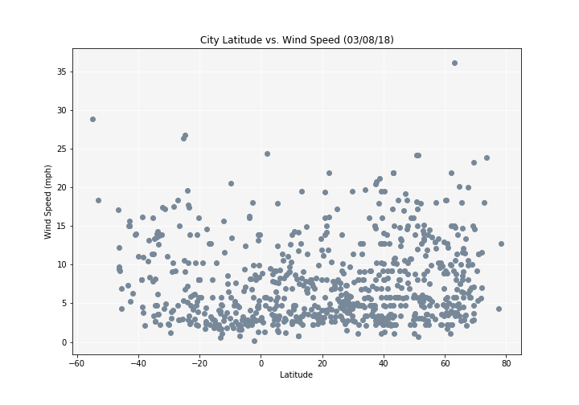

```python
# Dependencies
import random
import json
from pprint import pprint
import requests
from citipy import citipy
from config import api_key
import pandas as pd
import matplotlib.pyplot as plt
```

# Generate Cities List


```python
# Function to generate 1000 random coordinates
def randCoord():
    for x in range(1000):
        coordinates.append((random.randint(-90, 91), random.randint(-180, 181)))

# randCoord()
# print(coordinates)
```


```python
# Function to find unique cities based on generated coordinates
def findCity():
    for coordinate_pair in coordinates:
        lat, lon = coordinate_pair
        city_obj = citipy.nearest_city(lat, lon)
        city = city_obj.city_name
        
        # Want unique cities only
        if city not in cities:
            cities.append(city)

# findCity()
# print(cities)
# print(f"Unique cities found based on lat/lon out of {coordinate_count} coordinate pairs: {len(cities)}")
```

# Perform API Calls


```python
# Ask how many cities to analyze
how_many_cities = input("How many cities do you want to analyze? ")
```

    How many cities do you want to analyze? 500
    


```python
# Save config information
url = "http://api.openweathermap.org/data/2.5/weather?"
units = "imperial"

# Build partial query URL
query_url = f"{url}appid={api_key}&units={units}&q="
```


```python
# Hold generated coordinates and unique cities
coordinates = []
cities = []

# Set up lists to hold reponse information
name = []
cloudiness = []
country = []
date = []
humidity = []
lat = []
lon = []
max_temp = []
wind_speed = []

# Make counters
counter = 0
randCoord_count = 0

while len(name) < int(how_many_cities):
    
    # Generate coordinate pairs
    randCoord()
    
    # Count how many times randCoord ran
    randCoord_count += 1
    
    # Look up unique nearby cities
    findCity()
    
    # Loop through the list of cities and perform a request for data on each
    # *Need to start for loop at where it ended
    for city in cities[counter:]:
        
        # Increment counter
        counter += 1
        print(f"Processing Record {counter} | {city}")
        
        # Replace spaces in cities names of more than one word
        city_name = city.replace(" ", "+")
        
        # Print each query
        full_query_url = query_url + city_name
        print(full_query_url)
        
        # Retrieve data as json
        response = requests.get(full_query_url).json()
        
        # Append data to lists
        try:
            citi = response['name']
            if len(name) == int(how_many_cities):
                break            
            elif citi not in name:
                name.append(response['name'])
                cloudiness.append(response['clouds']['all'])
                country.append(response['sys']['country'])
                date.append(response['dt'])
                humidity.append(response['main']['humidity'])
                lat.append(response['coord']['lat'])
                lon.append(response['coord']['lon'])
                max_temp.append(response['main']['temp_max'])
                wind_speed.append(response['wind']['speed'])
        except KeyError:
            print(f"*City Not Found ({city})")
        except:
            raise
```

    Processing Record 1 | lukulu
    http://api.openweathermap.org/data/2.5/weather?appid=b9d7939379e121fce5e79c1c83d5fb95&units=imperial&q=lukulu
    Processing Record 2 | aklavik
    http://api.openweathermap.org/data/2.5/weather?appid=b9d7939379e121fce5e79c1c83d5fb95&units=imperial&q=aklavik
    Processing Record 3 | albany
    http://api.openweathermap.org/data/2.5/weather?appid=b9d7939379e121fce5e79c1c83d5fb95&units=imperial&q=albany
    Processing Record 4 | hilo
    http://api.openweathermap.org/data/2.5/weather?appid=b9d7939379e121fce5e79c1c83d5fb95&units=imperial&q=hilo
    Processing Record 5 | lebu
    http://api.openweathermap.org/data/2.5/weather?appid=b9d7939379e121fce5e79c1c83d5fb95&units=imperial&q=lebu
    Processing Record 6 | george town
    http://api.openweathermap.org/data/2.5/weather?appid=b9d7939379e121fce5e79c1c83d5fb95&units=imperial&q=george+town
    Processing Record 7 | cape town
    http://api.openweathermap.org/data/2.5/weather?appid=b9d7939379e121fce5e79c1c83d5fb95&units=imperial&q=cape+town
    Processing Record 8 | langley park
    http://api.openweathermap.org/data/2.5/weather?appid=b9d7939379e121fce5e79c1c83d5fb95&units=imperial&q=langley+park
    Processing Record 9 | prince rupert
    http://api.openweathermap.org/data/2.5/weather?appid=b9d7939379e121fce5e79c1c83d5fb95&units=imperial&q=prince+rupert
    Processing Record 10 | mys shmidta
    http://api.openweathermap.org/data/2.5/weather?appid=b9d7939379e121fce5e79c1c83d5fb95&units=imperial&q=mys+shmidta
    *City Not Found (mys shmidta)
    Processing Record 11 | kodiak
    http://api.openweathermap.org/data/2.5/weather?appid=b9d7939379e121fce5e79c1c83d5fb95&units=imperial&q=kodiak
    Processing Record 12 | zhicheng
    http://api.openweathermap.org/data/2.5/weather?appid=b9d7939379e121fce5e79c1c83d5fb95&units=imperial&q=zhicheng
    Processing Record 13 | fort nelson
    http://api.openweathermap.org/data/2.5/weather?appid=b9d7939379e121fce5e79c1c83d5fb95&units=imperial&q=fort+nelson
    Processing Record 14 | rungata
    http://api.openweathermap.org/data/2.5/weather?appid=b9d7939379e121fce5e79c1c83d5fb95&units=imperial&q=rungata
    *City Not Found (rungata)
    Processing Record 15 | rikitea
    http://api.openweathermap.org/data/2.5/weather?appid=b9d7939379e121fce5e79c1c83d5fb95&units=imperial&q=rikitea
    Processing Record 16 | avarua
    http://api.openweathermap.org/data/2.5/weather?appid=b9d7939379e121fce5e79c1c83d5fb95&units=imperial&q=avarua
    Processing Record 17 | punta arenas
    http://api.openweathermap.org/data/2.5/weather?appid=b9d7939379e121fce5e79c1c83d5fb95&units=imperial&q=punta+arenas
    Processing Record 18 | atuona
    http://api.openweathermap.org/data/2.5/weather?appid=b9d7939379e121fce5e79c1c83d5fb95&units=imperial&q=atuona
    Processing Record 19 | kewanee
    http://api.openweathermap.org/data/2.5/weather?appid=b9d7939379e121fce5e79c1c83d5fb95&units=imperial&q=kewanee
    Processing Record 20 | marsh harbour
    http://api.openweathermap.org/data/2.5/weather?appid=b9d7939379e121fce5e79c1c83d5fb95&units=imperial&q=marsh+harbour
    Processing Record 21 | chardara
    http://api.openweathermap.org/data/2.5/weather?appid=b9d7939379e121fce5e79c1c83d5fb95&units=imperial&q=chardara
    *City Not Found (chardara)
    Processing Record 22 | upernavik
    http://api.openweathermap.org/data/2.5/weather?appid=b9d7939379e121fce5e79c1c83d5fb95&units=imperial&q=upernavik
    Processing Record 23 | am timan
    http://api.openweathermap.org/data/2.5/weather?appid=b9d7939379e121fce5e79c1c83d5fb95&units=imperial&q=am+timan
    Processing Record 24 | rumphi
    http://api.openweathermap.org/data/2.5/weather?appid=b9d7939379e121fce5e79c1c83d5fb95&units=imperial&q=rumphi
    Processing Record 25 | thompson
    http://api.openweathermap.org/data/2.5/weather?appid=b9d7939379e121fce5e79c1c83d5fb95&units=imperial&q=thompson
    Processing Record 26 | georgetown
    http://api.openweathermap.org/data/2.5/weather?appid=b9d7939379e121fce5e79c1c83d5fb95&units=imperial&q=georgetown
    Processing Record 27 | vestmanna
    http://api.openweathermap.org/data/2.5/weather?appid=b9d7939379e121fce5e79c1c83d5fb95&units=imperial&q=vestmanna
    Processing Record 28 | iquitos
    http://api.openweathermap.org/data/2.5/weather?appid=b9d7939379e121fce5e79c1c83d5fb95&units=imperial&q=iquitos
    Processing Record 29 | vaini
    http://api.openweathermap.org/data/2.5/weather?appid=b9d7939379e121fce5e79c1c83d5fb95&units=imperial&q=vaini
    Processing Record 30 | nabire
    http://api.openweathermap.org/data/2.5/weather?appid=b9d7939379e121fce5e79c1c83d5fb95&units=imperial&q=nabire
    Processing Record 31 | bolshiye berezniki
    http://api.openweathermap.org/data/2.5/weather?appid=b9d7939379e121fce5e79c1c83d5fb95&units=imperial&q=bolshiye+berezniki
    *City Not Found (bolshiye berezniki)
    Processing Record 32 | port elizabeth
    http://api.openweathermap.org/data/2.5/weather?appid=b9d7939379e121fce5e79c1c83d5fb95&units=imperial&q=port+elizabeth
    Processing Record 33 | blagoyevo
    http://api.openweathermap.org/data/2.5/weather?appid=b9d7939379e121fce5e79c1c83d5fb95&units=imperial&q=blagoyevo
    Processing Record 34 | chuy
    http://api.openweathermap.org/data/2.5/weather?appid=b9d7939379e121fce5e79c1c83d5fb95&units=imperial&q=chuy
    Processing Record 35 | iqaluit
    http://api.openweathermap.org/data/2.5/weather?appid=b9d7939379e121fce5e79c1c83d5fb95&units=imperial&q=iqaluit
    Processing Record 36 | camacha
    http://api.openweathermap.org/data/2.5/weather?appid=b9d7939379e121fce5e79c1c83d5fb95&units=imperial&q=camacha
    Processing Record 37 | saint-pierre
    http://api.openweathermap.org/data/2.5/weather?appid=b9d7939379e121fce5e79c1c83d5fb95&units=imperial&q=saint-pierre
    Processing Record 38 | morris
    http://api.openweathermap.org/data/2.5/weather?appid=b9d7939379e121fce5e79c1c83d5fb95&units=imperial&q=morris
    Processing Record 39 | mocambique
    http://api.openweathermap.org/data/2.5/weather?appid=b9d7939379e121fce5e79c1c83d5fb95&units=imperial&q=mocambique
    *City Not Found (mocambique)
    Processing Record 40 | pemba
    http://api.openweathermap.org/data/2.5/weather?appid=b9d7939379e121fce5e79c1c83d5fb95&units=imperial&q=pemba
    Processing Record 41 | ushuaia
    http://api.openweathermap.org/data/2.5/weather?appid=b9d7939379e121fce5e79c1c83d5fb95&units=imperial&q=ushuaia
    Processing Record 42 | port alfred
    http://api.openweathermap.org/data/2.5/weather?appid=b9d7939379e121fce5e79c1c83d5fb95&units=imperial&q=port+alfred
    Processing Record 43 | alta floresta
    http://api.openweathermap.org/data/2.5/weather?appid=b9d7939379e121fce5e79c1c83d5fb95&units=imperial&q=alta+floresta
    Processing Record 44 | lorengau
    http://api.openweathermap.org/data/2.5/weather?appid=b9d7939379e121fce5e79c1c83d5fb95&units=imperial&q=lorengau
    Processing Record 45 | cabedelo
    http://api.openweathermap.org/data/2.5/weather?appid=b9d7939379e121fce5e79c1c83d5fb95&units=imperial&q=cabedelo
    Processing Record 46 | jamestown
    http://api.openweathermap.org/data/2.5/weather?appid=b9d7939379e121fce5e79c1c83d5fb95&units=imperial&q=jamestown
    Processing Record 47 | new norfolk
    http://api.openweathermap.org/data/2.5/weather?appid=b9d7939379e121fce5e79c1c83d5fb95&units=imperial&q=new+norfolk
    Processing Record 48 | pisco
    http://api.openweathermap.org/data/2.5/weather?appid=b9d7939379e121fce5e79c1c83d5fb95&units=imperial&q=pisco
    Processing Record 49 | bumba
    http://api.openweathermap.org/data/2.5/weather?appid=b9d7939379e121fce5e79c1c83d5fb95&units=imperial&q=bumba
    Processing Record 50 | yellowknife
    http://api.openweathermap.org/data/2.5/weather?appid=b9d7939379e121fce5e79c1c83d5fb95&units=imperial&q=yellowknife
    Processing Record 51 | muros
    http://api.openweathermap.org/data/2.5/weather?appid=b9d7939379e121fce5e79c1c83d5fb95&units=imperial&q=muros
    Processing Record 52 | hithadhoo
    http://api.openweathermap.org/data/2.5/weather?appid=b9d7939379e121fce5e79c1c83d5fb95&units=imperial&q=hithadhoo
    Processing Record 53 | talaya
    http://api.openweathermap.org/data/2.5/weather?appid=b9d7939379e121fce5e79c1c83d5fb95&units=imperial&q=talaya
    Processing Record 54 | vilyuysk
    http://api.openweathermap.org/data/2.5/weather?appid=b9d7939379e121fce5e79c1c83d5fb95&units=imperial&q=vilyuysk
    Processing Record 55 | horta
    http://api.openweathermap.org/data/2.5/weather?appid=b9d7939379e121fce5e79c1c83d5fb95&units=imperial&q=horta
    Processing Record 56 | kruisfontein
    http://api.openweathermap.org/data/2.5/weather?appid=b9d7939379e121fce5e79c1c83d5fb95&units=imperial&q=kruisfontein
    Processing Record 57 | churapcha
    http://api.openweathermap.org/data/2.5/weather?appid=b9d7939379e121fce5e79c1c83d5fb95&units=imperial&q=churapcha
    Processing Record 58 | khatanga
    http://api.openweathermap.org/data/2.5/weather?appid=b9d7939379e121fce5e79c1c83d5fb95&units=imperial&q=khatanga
    Processing Record 59 | seoul
    http://api.openweathermap.org/data/2.5/weather?appid=b9d7939379e121fce5e79c1c83d5fb95&units=imperial&q=seoul
    Processing Record 60 | kysyl-syr
    http://api.openweathermap.org/data/2.5/weather?appid=b9d7939379e121fce5e79c1c83d5fb95&units=imperial&q=kysyl-syr
    Processing Record 61 | castro
    http://api.openweathermap.org/data/2.5/weather?appid=b9d7939379e121fce5e79c1c83d5fb95&units=imperial&q=castro
    Processing Record 62 | lasa
    http://api.openweathermap.org/data/2.5/weather?appid=b9d7939379e121fce5e79c1c83d5fb95&units=imperial&q=lasa
    Processing Record 63 | tuggurt
    http://api.openweathermap.org/data/2.5/weather?appid=b9d7939379e121fce5e79c1c83d5fb95&units=imperial&q=tuggurt
    *City Not Found (tuggurt)
    Processing Record 64 | sitka
    http://api.openweathermap.org/data/2.5/weather?appid=b9d7939379e121fce5e79c1c83d5fb95&units=imperial&q=sitka
    Processing Record 65 | busselton
    http://api.openweathermap.org/data/2.5/weather?appid=b9d7939379e121fce5e79c1c83d5fb95&units=imperial&q=busselton
    Processing Record 66 | ahuimanu
    http://api.openweathermap.org/data/2.5/weather?appid=b9d7939379e121fce5e79c1c83d5fb95&units=imperial&q=ahuimanu
    Processing Record 67 | mataura
    http://api.openweathermap.org/data/2.5/weather?appid=b9d7939379e121fce5e79c1c83d5fb95&units=imperial&q=mataura
    Processing Record 68 | naze
    http://api.openweathermap.org/data/2.5/weather?appid=b9d7939379e121fce5e79c1c83d5fb95&units=imperial&q=naze
    Processing Record 69 | george
    http://api.openweathermap.org/data/2.5/weather?appid=b9d7939379e121fce5e79c1c83d5fb95&units=imperial&q=george
    Processing Record 70 | nantucket
    http://api.openweathermap.org/data/2.5/weather?appid=b9d7939379e121fce5e79c1c83d5fb95&units=imperial&q=nantucket
    Processing Record 71 | zapadnaya dvina
    http://api.openweathermap.org/data/2.5/weather?appid=b9d7939379e121fce5e79c1c83d5fb95&units=imperial&q=zapadnaya+dvina
    Processing Record 72 | douglas
    http://api.openweathermap.org/data/2.5/weather?appid=b9d7939379e121fce5e79c1c83d5fb95&units=imperial&q=douglas
    Processing Record 73 | ancud
    http://api.openweathermap.org/data/2.5/weather?appid=b9d7939379e121fce5e79c1c83d5fb95&units=imperial&q=ancud
    Processing Record 74 | nikolskoye
    http://api.openweathermap.org/data/2.5/weather?appid=b9d7939379e121fce5e79c1c83d5fb95&units=imperial&q=nikolskoye
    Processing Record 75 | grand river south east
    http://api.openweathermap.org/data/2.5/weather?appid=b9d7939379e121fce5e79c1c83d5fb95&units=imperial&q=grand+river+south+east
    *City Not Found (grand river south east)
    Processing Record 76 | batalha
    http://api.openweathermap.org/data/2.5/weather?appid=b9d7939379e121fce5e79c1c83d5fb95&units=imperial&q=batalha
    Processing Record 77 | torbay
    http://api.openweathermap.org/data/2.5/weather?appid=b9d7939379e121fce5e79c1c83d5fb95&units=imperial&q=torbay
    Processing Record 78 | luderitz
    http://api.openweathermap.org/data/2.5/weather?appid=b9d7939379e121fce5e79c1c83d5fb95&units=imperial&q=luderitz
    Processing Record 79 | udachnyy
    http://api.openweathermap.org/data/2.5/weather?appid=b9d7939379e121fce5e79c1c83d5fb95&units=imperial&q=udachnyy
    Processing Record 80 | dunedin
    http://api.openweathermap.org/data/2.5/weather?appid=b9d7939379e121fce5e79c1c83d5fb95&units=imperial&q=dunedin
    Processing Record 81 | kapaa
    http://api.openweathermap.org/data/2.5/weather?appid=b9d7939379e121fce5e79c1c83d5fb95&units=imperial&q=kapaa
    Processing Record 82 | tsihombe
    http://api.openweathermap.org/data/2.5/weather?appid=b9d7939379e121fce5e79c1c83d5fb95&units=imperial&q=tsihombe
    *City Not Found (tsihombe)
    Processing Record 83 | goderich
    http://api.openweathermap.org/data/2.5/weather?appid=b9d7939379e121fce5e79c1c83d5fb95&units=imperial&q=goderich
    Processing Record 84 | weligama
    http://api.openweathermap.org/data/2.5/weather?appid=b9d7939379e121fce5e79c1c83d5fb95&units=imperial&q=weligama
    Processing Record 85 | puerto ayora
    http://api.openweathermap.org/data/2.5/weather?appid=b9d7939379e121fce5e79c1c83d5fb95&units=imperial&q=puerto+ayora
    Processing Record 86 | severo-kurilsk
    http://api.openweathermap.org/data/2.5/weather?appid=b9d7939379e121fce5e79c1c83d5fb95&units=imperial&q=severo-kurilsk
    Processing Record 87 | porto santo
    http://api.openweathermap.org/data/2.5/weather?appid=b9d7939379e121fce5e79c1c83d5fb95&units=imperial&q=porto+santo
    *City Not Found (porto santo)
    Processing Record 88 | chokurdakh
    http://api.openweathermap.org/data/2.5/weather?appid=b9d7939379e121fce5e79c1c83d5fb95&units=imperial&q=chokurdakh
    Processing Record 89 | zhanaozen
    http://api.openweathermap.org/data/2.5/weather?appid=b9d7939379e121fce5e79c1c83d5fb95&units=imperial&q=zhanaozen
    Processing Record 90 | mar del plata
    http://api.openweathermap.org/data/2.5/weather?appid=b9d7939379e121fce5e79c1c83d5fb95&units=imperial&q=mar+del+plata
    Processing Record 91 | fairbanks
    http://api.openweathermap.org/data/2.5/weather?appid=b9d7939379e121fce5e79c1c83d5fb95&units=imperial&q=fairbanks
    Processing Record 92 | ozgon
    http://api.openweathermap.org/data/2.5/weather?appid=b9d7939379e121fce5e79c1c83d5fb95&units=imperial&q=ozgon
    *City Not Found (ozgon)
    Processing Record 93 | bambous virieux
    http://api.openweathermap.org/data/2.5/weather?appid=b9d7939379e121fce5e79c1c83d5fb95&units=imperial&q=bambous+virieux
    Processing Record 94 | anadyr
    http://api.openweathermap.org/data/2.5/weather?appid=b9d7939379e121fce5e79c1c83d5fb95&units=imperial&q=anadyr
    Processing Record 95 | mahebourg
    http://api.openweathermap.org/data/2.5/weather?appid=b9d7939379e121fce5e79c1c83d5fb95&units=imperial&q=mahebourg
    Processing Record 96 | geraldton
    http://api.openweathermap.org/data/2.5/weather?appid=b9d7939379e121fce5e79c1c83d5fb95&units=imperial&q=geraldton
    Processing Record 97 | butaritari
    http://api.openweathermap.org/data/2.5/weather?appid=b9d7939379e121fce5e79c1c83d5fb95&units=imperial&q=butaritari
    Processing Record 98 | shirokiy
    http://api.openweathermap.org/data/2.5/weather?appid=b9d7939379e121fce5e79c1c83d5fb95&units=imperial&q=shirokiy
    Processing Record 99 | nuuk
    http://api.openweathermap.org/data/2.5/weather?appid=b9d7939379e121fce5e79c1c83d5fb95&units=imperial&q=nuuk
    Processing Record 100 | thinadhoo
    http://api.openweathermap.org/data/2.5/weather?appid=b9d7939379e121fce5e79c1c83d5fb95&units=imperial&q=thinadhoo
    Processing Record 101 | kalmunai
    http://api.openweathermap.org/data/2.5/weather?appid=b9d7939379e121fce5e79c1c83d5fb95&units=imperial&q=kalmunai
    Processing Record 102 | carnarvon
    http://api.openweathermap.org/data/2.5/weather?appid=b9d7939379e121fce5e79c1c83d5fb95&units=imperial&q=carnarvon
    Processing Record 103 | maloshuyka
    http://api.openweathermap.org/data/2.5/weather?appid=b9d7939379e121fce5e79c1c83d5fb95&units=imperial&q=maloshuyka
    *City Not Found (maloshuyka)
    Processing Record 104 | mandalay
    http://api.openweathermap.org/data/2.5/weather?appid=b9d7939379e121fce5e79c1c83d5fb95&units=imperial&q=mandalay
    Processing Record 105 | honiara
    http://api.openweathermap.org/data/2.5/weather?appid=b9d7939379e121fce5e79c1c83d5fb95&units=imperial&q=honiara
    Processing Record 106 | lima
    http://api.openweathermap.org/data/2.5/weather?appid=b9d7939379e121fce5e79c1c83d5fb95&units=imperial&q=lima
    Processing Record 107 | isangel
    http://api.openweathermap.org/data/2.5/weather?appid=b9d7939379e121fce5e79c1c83d5fb95&units=imperial&q=isangel
    Processing Record 108 | mrirt
    http://api.openweathermap.org/data/2.5/weather?appid=b9d7939379e121fce5e79c1c83d5fb95&units=imperial&q=mrirt
    *City Not Found (mrirt)
    Processing Record 109 | nizhneyansk
    http://api.openweathermap.org/data/2.5/weather?appid=b9d7939379e121fce5e79c1c83d5fb95&units=imperial&q=nizhneyansk
    *City Not Found (nizhneyansk)
    Processing Record 110 | lompoc
    http://api.openweathermap.org/data/2.5/weather?appid=b9d7939379e121fce5e79c1c83d5fb95&units=imperial&q=lompoc
    Processing Record 111 | illoqqortoormiut
    http://api.openweathermap.org/data/2.5/weather?appid=b9d7939379e121fce5e79c1c83d5fb95&units=imperial&q=illoqqortoormiut
    *City Not Found (illoqqortoormiut)
    Processing Record 112 | taolanaro
    http://api.openweathermap.org/data/2.5/weather?appid=b9d7939379e121fce5e79c1c83d5fb95&units=imperial&q=taolanaro
    *City Not Found (taolanaro)
    Processing Record 113 | phalaborwa
    http://api.openweathermap.org/data/2.5/weather?appid=b9d7939379e121fce5e79c1c83d5fb95&units=imperial&q=phalaborwa
    Processing Record 114 | bairiki
    http://api.openweathermap.org/data/2.5/weather?appid=b9d7939379e121fce5e79c1c83d5fb95&units=imperial&q=bairiki
    *City Not Found (bairiki)
    Processing Record 115 | tasiilaq
    http://api.openweathermap.org/data/2.5/weather?appid=b9d7939379e121fce5e79c1c83d5fb95&units=imperial&q=tasiilaq
    Processing Record 116 | norman wells
    http://api.openweathermap.org/data/2.5/weather?appid=b9d7939379e121fce5e79c1c83d5fb95&units=imperial&q=norman+wells
    Processing Record 117 | dembi dolo
    http://api.openweathermap.org/data/2.5/weather?appid=b9d7939379e121fce5e79c1c83d5fb95&units=imperial&q=dembi+dolo
    Processing Record 118 | amahai
    http://api.openweathermap.org/data/2.5/weather?appid=b9d7939379e121fce5e79c1c83d5fb95&units=imperial&q=amahai
    Processing Record 119 | mayor pablo lagerenza
    http://api.openweathermap.org/data/2.5/weather?appid=b9d7939379e121fce5e79c1c83d5fb95&units=imperial&q=mayor+pablo+lagerenza
    Processing Record 120 | bluff
    http://api.openweathermap.org/data/2.5/weather?appid=b9d7939379e121fce5e79c1c83d5fb95&units=imperial&q=bluff
    Processing Record 121 | rantepao
    http://api.openweathermap.org/data/2.5/weather?appid=b9d7939379e121fce5e79c1c83d5fb95&units=imperial&q=rantepao
    Processing Record 122 | yanchukan
    http://api.openweathermap.org/data/2.5/weather?appid=b9d7939379e121fce5e79c1c83d5fb95&units=imperial&q=yanchukan
    *City Not Found (yanchukan)
    Processing Record 123 | baoro
    http://api.openweathermap.org/data/2.5/weather?appid=b9d7939379e121fce5e79c1c83d5fb95&units=imperial&q=baoro
    Processing Record 124 | hermanus
    http://api.openweathermap.org/data/2.5/weather?appid=b9d7939379e121fce5e79c1c83d5fb95&units=imperial&q=hermanus
    Processing Record 125 | dingle
    http://api.openweathermap.org/data/2.5/weather?appid=b9d7939379e121fce5e79c1c83d5fb95&units=imperial&q=dingle
    Processing Record 126 | zhangye
    http://api.openweathermap.org/data/2.5/weather?appid=b9d7939379e121fce5e79c1c83d5fb95&units=imperial&q=zhangye
    Processing Record 127 | kabalo
    http://api.openweathermap.org/data/2.5/weather?appid=b9d7939379e121fce5e79c1c83d5fb95&units=imperial&q=kabalo
    Processing Record 128 | vysokogornyy
    http://api.openweathermap.org/data/2.5/weather?appid=b9d7939379e121fce5e79c1c83d5fb95&units=imperial&q=vysokogornyy
    Processing Record 129 | pangai
    http://api.openweathermap.org/data/2.5/weather?appid=b9d7939379e121fce5e79c1c83d5fb95&units=imperial&q=pangai
    Processing Record 130 | vila franca do campo
    http://api.openweathermap.org/data/2.5/weather?appid=b9d7939379e121fce5e79c1c83d5fb95&units=imperial&q=vila+franca+do+campo
    Processing Record 131 | sentyabrskiy
    http://api.openweathermap.org/data/2.5/weather?appid=b9d7939379e121fce5e79c1c83d5fb95&units=imperial&q=sentyabrskiy
    *City Not Found (sentyabrskiy)
    Processing Record 132 | bredasdorp
    http://api.openweathermap.org/data/2.5/weather?appid=b9d7939379e121fce5e79c1c83d5fb95&units=imperial&q=bredasdorp
    Processing Record 133 | grand gaube
    http://api.openweathermap.org/data/2.5/weather?appid=b9d7939379e121fce5e79c1c83d5fb95&units=imperial&q=grand+gaube
    Processing Record 134 | batemans bay
    http://api.openweathermap.org/data/2.5/weather?appid=b9d7939379e121fce5e79c1c83d5fb95&units=imperial&q=batemans+bay
    Processing Record 135 | souillac
    http://api.openweathermap.org/data/2.5/weather?appid=b9d7939379e121fce5e79c1c83d5fb95&units=imperial&q=souillac
    Processing Record 136 | sumbe
    http://api.openweathermap.org/data/2.5/weather?appid=b9d7939379e121fce5e79c1c83d5fb95&units=imperial&q=sumbe
    Processing Record 137 | rocha
    http://api.openweathermap.org/data/2.5/weather?appid=b9d7939379e121fce5e79c1c83d5fb95&units=imperial&q=rocha
    Processing Record 138 | yulara
    http://api.openweathermap.org/data/2.5/weather?appid=b9d7939379e121fce5e79c1c83d5fb95&units=imperial&q=yulara
    Processing Record 139 | katsuura
    http://api.openweathermap.org/data/2.5/weather?appid=b9d7939379e121fce5e79c1c83d5fb95&units=imperial&q=katsuura
    Processing Record 140 | vila praia de ancora
    http://api.openweathermap.org/data/2.5/weather?appid=b9d7939379e121fce5e79c1c83d5fb95&units=imperial&q=vila+praia+de+ancora
    Processing Record 141 | chipinge
    http://api.openweathermap.org/data/2.5/weather?appid=b9d7939379e121fce5e79c1c83d5fb95&units=imperial&q=chipinge
    Processing Record 142 | tuktoyaktuk
    http://api.openweathermap.org/data/2.5/weather?appid=b9d7939379e121fce5e79c1c83d5fb95&units=imperial&q=tuktoyaktuk
    Processing Record 143 | anuchino
    http://api.openweathermap.org/data/2.5/weather?appid=b9d7939379e121fce5e79c1c83d5fb95&units=imperial&q=anuchino
    Processing Record 144 | gamba
    http://api.openweathermap.org/data/2.5/weather?appid=b9d7939379e121fce5e79c1c83d5fb95&units=imperial&q=gamba
    Processing Record 145 | pevek
    http://api.openweathermap.org/data/2.5/weather?appid=b9d7939379e121fce5e79c1c83d5fb95&units=imperial&q=pevek
    Processing Record 146 | trincomalee
    http://api.openweathermap.org/data/2.5/weather?appid=b9d7939379e121fce5e79c1c83d5fb95&units=imperial&q=trincomalee
    Processing Record 147 | taoudenni
    http://api.openweathermap.org/data/2.5/weather?appid=b9d7939379e121fce5e79c1c83d5fb95&units=imperial&q=taoudenni
    Processing Record 148 | ilulissat
    http://api.openweathermap.org/data/2.5/weather?appid=b9d7939379e121fce5e79c1c83d5fb95&units=imperial&q=ilulissat
    Processing Record 149 | hobart
    http://api.openweathermap.org/data/2.5/weather?appid=b9d7939379e121fce5e79c1c83d5fb95&units=imperial&q=hobart
    Processing Record 150 | derzhavinsk
    http://api.openweathermap.org/data/2.5/weather?appid=b9d7939379e121fce5e79c1c83d5fb95&units=imperial&q=derzhavinsk
    Processing Record 151 | truro
    http://api.openweathermap.org/data/2.5/weather?appid=b9d7939379e121fce5e79c1c83d5fb95&units=imperial&q=truro
    Processing Record 152 | sokolo
    http://api.openweathermap.org/data/2.5/weather?appid=b9d7939379e121fce5e79c1c83d5fb95&units=imperial&q=sokolo
    Processing Record 153 | magui
    http://api.openweathermap.org/data/2.5/weather?appid=b9d7939379e121fce5e79c1c83d5fb95&units=imperial&q=magui
    *City Not Found (magui)
    Processing Record 154 | olafsvik
    http://api.openweathermap.org/data/2.5/weather?appid=b9d7939379e121fce5e79c1c83d5fb95&units=imperial&q=olafsvik
    *City Not Found (olafsvik)
    Processing Record 155 | longyearbyen
    http://api.openweathermap.org/data/2.5/weather?appid=b9d7939379e121fce5e79c1c83d5fb95&units=imperial&q=longyearbyen
    Processing Record 156 | gonda
    http://api.openweathermap.org/data/2.5/weather?appid=b9d7939379e121fce5e79c1c83d5fb95&units=imperial&q=gonda
    Processing Record 157 | havoysund
    http://api.openweathermap.org/data/2.5/weather?appid=b9d7939379e121fce5e79c1c83d5fb95&units=imperial&q=havoysund
    Processing Record 158 | oistins
    http://api.openweathermap.org/data/2.5/weather?appid=b9d7939379e121fce5e79c1c83d5fb95&units=imperial&q=oistins
    Processing Record 159 | ostrovnoy
    http://api.openweathermap.org/data/2.5/weather?appid=b9d7939379e121fce5e79c1c83d5fb95&units=imperial&q=ostrovnoy
    Processing Record 160 | awbari
    http://api.openweathermap.org/data/2.5/weather?appid=b9d7939379e121fce5e79c1c83d5fb95&units=imperial&q=awbari
    Processing Record 161 | mergui
    http://api.openweathermap.org/data/2.5/weather?appid=b9d7939379e121fce5e79c1c83d5fb95&units=imperial&q=mergui
    *City Not Found (mergui)
    Processing Record 162 | munai
    http://api.openweathermap.org/data/2.5/weather?appid=b9d7939379e121fce5e79c1c83d5fb95&units=imperial&q=munai
    Processing Record 163 | port-gentil
    http://api.openweathermap.org/data/2.5/weather?appid=b9d7939379e121fce5e79c1c83d5fb95&units=imperial&q=port-gentil
    Processing Record 164 | hihifo
    http://api.openweathermap.org/data/2.5/weather?appid=b9d7939379e121fce5e79c1c83d5fb95&units=imperial&q=hihifo
    *City Not Found (hihifo)
    Processing Record 165 | san patricio
    http://api.openweathermap.org/data/2.5/weather?appid=b9d7939379e121fce5e79c1c83d5fb95&units=imperial&q=san+patricio
    Processing Record 166 | belushya guba
    http://api.openweathermap.org/data/2.5/weather?appid=b9d7939379e121fce5e79c1c83d5fb95&units=imperial&q=belushya+guba
    *City Not Found (belushya guba)
    Processing Record 167 | arraial do cabo
    http://api.openweathermap.org/data/2.5/weather?appid=b9d7939379e121fce5e79c1c83d5fb95&units=imperial&q=arraial+do+cabo
    Processing Record 168 | maldonado
    http://api.openweathermap.org/data/2.5/weather?appid=b9d7939379e121fce5e79c1c83d5fb95&units=imperial&q=maldonado
    Processing Record 169 | khirkiya
    http://api.openweathermap.org/data/2.5/weather?appid=b9d7939379e121fce5e79c1c83d5fb95&units=imperial&q=khirkiya
    Processing Record 170 | rovereto
    http://api.openweathermap.org/data/2.5/weather?appid=b9d7939379e121fce5e79c1c83d5fb95&units=imperial&q=rovereto
    Processing Record 171 | carupano
    http://api.openweathermap.org/data/2.5/weather?appid=b9d7939379e121fce5e79c1c83d5fb95&units=imperial&q=carupano
    Processing Record 172 | qaanaaq
    http://api.openweathermap.org/data/2.5/weather?appid=b9d7939379e121fce5e79c1c83d5fb95&units=imperial&q=qaanaaq
    Processing Record 173 | brae
    http://api.openweathermap.org/data/2.5/weather?appid=b9d7939379e121fce5e79c1c83d5fb95&units=imperial&q=brae
    Processing Record 174 | pangnirtung
    http://api.openweathermap.org/data/2.5/weather?appid=b9d7939379e121fce5e79c1c83d5fb95&units=imperial&q=pangnirtung
    Processing Record 175 | saleilua
    http://api.openweathermap.org/data/2.5/weather?appid=b9d7939379e121fce5e79c1c83d5fb95&units=imperial&q=saleilua
    *City Not Found (saleilua)
    Processing Record 176 | qaqortoq
    http://api.openweathermap.org/data/2.5/weather?appid=b9d7939379e121fce5e79c1c83d5fb95&units=imperial&q=qaqortoq
    Processing Record 177 | tumannyy
    http://api.openweathermap.org/data/2.5/weather?appid=b9d7939379e121fce5e79c1c83d5fb95&units=imperial&q=tumannyy
    *City Not Found (tumannyy)
    Processing Record 178 | bocaiuva
    http://api.openweathermap.org/data/2.5/weather?appid=b9d7939379e121fce5e79c1c83d5fb95&units=imperial&q=bocaiuva
    Processing Record 179 | dikson
    http://api.openweathermap.org/data/2.5/weather?appid=b9d7939379e121fce5e79c1c83d5fb95&units=imperial&q=dikson
    Processing Record 180 | port blair
    http://api.openweathermap.org/data/2.5/weather?appid=b9d7939379e121fce5e79c1c83d5fb95&units=imperial&q=port+blair
    Processing Record 181 | is
    http://api.openweathermap.org/data/2.5/weather?appid=b9d7939379e121fce5e79c1c83d5fb95&units=imperial&q=is
    *City Not Found (is)
    Processing Record 182 | najran
    http://api.openweathermap.org/data/2.5/weather?appid=b9d7939379e121fce5e79c1c83d5fb95&units=imperial&q=najran
    Processing Record 183 | uniao da victoria
    http://api.openweathermap.org/data/2.5/weather?appid=b9d7939379e121fce5e79c1c83d5fb95&units=imperial&q=uniao+da+victoria
    *City Not Found (uniao da victoria)
    Processing Record 184 | sao filipe
    http://api.openweathermap.org/data/2.5/weather?appid=b9d7939379e121fce5e79c1c83d5fb95&units=imperial&q=sao+filipe
    Processing Record 185 | east london
    http://api.openweathermap.org/data/2.5/weather?appid=b9d7939379e121fce5e79c1c83d5fb95&units=imperial&q=east+london
    Processing Record 186 | erenhot
    http://api.openweathermap.org/data/2.5/weather?appid=b9d7939379e121fce5e79c1c83d5fb95&units=imperial&q=erenhot
    Processing Record 187 | pechenga
    http://api.openweathermap.org/data/2.5/weather?appid=b9d7939379e121fce5e79c1c83d5fb95&units=imperial&q=pechenga
    Processing Record 188 | manturovo
    http://api.openweathermap.org/data/2.5/weather?appid=b9d7939379e121fce5e79c1c83d5fb95&units=imperial&q=manturovo
    Processing Record 189 | khorramshahr
    http://api.openweathermap.org/data/2.5/weather?appid=b9d7939379e121fce5e79c1c83d5fb95&units=imperial&q=khorramshahr
    Processing Record 190 | attawapiskat
    http://api.openweathermap.org/data/2.5/weather?appid=b9d7939379e121fce5e79c1c83d5fb95&units=imperial&q=attawapiskat
    *City Not Found (attawapiskat)
    Processing Record 191 | ribeira grande
    http://api.openweathermap.org/data/2.5/weather?appid=b9d7939379e121fce5e79c1c83d5fb95&units=imperial&q=ribeira+grande
    Processing Record 192 | garden city
    http://api.openweathermap.org/data/2.5/weather?appid=b9d7939379e121fce5e79c1c83d5fb95&units=imperial&q=garden+city
    Processing Record 193 | ostrogozhsk
    http://api.openweathermap.org/data/2.5/weather?appid=b9d7939379e121fce5e79c1c83d5fb95&units=imperial&q=ostrogozhsk
    Processing Record 194 | severnyy
    http://api.openweathermap.org/data/2.5/weather?appid=b9d7939379e121fce5e79c1c83d5fb95&units=imperial&q=severnyy
    *City Not Found (severnyy)
    Processing Record 195 | fortuna
    http://api.openweathermap.org/data/2.5/weather?appid=b9d7939379e121fce5e79c1c83d5fb95&units=imperial&q=fortuna
    Processing Record 196 | barcelos
    http://api.openweathermap.org/data/2.5/weather?appid=b9d7939379e121fce5e79c1c83d5fb95&units=imperial&q=barcelos
    Processing Record 197 | abha
    http://api.openweathermap.org/data/2.5/weather?appid=b9d7939379e121fce5e79c1c83d5fb95&units=imperial&q=abha
    Processing Record 198 | santander
    http://api.openweathermap.org/data/2.5/weather?appid=b9d7939379e121fce5e79c1c83d5fb95&units=imperial&q=santander
    Processing Record 199 | lagoa
    http://api.openweathermap.org/data/2.5/weather?appid=b9d7939379e121fce5e79c1c83d5fb95&units=imperial&q=lagoa
    Processing Record 200 | saleaula
    http://api.openweathermap.org/data/2.5/weather?appid=b9d7939379e121fce5e79c1c83d5fb95&units=imperial&q=saleaula
    *City Not Found (saleaula)
    Processing Record 201 | ponta delgada
    http://api.openweathermap.org/data/2.5/weather?appid=b9d7939379e121fce5e79c1c83d5fb95&units=imperial&q=ponta+delgada
    Processing Record 202 | saint george
    http://api.openweathermap.org/data/2.5/weather?appid=b9d7939379e121fce5e79c1c83d5fb95&units=imperial&q=saint+george
    Processing Record 203 | praya
    http://api.openweathermap.org/data/2.5/weather?appid=b9d7939379e121fce5e79c1c83d5fb95&units=imperial&q=praya
    Processing Record 204 | teya
    http://api.openweathermap.org/data/2.5/weather?appid=b9d7939379e121fce5e79c1c83d5fb95&units=imperial&q=teya
    Processing Record 205 | manicore
    http://api.openweathermap.org/data/2.5/weather?appid=b9d7939379e121fce5e79c1c83d5fb95&units=imperial&q=manicore
    Processing Record 206 | longlac
    http://api.openweathermap.org/data/2.5/weather?appid=b9d7939379e121fce5e79c1c83d5fb95&units=imperial&q=longlac
    *City Not Found (longlac)
    Processing Record 207 | alofi
    http://api.openweathermap.org/data/2.5/weather?appid=b9d7939379e121fce5e79c1c83d5fb95&units=imperial&q=alofi
    Processing Record 208 | svetlaya
    http://api.openweathermap.org/data/2.5/weather?appid=b9d7939379e121fce5e79c1c83d5fb95&units=imperial&q=svetlaya
    Processing Record 209 | doha
    http://api.openweathermap.org/data/2.5/weather?appid=b9d7939379e121fce5e79c1c83d5fb95&units=imperial&q=doha
    Processing Record 210 | santa cruz de la palma
    http://api.openweathermap.org/data/2.5/weather?appid=b9d7939379e121fce5e79c1c83d5fb95&units=imperial&q=santa+cruz+de+la+palma
    Processing Record 211 | tiarei
    http://api.openweathermap.org/data/2.5/weather?appid=b9d7939379e121fce5e79c1c83d5fb95&units=imperial&q=tiarei
    Processing Record 212 | santa eulalia del rio
    http://api.openweathermap.org/data/2.5/weather?appid=b9d7939379e121fce5e79c1c83d5fb95&units=imperial&q=santa+eulalia+del+rio
    *City Not Found (santa eulalia del rio)
    Processing Record 213 | mallaig
    http://api.openweathermap.org/data/2.5/weather?appid=b9d7939379e121fce5e79c1c83d5fb95&units=imperial&q=mallaig
    Processing Record 214 | acapulco
    http://api.openweathermap.org/data/2.5/weather?appid=b9d7939379e121fce5e79c1c83d5fb95&units=imperial&q=acapulco
    Processing Record 215 | tiksi
    http://api.openweathermap.org/data/2.5/weather?appid=b9d7939379e121fce5e79c1c83d5fb95&units=imperial&q=tiksi
    Processing Record 216 | nkayi
    http://api.openweathermap.org/data/2.5/weather?appid=b9d7939379e121fce5e79c1c83d5fb95&units=imperial&q=nkayi
    Processing Record 217 | araguacu
    http://api.openweathermap.org/data/2.5/weather?appid=b9d7939379e121fce5e79c1c83d5fb95&units=imperial&q=araguacu
    *City Not Found (araguacu)
    Processing Record 218 | williams lake
    http://api.openweathermap.org/data/2.5/weather?appid=b9d7939379e121fce5e79c1c83d5fb95&units=imperial&q=williams+lake
    Processing Record 219 | coahuayana
    http://api.openweathermap.org/data/2.5/weather?appid=b9d7939379e121fce5e79c1c83d5fb95&units=imperial&q=coahuayana
    Processing Record 220 | esperance
    http://api.openweathermap.org/data/2.5/weather?appid=b9d7939379e121fce5e79c1c83d5fb95&units=imperial&q=esperance
    Processing Record 221 | lata
    http://api.openweathermap.org/data/2.5/weather?appid=b9d7939379e121fce5e79c1c83d5fb95&units=imperial&q=lata
    Processing Record 222 | ginir
    http://api.openweathermap.org/data/2.5/weather?appid=b9d7939379e121fce5e79c1c83d5fb95&units=imperial&q=ginir
    Processing Record 223 | port hardy
    http://api.openweathermap.org/data/2.5/weather?appid=b9d7939379e121fce5e79c1c83d5fb95&units=imperial&q=port+hardy
    Processing Record 224 | istanbul
    http://api.openweathermap.org/data/2.5/weather?appid=b9d7939379e121fce5e79c1c83d5fb95&units=imperial&q=istanbul
    Processing Record 225 | roald
    http://api.openweathermap.org/data/2.5/weather?appid=b9d7939379e121fce5e79c1c83d5fb95&units=imperial&q=roald
    Processing Record 226 | paamiut
    http://api.openweathermap.org/data/2.5/weather?appid=b9d7939379e121fce5e79c1c83d5fb95&units=imperial&q=paamiut
    Processing Record 227 | hovd
    http://api.openweathermap.org/data/2.5/weather?appid=b9d7939379e121fce5e79c1c83d5fb95&units=imperial&q=hovd
    Processing Record 228 | faanui
    http://api.openweathermap.org/data/2.5/weather?appid=b9d7939379e121fce5e79c1c83d5fb95&units=imperial&q=faanui
    Processing Record 229 | gimli
    http://api.openweathermap.org/data/2.5/weather?appid=b9d7939379e121fce5e79c1c83d5fb95&units=imperial&q=gimli
    Processing Record 230 | tsogni
    http://api.openweathermap.org/data/2.5/weather?appid=b9d7939379e121fce5e79c1c83d5fb95&units=imperial&q=tsogni
    Processing Record 231 | sorland
    http://api.openweathermap.org/data/2.5/weather?appid=b9d7939379e121fce5e79c1c83d5fb95&units=imperial&q=sorland
    Processing Record 232 | hailar
    http://api.openweathermap.org/data/2.5/weather?appid=b9d7939379e121fce5e79c1c83d5fb95&units=imperial&q=hailar
    Processing Record 233 | chicama
    http://api.openweathermap.org/data/2.5/weather?appid=b9d7939379e121fce5e79c1c83d5fb95&units=imperial&q=chicama
    Processing Record 234 | paracuru
    http://api.openweathermap.org/data/2.5/weather?appid=b9d7939379e121fce5e79c1c83d5fb95&units=imperial&q=paracuru
    Processing Record 235 | panaba
    http://api.openweathermap.org/data/2.5/weather?appid=b9d7939379e121fce5e79c1c83d5fb95&units=imperial&q=panaba
    Processing Record 236 | saldanha
    http://api.openweathermap.org/data/2.5/weather?appid=b9d7939379e121fce5e79c1c83d5fb95&units=imperial&q=saldanha
    Processing Record 237 | kargasok
    http://api.openweathermap.org/data/2.5/weather?appid=b9d7939379e121fce5e79c1c83d5fb95&units=imperial&q=kargasok
    Processing Record 238 | magaria
    http://api.openweathermap.org/data/2.5/weather?appid=b9d7939379e121fce5e79c1c83d5fb95&units=imperial&q=magaria
    Processing Record 239 | noumea
    http://api.openweathermap.org/data/2.5/weather?appid=b9d7939379e121fce5e79c1c83d5fb95&units=imperial&q=noumea
    Processing Record 240 | tambacounda
    http://api.openweathermap.org/data/2.5/weather?appid=b9d7939379e121fce5e79c1c83d5fb95&units=imperial&q=tambacounda
    Processing Record 241 | antofagasta
    http://api.openweathermap.org/data/2.5/weather?appid=b9d7939379e121fce5e79c1c83d5fb95&units=imperial&q=antofagasta
    Processing Record 242 | terra roxa
    http://api.openweathermap.org/data/2.5/weather?appid=b9d7939379e121fce5e79c1c83d5fb95&units=imperial&q=terra+roxa
    Processing Record 243 | namibe
    http://api.openweathermap.org/data/2.5/weather?appid=b9d7939379e121fce5e79c1c83d5fb95&units=imperial&q=namibe
    Processing Record 244 | kuche
    http://api.openweathermap.org/data/2.5/weather?appid=b9d7939379e121fce5e79c1c83d5fb95&units=imperial&q=kuche
    *City Not Found (kuche)
    Processing Record 245 | barrow
    http://api.openweathermap.org/data/2.5/weather?appid=b9d7939379e121fce5e79c1c83d5fb95&units=imperial&q=barrow
    Processing Record 246 | bodden town
    http://api.openweathermap.org/data/2.5/weather?appid=b9d7939379e121fce5e79c1c83d5fb95&units=imperial&q=bodden+town
    Processing Record 247 | provideniya
    http://api.openweathermap.org/data/2.5/weather?appid=b9d7939379e121fce5e79c1c83d5fb95&units=imperial&q=provideniya
    Processing Record 248 | jiwani
    http://api.openweathermap.org/data/2.5/weather?appid=b9d7939379e121fce5e79c1c83d5fb95&units=imperial&q=jiwani
    Processing Record 249 | moyale
    http://api.openweathermap.org/data/2.5/weather?appid=b9d7939379e121fce5e79c1c83d5fb95&units=imperial&q=moyale
    Processing Record 250 | rongai
    http://api.openweathermap.org/data/2.5/weather?appid=b9d7939379e121fce5e79c1c83d5fb95&units=imperial&q=rongai
    Processing Record 251 | dicabisagan
    http://api.openweathermap.org/data/2.5/weather?appid=b9d7939379e121fce5e79c1c83d5fb95&units=imperial&q=dicabisagan
    Processing Record 252 | porbandar
    http://api.openweathermap.org/data/2.5/weather?appid=b9d7939379e121fce5e79c1c83d5fb95&units=imperial&q=porbandar
    Processing Record 253 | lerwick
    http://api.openweathermap.org/data/2.5/weather?appid=b9d7939379e121fce5e79c1c83d5fb95&units=imperial&q=lerwick
    Processing Record 254 | kastamonu
    http://api.openweathermap.org/data/2.5/weather?appid=b9d7939379e121fce5e79c1c83d5fb95&units=imperial&q=kastamonu
    Processing Record 255 | vaitupu
    http://api.openweathermap.org/data/2.5/weather?appid=b9d7939379e121fce5e79c1c83d5fb95&units=imperial&q=vaitupu
    *City Not Found (vaitupu)
    Processing Record 256 | vila velha
    http://api.openweathermap.org/data/2.5/weather?appid=b9d7939379e121fce5e79c1c83d5fb95&units=imperial&q=vila+velha
    Processing Record 257 | san ramon
    http://api.openweathermap.org/data/2.5/weather?appid=b9d7939379e121fce5e79c1c83d5fb95&units=imperial&q=san+ramon
    Processing Record 258 | cockburn town
    http://api.openweathermap.org/data/2.5/weather?appid=b9d7939379e121fce5e79c1c83d5fb95&units=imperial&q=cockburn+town
    Processing Record 259 | vostok
    http://api.openweathermap.org/data/2.5/weather?appid=b9d7939379e121fce5e79c1c83d5fb95&units=imperial&q=vostok
    Processing Record 260 | mogadishu
    http://api.openweathermap.org/data/2.5/weather?appid=b9d7939379e121fce5e79c1c83d5fb95&units=imperial&q=mogadishu
    Processing Record 261 | algiers
    http://api.openweathermap.org/data/2.5/weather?appid=b9d7939379e121fce5e79c1c83d5fb95&units=imperial&q=algiers
    Processing Record 262 | hirado
    http://api.openweathermap.org/data/2.5/weather?appid=b9d7939379e121fce5e79c1c83d5fb95&units=imperial&q=hirado
    Processing Record 263 | amudat
    http://api.openweathermap.org/data/2.5/weather?appid=b9d7939379e121fce5e79c1c83d5fb95&units=imperial&q=amudat
    Processing Record 264 | urucara
    http://api.openweathermap.org/data/2.5/weather?appid=b9d7939379e121fce5e79c1c83d5fb95&units=imperial&q=urucara
    Processing Record 265 | porto novo
    http://api.openweathermap.org/data/2.5/weather?appid=b9d7939379e121fce5e79c1c83d5fb95&units=imperial&q=porto+novo
    Processing Record 266 | xapuri
    http://api.openweathermap.org/data/2.5/weather?appid=b9d7939379e121fce5e79c1c83d5fb95&units=imperial&q=xapuri
    Processing Record 267 | lingao
    http://api.openweathermap.org/data/2.5/weather?appid=b9d7939379e121fce5e79c1c83d5fb95&units=imperial&q=lingao
    Processing Record 268 | padampur
    http://api.openweathermap.org/data/2.5/weather?appid=b9d7939379e121fce5e79c1c83d5fb95&units=imperial&q=padampur
    Processing Record 269 | mahibadhoo
    http://api.openweathermap.org/data/2.5/weather?appid=b9d7939379e121fce5e79c1c83d5fb95&units=imperial&q=mahibadhoo
    Processing Record 270 | richards bay
    http://api.openweathermap.org/data/2.5/weather?appid=b9d7939379e121fce5e79c1c83d5fb95&units=imperial&q=richards+bay
    Processing Record 271 | narsaq
    http://api.openweathermap.org/data/2.5/weather?appid=b9d7939379e121fce5e79c1c83d5fb95&units=imperial&q=narsaq
    Processing Record 272 | ponta do sol
    http://api.openweathermap.org/data/2.5/weather?appid=b9d7939379e121fce5e79c1c83d5fb95&units=imperial&q=ponta+do+sol
    Processing Record 273 | kamenka
    http://api.openweathermap.org/data/2.5/weather?appid=b9d7939379e121fce5e79c1c83d5fb95&units=imperial&q=kamenka
    Processing Record 274 | luanda
    http://api.openweathermap.org/data/2.5/weather?appid=b9d7939379e121fce5e79c1c83d5fb95&units=imperial&q=luanda
    Processing Record 275 | talnakh
    http://api.openweathermap.org/data/2.5/weather?appid=b9d7939379e121fce5e79c1c83d5fb95&units=imperial&q=talnakh
    Processing Record 276 | san cristobal
    http://api.openweathermap.org/data/2.5/weather?appid=b9d7939379e121fce5e79c1c83d5fb95&units=imperial&q=san+cristobal
    Processing Record 277 | meyungs
    http://api.openweathermap.org/data/2.5/weather?appid=b9d7939379e121fce5e79c1c83d5fb95&units=imperial&q=meyungs
    *City Not Found (meyungs)
    Processing Record 278 | oktyabrskiy
    http://api.openweathermap.org/data/2.5/weather?appid=b9d7939379e121fce5e79c1c83d5fb95&units=imperial&q=oktyabrskiy
    Processing Record 279 | valparaiso
    http://api.openweathermap.org/data/2.5/weather?appid=b9d7939379e121fce5e79c1c83d5fb95&units=imperial&q=valparaiso
    Processing Record 280 | puerto escondido
    http://api.openweathermap.org/data/2.5/weather?appid=b9d7939379e121fce5e79c1c83d5fb95&units=imperial&q=puerto+escondido
    Processing Record 281 | constitucion
    http://api.openweathermap.org/data/2.5/weather?appid=b9d7939379e121fce5e79c1c83d5fb95&units=imperial&q=constitucion
    Processing Record 282 | stykkisholmur
    http://api.openweathermap.org/data/2.5/weather?appid=b9d7939379e121fce5e79c1c83d5fb95&units=imperial&q=stykkisholmur
    Processing Record 283 | presidencia roque saenz pena
    http://api.openweathermap.org/data/2.5/weather?appid=b9d7939379e121fce5e79c1c83d5fb95&units=imperial&q=presidencia+roque+saenz+pena
    Processing Record 284 | codrington
    http://api.openweathermap.org/data/2.5/weather?appid=b9d7939379e121fce5e79c1c83d5fb95&units=imperial&q=codrington
    Processing Record 285 | bethel
    http://api.openweathermap.org/data/2.5/weather?appid=b9d7939379e121fce5e79c1c83d5fb95&units=imperial&q=bethel
    Processing Record 286 | deputatskiy
    http://api.openweathermap.org/data/2.5/weather?appid=b9d7939379e121fce5e79c1c83d5fb95&units=imperial&q=deputatskiy
    Processing Record 287 | kahului
    http://api.openweathermap.org/data/2.5/weather?appid=b9d7939379e121fce5e79c1c83d5fb95&units=imperial&q=kahului
    Processing Record 288 | caravelas
    http://api.openweathermap.org/data/2.5/weather?appid=b9d7939379e121fce5e79c1c83d5fb95&units=imperial&q=caravelas
    Processing Record 289 | nioro
    http://api.openweathermap.org/data/2.5/weather?appid=b9d7939379e121fce5e79c1c83d5fb95&units=imperial&q=nioro
    Processing Record 290 | swinford
    http://api.openweathermap.org/data/2.5/weather?appid=b9d7939379e121fce5e79c1c83d5fb95&units=imperial&q=swinford
    Processing Record 291 | saint-francois
    http://api.openweathermap.org/data/2.5/weather?appid=b9d7939379e121fce5e79c1c83d5fb95&units=imperial&q=saint-francois
    Processing Record 292 | komsomolskiy
    http://api.openweathermap.org/data/2.5/weather?appid=b9d7939379e121fce5e79c1c83d5fb95&units=imperial&q=komsomolskiy
    Processing Record 293 | muisne
    http://api.openweathermap.org/data/2.5/weather?appid=b9d7939379e121fce5e79c1c83d5fb95&units=imperial&q=muisne
    Processing Record 294 | burns lake
    http://api.openweathermap.org/data/2.5/weather?appid=b9d7939379e121fce5e79c1c83d5fb95&units=imperial&q=burns+lake
    Processing Record 295 | namatanai
    http://api.openweathermap.org/data/2.5/weather?appid=b9d7939379e121fce5e79c1c83d5fb95&units=imperial&q=namatanai
    Processing Record 296 | vao
    http://api.openweathermap.org/data/2.5/weather?appid=b9d7939379e121fce5e79c1c83d5fb95&units=imperial&q=vao
    Processing Record 297 | nanortalik
    http://api.openweathermap.org/data/2.5/weather?appid=b9d7939379e121fce5e79c1c83d5fb95&units=imperial&q=nanortalik
    Processing Record 298 | bertoua
    http://api.openweathermap.org/data/2.5/weather?appid=b9d7939379e121fce5e79c1c83d5fb95&units=imperial&q=bertoua
    Processing Record 299 | birao
    http://api.openweathermap.org/data/2.5/weather?appid=b9d7939379e121fce5e79c1c83d5fb95&units=imperial&q=birao
    Processing Record 300 | kulu
    http://api.openweathermap.org/data/2.5/weather?appid=b9d7939379e121fce5e79c1c83d5fb95&units=imperial&q=kulu
    Processing Record 301 | arlit
    http://api.openweathermap.org/data/2.5/weather?appid=b9d7939379e121fce5e79c1c83d5fb95&units=imperial&q=arlit
    Processing Record 302 | barentsburg
    http://api.openweathermap.org/data/2.5/weather?appid=b9d7939379e121fce5e79c1c83d5fb95&units=imperial&q=barentsburg
    *City Not Found (barentsburg)
    Processing Record 303 | plettenberg bay
    http://api.openweathermap.org/data/2.5/weather?appid=b9d7939379e121fce5e79c1c83d5fb95&units=imperial&q=plettenberg+bay
    Processing Record 304 | mayo
    http://api.openweathermap.org/data/2.5/weather?appid=b9d7939379e121fce5e79c1c83d5fb95&units=imperial&q=mayo
    Processing Record 305 | waverly
    http://api.openweathermap.org/data/2.5/weather?appid=b9d7939379e121fce5e79c1c83d5fb95&units=imperial&q=waverly
    Processing Record 306 | guerrero negro
    http://api.openweathermap.org/data/2.5/weather?appid=b9d7939379e121fce5e79c1c83d5fb95&units=imperial&q=guerrero+negro
    Processing Record 307 | kaitangata
    http://api.openweathermap.org/data/2.5/weather?appid=b9d7939379e121fce5e79c1c83d5fb95&units=imperial&q=kaitangata
    Processing Record 308 | samalaeulu
    http://api.openweathermap.org/data/2.5/weather?appid=b9d7939379e121fce5e79c1c83d5fb95&units=imperial&q=samalaeulu
    *City Not Found (samalaeulu)
    Processing Record 309 | olonets
    http://api.openweathermap.org/data/2.5/weather?appid=b9d7939379e121fce5e79c1c83d5fb95&units=imperial&q=olonets
    Processing Record 310 | hirara
    http://api.openweathermap.org/data/2.5/weather?appid=b9d7939379e121fce5e79c1c83d5fb95&units=imperial&q=hirara
    Processing Record 311 | kununurra
    http://api.openweathermap.org/data/2.5/weather?appid=b9d7939379e121fce5e79c1c83d5fb95&units=imperial&q=kununurra
    Processing Record 312 | warrington
    http://api.openweathermap.org/data/2.5/weather?appid=b9d7939379e121fce5e79c1c83d5fb95&units=imperial&q=warrington
    Processing Record 313 | koutsouras
    http://api.openweathermap.org/data/2.5/weather?appid=b9d7939379e121fce5e79c1c83d5fb95&units=imperial&q=koutsouras
    Processing Record 314 | kuching
    http://api.openweathermap.org/data/2.5/weather?appid=b9d7939379e121fce5e79c1c83d5fb95&units=imperial&q=kuching
    Processing Record 315 | solnechnyy
    http://api.openweathermap.org/data/2.5/weather?appid=b9d7939379e121fce5e79c1c83d5fb95&units=imperial&q=solnechnyy
    Processing Record 316 | alice springs
    http://api.openweathermap.org/data/2.5/weather?appid=b9d7939379e121fce5e79c1c83d5fb95&units=imperial&q=alice+springs
    Processing Record 317 | teguldet
    http://api.openweathermap.org/data/2.5/weather?appid=b9d7939379e121fce5e79c1c83d5fb95&units=imperial&q=teguldet
    Processing Record 318 | tianpeng
    http://api.openweathermap.org/data/2.5/weather?appid=b9d7939379e121fce5e79c1c83d5fb95&units=imperial&q=tianpeng
    Processing Record 319 | saint-augustin
    http://api.openweathermap.org/data/2.5/weather?appid=b9d7939379e121fce5e79c1c83d5fb95&units=imperial&q=saint-augustin
    Processing Record 320 | vardo
    http://api.openweathermap.org/data/2.5/weather?appid=b9d7939379e121fce5e79c1c83d5fb95&units=imperial&q=vardo
    Processing Record 321 | faya
    http://api.openweathermap.org/data/2.5/weather?appid=b9d7939379e121fce5e79c1c83d5fb95&units=imperial&q=faya
    Processing Record 322 | husavik
    http://api.openweathermap.org/data/2.5/weather?appid=b9d7939379e121fce5e79c1c83d5fb95&units=imperial&q=husavik
    Processing Record 323 | diu
    http://api.openweathermap.org/data/2.5/weather?appid=b9d7939379e121fce5e79c1c83d5fb95&units=imperial&q=diu
    Processing Record 324 | hamilton
    http://api.openweathermap.org/data/2.5/weather?appid=b9d7939379e121fce5e79c1c83d5fb95&units=imperial&q=hamilton
    Processing Record 325 | shingu
    http://api.openweathermap.org/data/2.5/weather?appid=b9d7939379e121fce5e79c1c83d5fb95&units=imperial&q=shingu
    Processing Record 326 | etla
    http://api.openweathermap.org/data/2.5/weather?appid=b9d7939379e121fce5e79c1c83d5fb95&units=imperial&q=etla
    Processing Record 327 | soria
    http://api.openweathermap.org/data/2.5/weather?appid=b9d7939379e121fce5e79c1c83d5fb95&units=imperial&q=soria
    Processing Record 328 | rockland
    http://api.openweathermap.org/data/2.5/weather?appid=b9d7939379e121fce5e79c1c83d5fb95&units=imperial&q=rockland
    Processing Record 329 | saskylakh
    http://api.openweathermap.org/data/2.5/weather?appid=b9d7939379e121fce5e79c1c83d5fb95&units=imperial&q=saskylakh
    Processing Record 330 | cidreira
    http://api.openweathermap.org/data/2.5/weather?appid=b9d7939379e121fce5e79c1c83d5fb95&units=imperial&q=cidreira
    Processing Record 331 | campbell river
    http://api.openweathermap.org/data/2.5/weather?appid=b9d7939379e121fce5e79c1c83d5fb95&units=imperial&q=campbell+river
    Processing Record 332 | aleksandrov gay
    http://api.openweathermap.org/data/2.5/weather?appid=b9d7939379e121fce5e79c1c83d5fb95&units=imperial&q=aleksandrov+gay
    Processing Record 333 | antigonish
    http://api.openweathermap.org/data/2.5/weather?appid=b9d7939379e121fce5e79c1c83d5fb95&units=imperial&q=antigonish
    Processing Record 334 | ambon
    http://api.openweathermap.org/data/2.5/weather?appid=b9d7939379e121fce5e79c1c83d5fb95&units=imperial&q=ambon
    Processing Record 335 | camopi
    http://api.openweathermap.org/data/2.5/weather?appid=b9d7939379e121fce5e79c1c83d5fb95&units=imperial&q=camopi
    Processing Record 336 | yenotayevka
    http://api.openweathermap.org/data/2.5/weather?appid=b9d7939379e121fce5e79c1c83d5fb95&units=imperial&q=yenotayevka
    Processing Record 337 | emerald
    http://api.openweathermap.org/data/2.5/weather?appid=b9d7939379e121fce5e79c1c83d5fb95&units=imperial&q=emerald
    Processing Record 338 | samarai
    http://api.openweathermap.org/data/2.5/weather?appid=b9d7939379e121fce5e79c1c83d5fb95&units=imperial&q=samarai
    Processing Record 339 | victoria
    http://api.openweathermap.org/data/2.5/weather?appid=b9d7939379e121fce5e79c1c83d5fb95&units=imperial&q=victoria
    Processing Record 340 | high rock
    http://api.openweathermap.org/data/2.5/weather?appid=b9d7939379e121fce5e79c1c83d5fb95&units=imperial&q=high+rock
    Processing Record 341 | odweyne
    http://api.openweathermap.org/data/2.5/weather?appid=b9d7939379e121fce5e79c1c83d5fb95&units=imperial&q=odweyne
    *City Not Found (odweyne)
    Processing Record 342 | sernur
    http://api.openweathermap.org/data/2.5/weather?appid=b9d7939379e121fce5e79c1c83d5fb95&units=imperial&q=sernur
    Processing Record 343 | barbar
    http://api.openweathermap.org/data/2.5/weather?appid=b9d7939379e121fce5e79c1c83d5fb95&units=imperial&q=barbar
    *City Not Found (barbar)
    Processing Record 344 | sibolga
    http://api.openweathermap.org/data/2.5/weather?appid=b9d7939379e121fce5e79c1c83d5fb95&units=imperial&q=sibolga
    Processing Record 345 | opuwo
    http://api.openweathermap.org/data/2.5/weather?appid=b9d7939379e121fce5e79c1c83d5fb95&units=imperial&q=opuwo
    Processing Record 346 | wadi
    http://api.openweathermap.org/data/2.5/weather?appid=b9d7939379e121fce5e79c1c83d5fb95&units=imperial&q=wadi
    Processing Record 347 | aden
    http://api.openweathermap.org/data/2.5/weather?appid=b9d7939379e121fce5e79c1c83d5fb95&units=imperial&q=aden
    Processing Record 348 | bialogard
    http://api.openweathermap.org/data/2.5/weather?appid=b9d7939379e121fce5e79c1c83d5fb95&units=imperial&q=bialogard
    Processing Record 349 | yarmouth
    http://api.openweathermap.org/data/2.5/weather?appid=b9d7939379e121fce5e79c1c83d5fb95&units=imperial&q=yarmouth
    Processing Record 350 | port lincoln
    http://api.openweathermap.org/data/2.5/weather?appid=b9d7939379e121fce5e79c1c83d5fb95&units=imperial&q=port+lincoln
    Processing Record 351 | cayenne
    http://api.openweathermap.org/data/2.5/weather?appid=b9d7939379e121fce5e79c1c83d5fb95&units=imperial&q=cayenne
    Processing Record 352 | caiaponia
    http://api.openweathermap.org/data/2.5/weather?appid=b9d7939379e121fce5e79c1c83d5fb95&units=imperial&q=caiaponia
    Processing Record 353 | kavieng
    http://api.openweathermap.org/data/2.5/weather?appid=b9d7939379e121fce5e79c1c83d5fb95&units=imperial&q=kavieng
    Processing Record 354 | bhinmal
    http://api.openweathermap.org/data/2.5/weather?appid=b9d7939379e121fce5e79c1c83d5fb95&units=imperial&q=bhinmal
    Processing Record 355 | pundaguitan
    http://api.openweathermap.org/data/2.5/weather?appid=b9d7939379e121fce5e79c1c83d5fb95&units=imperial&q=pundaguitan
    Processing Record 356 | amderma
    http://api.openweathermap.org/data/2.5/weather?appid=b9d7939379e121fce5e79c1c83d5fb95&units=imperial&q=amderma
    *City Not Found (amderma)
    Processing Record 357 | syracuse
    http://api.openweathermap.org/data/2.5/weather?appid=b9d7939379e121fce5e79c1c83d5fb95&units=imperial&q=syracuse
    Processing Record 358 | yingcheng
    http://api.openweathermap.org/data/2.5/weather?appid=b9d7939379e121fce5e79c1c83d5fb95&units=imperial&q=yingcheng
    Processing Record 359 | nome
    http://api.openweathermap.org/data/2.5/weather?appid=b9d7939379e121fce5e79c1c83d5fb95&units=imperial&q=nome
    Processing Record 360 | jacobina
    http://api.openweathermap.org/data/2.5/weather?appid=b9d7939379e121fce5e79c1c83d5fb95&units=imperial&q=jacobina
    Processing Record 361 | kamenskoye
    http://api.openweathermap.org/data/2.5/weather?appid=b9d7939379e121fce5e79c1c83d5fb95&units=imperial&q=kamenskoye
    *City Not Found (kamenskoye)
    Processing Record 362 | ergani
    http://api.openweathermap.org/data/2.5/weather?appid=b9d7939379e121fce5e79c1c83d5fb95&units=imperial&q=ergani
    Processing Record 363 | berlevag
    http://api.openweathermap.org/data/2.5/weather?appid=b9d7939379e121fce5e79c1c83d5fb95&units=imperial&q=berlevag
    Processing Record 364 | jalu
    http://api.openweathermap.org/data/2.5/weather?appid=b9d7939379e121fce5e79c1c83d5fb95&units=imperial&q=jalu
    Processing Record 365 | artyom
    http://api.openweathermap.org/data/2.5/weather?appid=b9d7939379e121fce5e79c1c83d5fb95&units=imperial&q=artyom
    Processing Record 366 | mount isa
    http://api.openweathermap.org/data/2.5/weather?appid=b9d7939379e121fce5e79c1c83d5fb95&units=imperial&q=mount+isa
    Processing Record 367 | petropavlovsk-kamchatskiy
    http://api.openweathermap.org/data/2.5/weather?appid=b9d7939379e121fce5e79c1c83d5fb95&units=imperial&q=petropavlovsk-kamchatskiy
    Processing Record 368 | nhulunbuy
    http://api.openweathermap.org/data/2.5/weather?appid=b9d7939379e121fce5e79c1c83d5fb95&units=imperial&q=nhulunbuy
    Processing Record 369 | qena
    http://api.openweathermap.org/data/2.5/weather?appid=b9d7939379e121fce5e79c1c83d5fb95&units=imperial&q=qena
    Processing Record 370 | mattru
    http://api.openweathermap.org/data/2.5/weather?appid=b9d7939379e121fce5e79c1c83d5fb95&units=imperial&q=mattru
    Processing Record 371 | pochutla
    http://api.openweathermap.org/data/2.5/weather?appid=b9d7939379e121fce5e79c1c83d5fb95&units=imperial&q=pochutla
    Processing Record 372 | hambantota
    http://api.openweathermap.org/data/2.5/weather?appid=b9d7939379e121fce5e79c1c83d5fb95&units=imperial&q=hambantota
    Processing Record 373 | san felipe
    http://api.openweathermap.org/data/2.5/weather?appid=b9d7939379e121fce5e79c1c83d5fb95&units=imperial&q=san+felipe
    Processing Record 374 | sayville
    http://api.openweathermap.org/data/2.5/weather?appid=b9d7939379e121fce5e79c1c83d5fb95&units=imperial&q=sayville
    Processing Record 375 | rafai
    http://api.openweathermap.org/data/2.5/weather?appid=b9d7939379e121fce5e79c1c83d5fb95&units=imperial&q=rafai
    Processing Record 376 | natal
    http://api.openweathermap.org/data/2.5/weather?appid=b9d7939379e121fce5e79c1c83d5fb95&units=imperial&q=natal
    Processing Record 377 | stepankovice
    http://api.openweathermap.org/data/2.5/weather?appid=b9d7939379e121fce5e79c1c83d5fb95&units=imperial&q=stepankovice
    Processing Record 378 | batagay-alyta
    http://api.openweathermap.org/data/2.5/weather?appid=b9d7939379e121fce5e79c1c83d5fb95&units=imperial&q=batagay-alyta
    Processing Record 379 | nata
    http://api.openweathermap.org/data/2.5/weather?appid=b9d7939379e121fce5e79c1c83d5fb95&units=imperial&q=nata
    Processing Record 380 | aloleng
    http://api.openweathermap.org/data/2.5/weather?appid=b9d7939379e121fce5e79c1c83d5fb95&units=imperial&q=aloleng
    Processing Record 381 | yayva
    http://api.openweathermap.org/data/2.5/weather?appid=b9d7939379e121fce5e79c1c83d5fb95&units=imperial&q=yayva
    Processing Record 382 | loandjili
    http://api.openweathermap.org/data/2.5/weather?appid=b9d7939379e121fce5e79c1c83d5fb95&units=imperial&q=loandjili
    Processing Record 383 | porterville
    http://api.openweathermap.org/data/2.5/weather?appid=b9d7939379e121fce5e79c1c83d5fb95&units=imperial&q=porterville
    Processing Record 384 | cururupu
    http://api.openweathermap.org/data/2.5/weather?appid=b9d7939379e121fce5e79c1c83d5fb95&units=imperial&q=cururupu
    Processing Record 385 | san vicente
    http://api.openweathermap.org/data/2.5/weather?appid=b9d7939379e121fce5e79c1c83d5fb95&units=imperial&q=san+vicente
    Processing Record 386 | rawson
    http://api.openweathermap.org/data/2.5/weather?appid=b9d7939379e121fce5e79c1c83d5fb95&units=imperial&q=rawson
    Processing Record 387 | strezhevoy
    http://api.openweathermap.org/data/2.5/weather?appid=b9d7939379e121fce5e79c1c83d5fb95&units=imperial&q=strezhevoy
    Processing Record 388 | pedernales
    http://api.openweathermap.org/data/2.5/weather?appid=b9d7939379e121fce5e79c1c83d5fb95&units=imperial&q=pedernales
    Processing Record 389 | salalah
    http://api.openweathermap.org/data/2.5/weather?appid=b9d7939379e121fce5e79c1c83d5fb95&units=imperial&q=salalah
    Processing Record 390 | jahrom
    http://api.openweathermap.org/data/2.5/weather?appid=b9d7939379e121fce5e79c1c83d5fb95&units=imperial&q=jahrom
    *City Not Found (jahrom)
    Processing Record 391 | benguela
    http://api.openweathermap.org/data/2.5/weather?appid=b9d7939379e121fce5e79c1c83d5fb95&units=imperial&q=benguela
    Processing Record 392 | bathsheba
    http://api.openweathermap.org/data/2.5/weather?appid=b9d7939379e121fce5e79c1c83d5fb95&units=imperial&q=bathsheba
    Processing Record 393 | panuco
    http://api.openweathermap.org/data/2.5/weather?appid=b9d7939379e121fce5e79c1c83d5fb95&units=imperial&q=panuco
    Processing Record 394 | mandera
    http://api.openweathermap.org/data/2.5/weather?appid=b9d7939379e121fce5e79c1c83d5fb95&units=imperial&q=mandera
    Processing Record 395 | lolua
    http://api.openweathermap.org/data/2.5/weather?appid=b9d7939379e121fce5e79c1c83d5fb95&units=imperial&q=lolua
    *City Not Found (lolua)
    Processing Record 396 | grindavik
    http://api.openweathermap.org/data/2.5/weather?appid=b9d7939379e121fce5e79c1c83d5fb95&units=imperial&q=grindavik
    Processing Record 397 | poim
    http://api.openweathermap.org/data/2.5/weather?appid=b9d7939379e121fce5e79c1c83d5fb95&units=imperial&q=poim
    Processing Record 398 | ascension
    http://api.openweathermap.org/data/2.5/weather?appid=b9d7939379e121fce5e79c1c83d5fb95&units=imperial&q=ascension
    *City Not Found (ascension)
    Processing Record 399 | airai
    http://api.openweathermap.org/data/2.5/weather?appid=b9d7939379e121fce5e79c1c83d5fb95&units=imperial&q=airai
    Processing Record 400 | taltal
    http://api.openweathermap.org/data/2.5/weather?appid=b9d7939379e121fce5e79c1c83d5fb95&units=imperial&q=taltal
    Processing Record 401 | southbridge
    http://api.openweathermap.org/data/2.5/weather?appid=b9d7939379e121fce5e79c1c83d5fb95&units=imperial&q=southbridge
    Processing Record 402 | anloga
    http://api.openweathermap.org/data/2.5/weather?appid=b9d7939379e121fce5e79c1c83d5fb95&units=imperial&q=anloga
    Processing Record 403 | dekar
    http://api.openweathermap.org/data/2.5/weather?appid=b9d7939379e121fce5e79c1c83d5fb95&units=imperial&q=dekar
    Processing Record 404 | puerto del rosario
    http://api.openweathermap.org/data/2.5/weather?appid=b9d7939379e121fce5e79c1c83d5fb95&units=imperial&q=puerto+del+rosario
    Processing Record 405 | kalakamati
    http://api.openweathermap.org/data/2.5/weather?appid=b9d7939379e121fce5e79c1c83d5fb95&units=imperial&q=kalakamati
    Processing Record 406 | sambava
    http://api.openweathermap.org/data/2.5/weather?appid=b9d7939379e121fce5e79c1c83d5fb95&units=imperial&q=sambava
    Processing Record 407 | mahaicony
    http://api.openweathermap.org/data/2.5/weather?appid=b9d7939379e121fce5e79c1c83d5fb95&units=imperial&q=mahaicony
    *City Not Found (mahaicony)
    Processing Record 408 | guiratinga
    http://api.openweathermap.org/data/2.5/weather?appid=b9d7939379e121fce5e79c1c83d5fb95&units=imperial&q=guiratinga
    Processing Record 409 | xining
    http://api.openweathermap.org/data/2.5/weather?appid=b9d7939379e121fce5e79c1c83d5fb95&units=imperial&q=xining
    Processing Record 410 | tanete
    http://api.openweathermap.org/data/2.5/weather?appid=b9d7939379e121fce5e79c1c83d5fb95&units=imperial&q=tanete
    Processing Record 411 | louisbourg
    http://api.openweathermap.org/data/2.5/weather?appid=b9d7939379e121fce5e79c1c83d5fb95&units=imperial&q=louisbourg
    *City Not Found (louisbourg)
    Processing Record 412 | bambanglipuro
    http://api.openweathermap.org/data/2.5/weather?appid=b9d7939379e121fce5e79c1c83d5fb95&units=imperial&q=bambanglipuro
    Processing Record 413 | zhigansk
    http://api.openweathermap.org/data/2.5/weather?appid=b9d7939379e121fce5e79c1c83d5fb95&units=imperial&q=zhigansk
    Processing Record 414 | tambopata
    http://api.openweathermap.org/data/2.5/weather?appid=b9d7939379e121fce5e79c1c83d5fb95&units=imperial&q=tambopata
    *City Not Found (tambopata)
    Processing Record 415 | norfolk
    http://api.openweathermap.org/data/2.5/weather?appid=b9d7939379e121fce5e79c1c83d5fb95&units=imperial&q=norfolk
    Processing Record 416 | jatibarang
    http://api.openweathermap.org/data/2.5/weather?appid=b9d7939379e121fce5e79c1c83d5fb95&units=imperial&q=jatibarang
    Processing Record 417 | north platte
    http://api.openweathermap.org/data/2.5/weather?appid=b9d7939379e121fce5e79c1c83d5fb95&units=imperial&q=north+platte
    Processing Record 418 | sal rei
    http://api.openweathermap.org/data/2.5/weather?appid=b9d7939379e121fce5e79c1c83d5fb95&units=imperial&q=sal+rei
    Processing Record 419 | necochea
    http://api.openweathermap.org/data/2.5/weather?appid=b9d7939379e121fce5e79c1c83d5fb95&units=imperial&q=necochea
    Processing Record 420 | krasnoselkup
    http://api.openweathermap.org/data/2.5/weather?appid=b9d7939379e121fce5e79c1c83d5fb95&units=imperial&q=krasnoselkup
    *City Not Found (krasnoselkup)
    Processing Record 421 | los llanos de aridane
    http://api.openweathermap.org/data/2.5/weather?appid=b9d7939379e121fce5e79c1c83d5fb95&units=imperial&q=los+llanos+de+aridane
    Processing Record 422 | san policarpo
    http://api.openweathermap.org/data/2.5/weather?appid=b9d7939379e121fce5e79c1c83d5fb95&units=imperial&q=san+policarpo
    Processing Record 423 | maniitsoq
    http://api.openweathermap.org/data/2.5/weather?appid=b9d7939379e121fce5e79c1c83d5fb95&units=imperial&q=maniitsoq
    Processing Record 424 | gardan diwal
    http://api.openweathermap.org/data/2.5/weather?appid=b9d7939379e121fce5e79c1c83d5fb95&units=imperial&q=gardan+diwal
    *City Not Found (gardan diwal)
    Processing Record 425 | klaksvik
    http://api.openweathermap.org/data/2.5/weather?appid=b9d7939379e121fce5e79c1c83d5fb95&units=imperial&q=klaksvik
    Processing Record 426 | baruun-urt
    http://api.openweathermap.org/data/2.5/weather?appid=b9d7939379e121fce5e79c1c83d5fb95&units=imperial&q=baruun-urt
    Processing Record 427 | kalanguy
    http://api.openweathermap.org/data/2.5/weather?appid=b9d7939379e121fce5e79c1c83d5fb95&units=imperial&q=kalanguy
    Processing Record 428 | haapiti
    http://api.openweathermap.org/data/2.5/weather?appid=b9d7939379e121fce5e79c1c83d5fb95&units=imperial&q=haapiti
    Processing Record 429 | darhan
    http://api.openweathermap.org/data/2.5/weather?appid=b9d7939379e121fce5e79c1c83d5fb95&units=imperial&q=darhan
    Processing Record 430 | byron bay
    http://api.openweathermap.org/data/2.5/weather?appid=b9d7939379e121fce5e79c1c83d5fb95&units=imperial&q=byron+bay
    Processing Record 431 | farafangana
    http://api.openweathermap.org/data/2.5/weather?appid=b9d7939379e121fce5e79c1c83d5fb95&units=imperial&q=farafangana
    Processing Record 432 | palembang
    http://api.openweathermap.org/data/2.5/weather?appid=b9d7939379e121fce5e79c1c83d5fb95&units=imperial&q=palembang
    Processing Record 433 | coquimbo
    http://api.openweathermap.org/data/2.5/weather?appid=b9d7939379e121fce5e79c1c83d5fb95&units=imperial&q=coquimbo
    Processing Record 434 | port townsend
    http://api.openweathermap.org/data/2.5/weather?appid=b9d7939379e121fce5e79c1c83d5fb95&units=imperial&q=port+townsend
    Processing Record 435 | zaranj
    http://api.openweathermap.org/data/2.5/weather?appid=b9d7939379e121fce5e79c1c83d5fb95&units=imperial&q=zaranj
    Processing Record 436 | eureka
    http://api.openweathermap.org/data/2.5/weather?appid=b9d7939379e121fce5e79c1c83d5fb95&units=imperial&q=eureka
    Processing Record 437 | tuatapere
    http://api.openweathermap.org/data/2.5/weather?appid=b9d7939379e121fce5e79c1c83d5fb95&units=imperial&q=tuatapere
    Processing Record 438 | whitehorse
    http://api.openweathermap.org/data/2.5/weather?appid=b9d7939379e121fce5e79c1c83d5fb95&units=imperial&q=whitehorse
    Processing Record 439 | khandyga
    http://api.openweathermap.org/data/2.5/weather?appid=b9d7939379e121fce5e79c1c83d5fb95&units=imperial&q=khandyga
    Processing Record 440 | smithers
    http://api.openweathermap.org/data/2.5/weather?appid=b9d7939379e121fce5e79c1c83d5fb95&units=imperial&q=smithers
    Processing Record 441 | ngukurr
    http://api.openweathermap.org/data/2.5/weather?appid=b9d7939379e121fce5e79c1c83d5fb95&units=imperial&q=ngukurr
    *City Not Found (ngukurr)
    Processing Record 442 | aranda de duero
    http://api.openweathermap.org/data/2.5/weather?appid=b9d7939379e121fce5e79c1c83d5fb95&units=imperial&q=aranda+de+duero
    Processing Record 443 | igarape-miri
    http://api.openweathermap.org/data/2.5/weather?appid=b9d7939379e121fce5e79c1c83d5fb95&units=imperial&q=igarape-miri
    *City Not Found (igarape-miri)
    Processing Record 444 | dalianwan
    http://api.openweathermap.org/data/2.5/weather?appid=b9d7939379e121fce5e79c1c83d5fb95&units=imperial&q=dalianwan
    Processing Record 445 | akhisar
    http://api.openweathermap.org/data/2.5/weather?appid=b9d7939379e121fce5e79c1c83d5fb95&units=imperial&q=akhisar
    Processing Record 446 | tshane
    http://api.openweathermap.org/data/2.5/weather?appid=b9d7939379e121fce5e79c1c83d5fb95&units=imperial&q=tshane
    Processing Record 447 | itarema
    http://api.openweathermap.org/data/2.5/weather?appid=b9d7939379e121fce5e79c1c83d5fb95&units=imperial&q=itarema
    Processing Record 448 | barawe
    http://api.openweathermap.org/data/2.5/weather?appid=b9d7939379e121fce5e79c1c83d5fb95&units=imperial&q=barawe
    *City Not Found (barawe)
    Processing Record 449 | ketchikan
    http://api.openweathermap.org/data/2.5/weather?appid=b9d7939379e121fce5e79c1c83d5fb95&units=imperial&q=ketchikan
    Processing Record 450 | manono
    http://api.openweathermap.org/data/2.5/weather?appid=b9d7939379e121fce5e79c1c83d5fb95&units=imperial&q=manono
    Processing Record 451 | ust-kuyga
    http://api.openweathermap.org/data/2.5/weather?appid=b9d7939379e121fce5e79c1c83d5fb95&units=imperial&q=ust-kuyga
    Processing Record 452 | bundaberg
    http://api.openweathermap.org/data/2.5/weather?appid=b9d7939379e121fce5e79c1c83d5fb95&units=imperial&q=bundaberg
    Processing Record 453 | pyaozerskiy
    http://api.openweathermap.org/data/2.5/weather?appid=b9d7939379e121fce5e79c1c83d5fb95&units=imperial&q=pyaozerskiy
    Processing Record 454 | leningradskiy
    http://api.openweathermap.org/data/2.5/weather?appid=b9d7939379e121fce5e79c1c83d5fb95&units=imperial&q=leningradskiy
    Processing Record 455 | hay river
    http://api.openweathermap.org/data/2.5/weather?appid=b9d7939379e121fce5e79c1c83d5fb95&units=imperial&q=hay+river
    Processing Record 456 | bengkulu
    http://api.openweathermap.org/data/2.5/weather?appid=b9d7939379e121fce5e79c1c83d5fb95&units=imperial&q=bengkulu
    *City Not Found (bengkulu)
    Processing Record 457 | kareli
    http://api.openweathermap.org/data/2.5/weather?appid=b9d7939379e121fce5e79c1c83d5fb95&units=imperial&q=kareli
    Processing Record 458 | punto fijo
    http://api.openweathermap.org/data/2.5/weather?appid=b9d7939379e121fce5e79c1c83d5fb95&units=imperial&q=punto+fijo
    Processing Record 459 | sassenberg
    http://api.openweathermap.org/data/2.5/weather?appid=b9d7939379e121fce5e79c1c83d5fb95&units=imperial&q=sassenberg
    Processing Record 460 | nahrin
    http://api.openweathermap.org/data/2.5/weather?appid=b9d7939379e121fce5e79c1c83d5fb95&units=imperial&q=nahrin
    Processing Record 461 | yeppoon
    http://api.openweathermap.org/data/2.5/weather?appid=b9d7939379e121fce5e79c1c83d5fb95&units=imperial&q=yeppoon
    Processing Record 462 | shaartuz
    http://api.openweathermap.org/data/2.5/weather?appid=b9d7939379e121fce5e79c1c83d5fb95&units=imperial&q=shaartuz
    *City Not Found (shaartuz)
    Processing Record 463 | goure
    http://api.openweathermap.org/data/2.5/weather?appid=b9d7939379e121fce5e79c1c83d5fb95&units=imperial&q=goure
    Processing Record 464 | chavakkad
    http://api.openweathermap.org/data/2.5/weather?appid=b9d7939379e121fce5e79c1c83d5fb95&units=imperial&q=chavakkad
    Processing Record 465 | katobu
    http://api.openweathermap.org/data/2.5/weather?appid=b9d7939379e121fce5e79c1c83d5fb95&units=imperial&q=katobu
    Processing Record 466 | potgietersrus
    http://api.openweathermap.org/data/2.5/weather?appid=b9d7939379e121fce5e79c1c83d5fb95&units=imperial&q=potgietersrus
    *City Not Found (potgietersrus)
    Processing Record 467 | kailua
    http://api.openweathermap.org/data/2.5/weather?appid=b9d7939379e121fce5e79c1c83d5fb95&units=imperial&q=kailua
    Processing Record 468 | tromso
    http://api.openweathermap.org/data/2.5/weather?appid=b9d7939379e121fce5e79c1c83d5fb95&units=imperial&q=tromso
    Processing Record 469 | diamantino
    http://api.openweathermap.org/data/2.5/weather?appid=b9d7939379e121fce5e79c1c83d5fb95&units=imperial&q=diamantino
    Processing Record 470 | le pradet
    http://api.openweathermap.org/data/2.5/weather?appid=b9d7939379e121fce5e79c1c83d5fb95&units=imperial&q=le+pradet
    Processing Record 471 | novobirilyussy
    http://api.openweathermap.org/data/2.5/weather?appid=b9d7939379e121fce5e79c1c83d5fb95&units=imperial&q=novobirilyussy
    Processing Record 472 | miri
    http://api.openweathermap.org/data/2.5/weather?appid=b9d7939379e121fce5e79c1c83d5fb95&units=imperial&q=miri
    Processing Record 473 | sijunjung
    http://api.openweathermap.org/data/2.5/weather?appid=b9d7939379e121fce5e79c1c83d5fb95&units=imperial&q=sijunjung
    Processing Record 474 | cleveland
    http://api.openweathermap.org/data/2.5/weather?appid=b9d7939379e121fce5e79c1c83d5fb95&units=imperial&q=cleveland
    Processing Record 475 | marcona
    http://api.openweathermap.org/data/2.5/weather?appid=b9d7939379e121fce5e79c1c83d5fb95&units=imperial&q=marcona
    *City Not Found (marcona)
    Processing Record 476 | preobrazheniye
    http://api.openweathermap.org/data/2.5/weather?appid=b9d7939379e121fce5e79c1c83d5fb95&units=imperial&q=preobrazheniye
    Processing Record 477 | ahipara
    http://api.openweathermap.org/data/2.5/weather?appid=b9d7939379e121fce5e79c1c83d5fb95&units=imperial&q=ahipara
    Processing Record 478 | lucapa
    http://api.openweathermap.org/data/2.5/weather?appid=b9d7939379e121fce5e79c1c83d5fb95&units=imperial&q=lucapa
    Processing Record 479 | rio gallegos
    http://api.openweathermap.org/data/2.5/weather?appid=b9d7939379e121fce5e79c1c83d5fb95&units=imperial&q=rio+gallegos
    Processing Record 480 | dudinka
    http://api.openweathermap.org/data/2.5/weather?appid=b9d7939379e121fce5e79c1c83d5fb95&units=imperial&q=dudinka
    Processing Record 481 | kristiansand
    http://api.openweathermap.org/data/2.5/weather?appid=b9d7939379e121fce5e79c1c83d5fb95&units=imperial&q=kristiansand
    Processing Record 482 | nelson bay
    http://api.openweathermap.org/data/2.5/weather?appid=b9d7939379e121fce5e79c1c83d5fb95&units=imperial&q=nelson+bay
    Processing Record 483 | cape coast
    http://api.openweathermap.org/data/2.5/weather?appid=b9d7939379e121fce5e79c1c83d5fb95&units=imperial&q=cape+coast
    Processing Record 484 | chernyshevskiy
    http://api.openweathermap.org/data/2.5/weather?appid=b9d7939379e121fce5e79c1c83d5fb95&units=imperial&q=chernyshevskiy
    Processing Record 485 | pelym
    http://api.openweathermap.org/data/2.5/weather?appid=b9d7939379e121fce5e79c1c83d5fb95&units=imperial&q=pelym
    Processing Record 486 | oranjestad
    http://api.openweathermap.org/data/2.5/weather?appid=b9d7939379e121fce5e79c1c83d5fb95&units=imperial&q=oranjestad
    Processing Record 487 | bolungarvik
    http://api.openweathermap.org/data/2.5/weather?appid=b9d7939379e121fce5e79c1c83d5fb95&units=imperial&q=bolungarvik
    *City Not Found (bolungarvik)
    Processing Record 488 | torata
    http://api.openweathermap.org/data/2.5/weather?appid=b9d7939379e121fce5e79c1c83d5fb95&units=imperial&q=torata
    Processing Record 489 | lithgow
    http://api.openweathermap.org/data/2.5/weather?appid=b9d7939379e121fce5e79c1c83d5fb95&units=imperial&q=lithgow
    Processing Record 490 | cabo san lucas
    http://api.openweathermap.org/data/2.5/weather?appid=b9d7939379e121fce5e79c1c83d5fb95&units=imperial&q=cabo+san+lucas
    Processing Record 491 | amapa
    http://api.openweathermap.org/data/2.5/weather?appid=b9d7939379e121fce5e79c1c83d5fb95&units=imperial&q=amapa
    Processing Record 492 | ode
    http://api.openweathermap.org/data/2.5/weather?appid=b9d7939379e121fce5e79c1c83d5fb95&units=imperial&q=ode
    Processing Record 493 | ulaangom
    http://api.openweathermap.org/data/2.5/weather?appid=b9d7939379e121fce5e79c1c83d5fb95&units=imperial&q=ulaangom
    Processing Record 494 | kautokeino
    http://api.openweathermap.org/data/2.5/weather?appid=b9d7939379e121fce5e79c1c83d5fb95&units=imperial&q=kautokeino
    Processing Record 495 | la ronge
    http://api.openweathermap.org/data/2.5/weather?appid=b9d7939379e121fce5e79c1c83d5fb95&units=imperial&q=la+ronge
    Processing Record 496 | te anau
    http://api.openweathermap.org/data/2.5/weather?appid=b9d7939379e121fce5e79c1c83d5fb95&units=imperial&q=te+anau
    Processing Record 497 | nortelandia
    http://api.openweathermap.org/data/2.5/weather?appid=b9d7939379e121fce5e79c1c83d5fb95&units=imperial&q=nortelandia
    Processing Record 498 | quatre cocos
    http://api.openweathermap.org/data/2.5/weather?appid=b9d7939379e121fce5e79c1c83d5fb95&units=imperial&q=quatre+cocos
    Processing Record 499 | alugan
    http://api.openweathermap.org/data/2.5/weather?appid=b9d7939379e121fce5e79c1c83d5fb95&units=imperial&q=alugan
    Processing Record 500 | sinnamary
    http://api.openweathermap.org/data/2.5/weather?appid=b9d7939379e121fce5e79c1c83d5fb95&units=imperial&q=sinnamary
    Processing Record 501 | namalenga
    http://api.openweathermap.org/data/2.5/weather?appid=b9d7939379e121fce5e79c1c83d5fb95&units=imperial&q=namalenga
    Processing Record 502 | khuzhir
    http://api.openweathermap.org/data/2.5/weather?appid=b9d7939379e121fce5e79c1c83d5fb95&units=imperial&q=khuzhir
    Processing Record 503 | saint-philippe
    http://api.openweathermap.org/data/2.5/weather?appid=b9d7939379e121fce5e79c1c83d5fb95&units=imperial&q=saint-philippe
    Processing Record 504 | cherskiy
    http://api.openweathermap.org/data/2.5/weather?appid=b9d7939379e121fce5e79c1c83d5fb95&units=imperial&q=cherskiy
    Processing Record 505 | clyde river
    http://api.openweathermap.org/data/2.5/weather?appid=b9d7939379e121fce5e79c1c83d5fb95&units=imperial&q=clyde+river
    Processing Record 506 | korla
    http://api.openweathermap.org/data/2.5/weather?appid=b9d7939379e121fce5e79c1c83d5fb95&units=imperial&q=korla
    *City Not Found (korla)
    Processing Record 507 | gerash
    http://api.openweathermap.org/data/2.5/weather?appid=b9d7939379e121fce5e79c1c83d5fb95&units=imperial&q=gerash
    Processing Record 508 | haines junction
    http://api.openweathermap.org/data/2.5/weather?appid=b9d7939379e121fce5e79c1c83d5fb95&units=imperial&q=haines+junction
    Processing Record 509 | huarmey
    http://api.openweathermap.org/data/2.5/weather?appid=b9d7939379e121fce5e79c1c83d5fb95&units=imperial&q=huarmey
    Processing Record 510 | hofn
    http://api.openweathermap.org/data/2.5/weather?appid=b9d7939379e121fce5e79c1c83d5fb95&units=imperial&q=hofn
    Processing Record 511 | state college
    http://api.openweathermap.org/data/2.5/weather?appid=b9d7939379e121fce5e79c1c83d5fb95&units=imperial&q=state+college
    Processing Record 512 | salgar
    http://api.openweathermap.org/data/2.5/weather?appid=b9d7939379e121fce5e79c1c83d5fb95&units=imperial&q=salgar
    Processing Record 513 | ilheus
    http://api.openweathermap.org/data/2.5/weather?appid=b9d7939379e121fce5e79c1c83d5fb95&units=imperial&q=ilheus
    Processing Record 514 | larsnes
    http://api.openweathermap.org/data/2.5/weather?appid=b9d7939379e121fce5e79c1c83d5fb95&units=imperial&q=larsnes
    Processing Record 515 | alibag
    http://api.openweathermap.org/data/2.5/weather?appid=b9d7939379e121fce5e79c1c83d5fb95&units=imperial&q=alibag
    Processing Record 516 | riberalta
    http://api.openweathermap.org/data/2.5/weather?appid=b9d7939379e121fce5e79c1c83d5fb95&units=imperial&q=riberalta
    Processing Record 517 | amga
    http://api.openweathermap.org/data/2.5/weather?appid=b9d7939379e121fce5e79c1c83d5fb95&units=imperial&q=amga
    Processing Record 518 | sun valley
    http://api.openweathermap.org/data/2.5/weather?appid=b9d7939379e121fce5e79c1c83d5fb95&units=imperial&q=sun+valley
    Processing Record 519 | heihe
    http://api.openweathermap.org/data/2.5/weather?appid=b9d7939379e121fce5e79c1c83d5fb95&units=imperial&q=heihe
    Processing Record 520 | la celia
    http://api.openweathermap.org/data/2.5/weather?appid=b9d7939379e121fce5e79c1c83d5fb95&units=imperial&q=la+celia
    Processing Record 521 | okha
    http://api.openweathermap.org/data/2.5/weather?appid=b9d7939379e121fce5e79c1c83d5fb95&units=imperial&q=okha
    Processing Record 522 | nusaybin
    http://api.openweathermap.org/data/2.5/weather?appid=b9d7939379e121fce5e79c1c83d5fb95&units=imperial&q=nusaybin
    Processing Record 523 | teguise
    http://api.openweathermap.org/data/2.5/weather?appid=b9d7939379e121fce5e79c1c83d5fb95&units=imperial&q=teguise
    Processing Record 524 | juifang
    http://api.openweathermap.org/data/2.5/weather?appid=b9d7939379e121fce5e79c1c83d5fb95&units=imperial&q=juifang
    *City Not Found (juifang)
    Processing Record 525 | san francisco
    http://api.openweathermap.org/data/2.5/weather?appid=b9d7939379e121fce5e79c1c83d5fb95&units=imperial&q=san+francisco
    Processing Record 526 | cap malheureux
    http://api.openweathermap.org/data/2.5/weather?appid=b9d7939379e121fce5e79c1c83d5fb95&units=imperial&q=cap+malheureux
    Processing Record 527 | dukat
    http://api.openweathermap.org/data/2.5/weather?appid=b9d7939379e121fce5e79c1c83d5fb95&units=imperial&q=dukat
    Processing Record 528 | boo
    http://api.openweathermap.org/data/2.5/weather?appid=b9d7939379e121fce5e79c1c83d5fb95&units=imperial&q=boo
    Processing Record 529 | balgazyn
    http://api.openweathermap.org/data/2.5/weather?appid=b9d7939379e121fce5e79c1c83d5fb95&units=imperial&q=balgazyn
    Processing Record 530 | bhag
    http://api.openweathermap.org/data/2.5/weather?appid=b9d7939379e121fce5e79c1c83d5fb95&units=imperial&q=bhag
    Processing Record 531 | kaohsiung
    http://api.openweathermap.org/data/2.5/weather?appid=b9d7939379e121fce5e79c1c83d5fb95&units=imperial&q=kaohsiung
    Processing Record 532 | somotillo
    http://api.openweathermap.org/data/2.5/weather?appid=b9d7939379e121fce5e79c1c83d5fb95&units=imperial&q=somotillo
    Processing Record 533 | chumikan
    http://api.openweathermap.org/data/2.5/weather?appid=b9d7939379e121fce5e79c1c83d5fb95&units=imperial&q=chumikan
    Processing Record 534 | velyka bahachka
    http://api.openweathermap.org/data/2.5/weather?appid=b9d7939379e121fce5e79c1c83d5fb95&units=imperial&q=velyka+bahachka
    Processing Record 535 | sembakung
    http://api.openweathermap.org/data/2.5/weather?appid=b9d7939379e121fce5e79c1c83d5fb95&units=imperial&q=sembakung
    Processing Record 536 | havre-saint-pierre
    http://api.openweathermap.org/data/2.5/weather?appid=b9d7939379e121fce5e79c1c83d5fb95&units=imperial&q=havre-saint-pierre
    Processing Record 537 | severobaykalsk
    http://api.openweathermap.org/data/2.5/weather?appid=b9d7939379e121fce5e79c1c83d5fb95&units=imperial&q=severobaykalsk
    Processing Record 538 | yinchuan
    http://api.openweathermap.org/data/2.5/weather?appid=b9d7939379e121fce5e79c1c83d5fb95&units=imperial&q=yinchuan
    Processing Record 539 | kloulklubed
    http://api.openweathermap.org/data/2.5/weather?appid=b9d7939379e121fce5e79c1c83d5fb95&units=imperial&q=kloulklubed
    Processing Record 540 | sorong
    http://api.openweathermap.org/data/2.5/weather?appid=b9d7939379e121fce5e79c1c83d5fb95&units=imperial&q=sorong
    Processing Record 541 | halmeu
    http://api.openweathermap.org/data/2.5/weather?appid=b9d7939379e121fce5e79c1c83d5fb95&units=imperial&q=halmeu
    Processing Record 542 | savannah bight
    http://api.openweathermap.org/data/2.5/weather?appid=b9d7939379e121fce5e79c1c83d5fb95&units=imperial&q=savannah+bight
    Processing Record 543 | geresk
    http://api.openweathermap.org/data/2.5/weather?appid=b9d7939379e121fce5e79c1c83d5fb95&units=imperial&q=geresk
    *City Not Found (geresk)
    Processing Record 544 | oudtshoorn
    http://api.openweathermap.org/data/2.5/weather?appid=b9d7939379e121fce5e79c1c83d5fb95&units=imperial&q=oudtshoorn
    Processing Record 545 | charters towers
    http://api.openweathermap.org/data/2.5/weather?appid=b9d7939379e121fce5e79c1c83d5fb95&units=imperial&q=charters+towers
    Processing Record 546 | vikersund
    http://api.openweathermap.org/data/2.5/weather?appid=b9d7939379e121fce5e79c1c83d5fb95&units=imperial&q=vikersund
    Processing Record 547 | marathon
    http://api.openweathermap.org/data/2.5/weather?appid=b9d7939379e121fce5e79c1c83d5fb95&units=imperial&q=marathon
    Processing Record 548 | coldwater
    http://api.openweathermap.org/data/2.5/weather?appid=b9d7939379e121fce5e79c1c83d5fb95&units=imperial&q=coldwater
    Processing Record 549 | casa grande
    http://api.openweathermap.org/data/2.5/weather?appid=b9d7939379e121fce5e79c1c83d5fb95&units=imperial&q=casa+grande
    Processing Record 550 | aban
    http://api.openweathermap.org/data/2.5/weather?appid=b9d7939379e121fce5e79c1c83d5fb95&units=imperial&q=aban
    *City Not Found (aban)
    Processing Record 551 | riyadh
    http://api.openweathermap.org/data/2.5/weather?appid=b9d7939379e121fce5e79c1c83d5fb95&units=imperial&q=riyadh
    Processing Record 552 | moville
    http://api.openweathermap.org/data/2.5/weather?appid=b9d7939379e121fce5e79c1c83d5fb95&units=imperial&q=moville
    Processing Record 553 | athabasca
    http://api.openweathermap.org/data/2.5/weather?appid=b9d7939379e121fce5e79c1c83d5fb95&units=imperial&q=athabasca
    Processing Record 554 | zwedru
    http://api.openweathermap.org/data/2.5/weather?appid=b9d7939379e121fce5e79c1c83d5fb95&units=imperial&q=zwedru
    Processing Record 555 | maragogi
    http://api.openweathermap.org/data/2.5/weather?appid=b9d7939379e121fce5e79c1c83d5fb95&units=imperial&q=maragogi
    Processing Record 556 | trelew
    http://api.openweathermap.org/data/2.5/weather?appid=b9d7939379e121fce5e79c1c83d5fb95&units=imperial&q=trelew
    Processing Record 557 | kholodnyy
    http://api.openweathermap.org/data/2.5/weather?appid=b9d7939379e121fce5e79c1c83d5fb95&units=imperial&q=kholodnyy
    Processing Record 558 | sokode
    http://api.openweathermap.org/data/2.5/weather?appid=b9d7939379e121fce5e79c1c83d5fb95&units=imperial&q=sokode
    Processing Record 559 | amethi
    http://api.openweathermap.org/data/2.5/weather?appid=b9d7939379e121fce5e79c1c83d5fb95&units=imperial&q=amethi
    Processing Record 560 | el alto
    http://api.openweathermap.org/data/2.5/weather?appid=b9d7939379e121fce5e79c1c83d5fb95&units=imperial&q=el+alto
    Processing Record 561 | rudbar
    http://api.openweathermap.org/data/2.5/weather?appid=b9d7939379e121fce5e79c1c83d5fb95&units=imperial&q=rudbar
    *City Not Found (rudbar)
    Processing Record 562 | northam
    http://api.openweathermap.org/data/2.5/weather?appid=b9d7939379e121fce5e79c1c83d5fb95&units=imperial&q=northam
    Processing Record 563 | mehamn
    http://api.openweathermap.org/data/2.5/weather?appid=b9d7939379e121fce5e79c1c83d5fb95&units=imperial&q=mehamn
    Processing Record 564 | ziro
    http://api.openweathermap.org/data/2.5/weather?appid=b9d7939379e121fce5e79c1c83d5fb95&units=imperial&q=ziro
    


```python
# print(name)
print(f"Unique cities found after {randCoord_count} random coordinate generation(s): {len(cities)}")
print(f"Number of cities successfully queried out of {counter - 1}: {len(name)}")
```

    Unique cities found after 2 random coordinate generation(s): 730
    Number of cities successfully queried out of 563: 500
    


```python
cities_data_df = pd.DataFrame({'City': name, 
                               'Cloudiness': cloudiness, 
                               'Country': country, 
                               'Date': date, 
                               'Humidity': humidity, 
                               'Lat': lat, 
                               'Lon': lon, 
                               'Max Temp': max_temp, 
                               'Wind Speed': wind_speed})

cities_data_df
```


<div>
<style>
    .dataframe thead tr:only-child th {
        text-align: right;
    }

    .dataframe thead th {
        text-align: left;
    }

    .dataframe tbody tr th {
        vertical-align: top;
    }
</style>
<table border="1" class="dataframe">
  <thead>
    <tr style="text-align: right;">
      <th></th>
      <th>City</th>
      <th>Cloudiness</th>
      <th>Country</th>
      <th>Date</th>
      <th>Humidity</th>
      <th>Lat</th>
      <th>Lon</th>
      <th>Max Temp</th>
      <th>Wind Speed</th>
    </tr>
  </thead>
  <tbody>
    <tr>
      <th>0</th>
      <td>Lukulu</td>
      <td>32</td>
      <td>ZM</td>
      <td>1520311762</td>
      <td>74</td>
      <td>-14.38</td>
      <td>23.24</td>
      <td>69.22</td>
      <td>4.94</td>
    </tr>
    <tr>
      <th>1</th>
      <td>Aklavik</td>
      <td>75</td>
      <td>CA</td>
      <td>1520308800</td>
      <td>61</td>
      <td>68.22</td>
      <td>-135.01</td>
      <td>14.00</td>
      <td>8.05</td>
    </tr>
    <tr>
      <th>2</th>
      <td>Albany</td>
      <td>75</td>
      <td>US</td>
      <td>1520308440</td>
      <td>69</td>
      <td>42.65</td>
      <td>-73.75</td>
      <td>33.80</td>
      <td>5.82</td>
    </tr>
    <tr>
      <th>3</th>
      <td>Hilo</td>
      <td>90</td>
      <td>US</td>
      <td>1520308860</td>
      <td>69</td>
      <td>19.71</td>
      <td>-155.08</td>
      <td>73.40</td>
      <td>10.29</td>
    </tr>
    <tr>
      <th>4</th>
      <td>Lebu</td>
      <td>80</td>
      <td>ET</td>
      <td>1520311764</td>
      <td>80</td>
      <td>8.96</td>
      <td>38.73</td>
      <td>57.52</td>
      <td>4.16</td>
    </tr>
    <tr>
      <th>5</th>
      <td>George Town</td>
      <td>75</td>
      <td>MY</td>
      <td>1520310600</td>
      <td>70</td>
      <td>5.42</td>
      <td>100.33</td>
      <td>87.80</td>
      <td>4.70</td>
    </tr>
    <tr>
      <th>6</th>
      <td>Cape Town</td>
      <td>0</td>
      <td>ZA</td>
      <td>1520308800</td>
      <td>88</td>
      <td>-33.93</td>
      <td>18.42</td>
      <td>62.60</td>
      <td>13.87</td>
    </tr>
    <tr>
      <th>7</th>
      <td>Langley Park</td>
      <td>1</td>
      <td>US</td>
      <td>1520309700</td>
      <td>74</td>
      <td>38.99</td>
      <td>-76.98</td>
      <td>41.00</td>
      <td>4.50</td>
    </tr>
    <tr>
      <th>8</th>
      <td>Prince Rupert</td>
      <td>90</td>
      <td>CA</td>
      <td>1520308800</td>
      <td>69</td>
      <td>54.32</td>
      <td>-130.32</td>
      <td>33.80</td>
      <td>5.82</td>
    </tr>
    <tr>
      <th>9</th>
      <td>Kodiak</td>
      <td>1</td>
      <td>US</td>
      <td>1520308380</td>
      <td>59</td>
      <td>39.95</td>
      <td>-94.76</td>
      <td>35.60</td>
      <td>8.05</td>
    </tr>
    <tr>
      <th>10</th>
      <td>Zhicheng</td>
      <td>92</td>
      <td>CN</td>
      <td>1520311766</td>
      <td>70</td>
      <td>35.04</td>
      <td>112.59</td>
      <td>44.61</td>
      <td>6.17</td>
    </tr>
    <tr>
      <th>11</th>
      <td>Fort Nelson</td>
      <td>40</td>
      <td>CA</td>
      <td>1520308800</td>
      <td>84</td>
      <td>58.81</td>
      <td>-122.69</td>
      <td>5.00</td>
      <td>4.70</td>
    </tr>
    <tr>
      <th>12</th>
      <td>Rikitea</td>
      <td>92</td>
      <td>PF</td>
      <td>1520311337</td>
      <td>97</td>
      <td>-23.12</td>
      <td>-134.97</td>
      <td>81.51</td>
      <td>10.76</td>
    </tr>
    <tr>
      <th>13</th>
      <td>Avarua</td>
      <td>40</td>
      <td>CK</td>
      <td>1520308800</td>
      <td>74</td>
      <td>-21.21</td>
      <td>-159.78</td>
      <td>82.40</td>
      <td>11.41</td>
    </tr>
    <tr>
      <th>14</th>
      <td>Punta Arenas</td>
      <td>40</td>
      <td>CL</td>
      <td>1520308800</td>
      <td>76</td>
      <td>-53.16</td>
      <td>-70.91</td>
      <td>55.40</td>
      <td>18.34</td>
    </tr>
    <tr>
      <th>15</th>
      <td>Atuona</td>
      <td>0</td>
      <td>PF</td>
      <td>1520311297</td>
      <td>100</td>
      <td>-9.80</td>
      <td>-139.03</td>
      <td>81.42</td>
      <td>16.69</td>
    </tr>
    <tr>
      <th>16</th>
      <td>Kewanee</td>
      <td>1</td>
      <td>US</td>
      <td>1520308500</td>
      <td>88</td>
      <td>41.25</td>
      <td>-89.92</td>
      <td>35.60</td>
      <td>12.21</td>
    </tr>
    <tr>
      <th>17</th>
      <td>Marsh Harbour</td>
      <td>0</td>
      <td>BS</td>
      <td>1520311768</td>
      <td>100</td>
      <td>26.54</td>
      <td>-77.06</td>
      <td>68.01</td>
      <td>8.63</td>
    </tr>
    <tr>
      <th>18</th>
      <td>Upernavik</td>
      <td>68</td>
      <td>GL</td>
      <td>1520311330</td>
      <td>98</td>
      <td>72.79</td>
      <td>-56.15</td>
      <td>4.56</td>
      <td>1.59</td>
    </tr>
    <tr>
      <th>19</th>
      <td>Am Timan</td>
      <td>0</td>
      <td>TD</td>
      <td>1520311770</td>
      <td>28</td>
      <td>11.04</td>
      <td>20.28</td>
      <td>70.12</td>
      <td>3.38</td>
    </tr>
    <tr>
      <th>20</th>
      <td>Rumphi</td>
      <td>80</td>
      <td>MW</td>
      <td>1520311770</td>
      <td>97</td>
      <td>-11.02</td>
      <td>33.86</td>
      <td>63.87</td>
      <td>3.60</td>
    </tr>
    <tr>
      <th>21</th>
      <td>Thompson</td>
      <td>40</td>
      <td>CA</td>
      <td>1520308800</td>
      <td>66</td>
      <td>55.74</td>
      <td>-97.86</td>
      <td>15.80</td>
      <td>6.93</td>
    </tr>
    <tr>
      <th>22</th>
      <td>Georgetown</td>
      <td>75</td>
      <td>GY</td>
      <td>1520308800</td>
      <td>88</td>
      <td>6.80</td>
      <td>-58.16</td>
      <td>78.80</td>
      <td>9.17</td>
    </tr>
    <tr>
      <th>23</th>
      <td>Vestmanna</td>
      <td>20</td>
      <td>FO</td>
      <td>1520310000</td>
      <td>79</td>
      <td>62.16</td>
      <td>-7.17</td>
      <td>28.40</td>
      <td>3.36</td>
    </tr>
    <tr>
      <th>24</th>
      <td>Iquitos</td>
      <td>75</td>
      <td>PE</td>
      <td>1520308800</td>
      <td>88</td>
      <td>-3.75</td>
      <td>-73.25</td>
      <td>78.80</td>
      <td>4.70</td>
    </tr>
    <tr>
      <th>25</th>
      <td>Vaini</td>
      <td>0</td>
      <td>IN</td>
      <td>1520311296</td>
      <td>28</td>
      <td>15.34</td>
      <td>74.49</td>
      <td>91.72</td>
      <td>3.94</td>
    </tr>
    <tr>
      <th>26</th>
      <td>Nabire</td>
      <td>68</td>
      <td>ID</td>
      <td>1520311772</td>
      <td>90</td>
      <td>-3.36</td>
      <td>135.50</td>
      <td>76.42</td>
      <td>1.14</td>
    </tr>
    <tr>
      <th>27</th>
      <td>Port Elizabeth</td>
      <td>1</td>
      <td>US</td>
      <td>1520308560</td>
      <td>68</td>
      <td>39.31</td>
      <td>-74.98</td>
      <td>35.60</td>
      <td>4.70</td>
    </tr>
    <tr>
      <th>28</th>
      <td>Blagoyevo</td>
      <td>44</td>
      <td>RU</td>
      <td>1520311773</td>
      <td>62</td>
      <td>63.37</td>
      <td>47.92</td>
      <td>3.79</td>
      <td>8.30</td>
    </tr>
    <tr>
      <th>29</th>
      <td>Chuy</td>
      <td>12</td>
      <td>UY</td>
      <td>1520311774</td>
      <td>93</td>
      <td>-33.69</td>
      <td>-53.46</td>
      <td>66.61</td>
      <td>17.25</td>
    </tr>
    <tr>
      <th>...</th>
      <td>...</td>
      <td>...</td>
      <td>...</td>
      <td>...</td>
      <td>...</td>
      <td>...</td>
      <td>...</td>
      <td>...</td>
      <td>...</td>
    </tr>
    <tr>
      <th>470</th>
      <td>Kaohsiung</td>
      <td>75</td>
      <td>TW</td>
      <td>1520308800</td>
      <td>69</td>
      <td>22.62</td>
      <td>120.31</td>
      <td>77.00</td>
      <td>8.05</td>
    </tr>
    <tr>
      <th>471</th>
      <td>Somotillo</td>
      <td>0</td>
      <td>NI</td>
      <td>1520311987</td>
      <td>56</td>
      <td>13.04</td>
      <td>-86.91</td>
      <td>72.64</td>
      <td>4.50</td>
    </tr>
    <tr>
      <th>472</th>
      <td>Chumikan</td>
      <td>36</td>
      <td>RU</td>
      <td>1520311988</td>
      <td>42</td>
      <td>54.72</td>
      <td>135.31</td>
      <td>9.28</td>
      <td>10.76</td>
    </tr>
    <tr>
      <th>473</th>
      <td>Velyka Bahachka</td>
      <td>24</td>
      <td>UA</td>
      <td>1520311988</td>
      <td>75</td>
      <td>49.79</td>
      <td>33.72</td>
      <td>5.59</td>
      <td>3.04</td>
    </tr>
    <tr>
      <th>474</th>
      <td>Sembakung</td>
      <td>12</td>
      <td>ID</td>
      <td>1520311989</td>
      <td>50</td>
      <td>3.82</td>
      <td>117.25</td>
      <td>94.29</td>
      <td>2.93</td>
    </tr>
    <tr>
      <th>475</th>
      <td>Havre-Saint-Pierre</td>
      <td>90</td>
      <td>CA</td>
      <td>1520308800</td>
      <td>84</td>
      <td>50.23</td>
      <td>-63.60</td>
      <td>32.00</td>
      <td>6.93</td>
    </tr>
    <tr>
      <th>476</th>
      <td>Severobaykalsk</td>
      <td>0</td>
      <td>RU</td>
      <td>1520311990</td>
      <td>62</td>
      <td>55.65</td>
      <td>109.32</td>
      <td>-1.39</td>
      <td>2.04</td>
    </tr>
    <tr>
      <th>477</th>
      <td>Yinchuan</td>
      <td>0</td>
      <td>CN</td>
      <td>1520311990</td>
      <td>42</td>
      <td>38.48</td>
      <td>106.21</td>
      <td>53.83</td>
      <td>4.61</td>
    </tr>
    <tr>
      <th>478</th>
      <td>Kloulklubed</td>
      <td>90</td>
      <td>PW</td>
      <td>1520308260</td>
      <td>79</td>
      <td>7.04</td>
      <td>134.26</td>
      <td>89.60</td>
      <td>9.17</td>
    </tr>
    <tr>
      <th>479</th>
      <td>Sorong</td>
      <td>36</td>
      <td>ID</td>
      <td>1520311991</td>
      <td>100</td>
      <td>-0.86</td>
      <td>131.25</td>
      <td>82.72</td>
      <td>6.62</td>
    </tr>
    <tr>
      <th>480</th>
      <td>Halmeu</td>
      <td>0</td>
      <td>RO</td>
      <td>1520310600</td>
      <td>97</td>
      <td>47.98</td>
      <td>23.00</td>
      <td>42.80</td>
      <td>9.17</td>
    </tr>
    <tr>
      <th>481</th>
      <td>Savannah Bight</td>
      <td>0</td>
      <td>HN</td>
      <td>1520311992</td>
      <td>100</td>
      <td>16.45</td>
      <td>-85.85</td>
      <td>77.32</td>
      <td>12.21</td>
    </tr>
    <tr>
      <th>482</th>
      <td>Oudtshoorn</td>
      <td>75</td>
      <td>ZA</td>
      <td>1520308800</td>
      <td>93</td>
      <td>-33.59</td>
      <td>22.20</td>
      <td>66.20</td>
      <td>6.93</td>
    </tr>
    <tr>
      <th>483</th>
      <td>Charters Towers</td>
      <td>44</td>
      <td>AU</td>
      <td>1520311993</td>
      <td>74</td>
      <td>-20.07</td>
      <td>146.27</td>
      <td>81.69</td>
      <td>13.22</td>
    </tr>
    <tr>
      <th>484</th>
      <td>Vikersund</td>
      <td>92</td>
      <td>NO</td>
      <td>1520311993</td>
      <td>85</td>
      <td>59.97</td>
      <td>9.99</td>
      <td>17.52</td>
      <td>3.04</td>
    </tr>
    <tr>
      <th>485</th>
      <td>Marathon</td>
      <td>0</td>
      <td>CA</td>
      <td>1520311994</td>
      <td>82</td>
      <td>48.72</td>
      <td>-86.38</td>
      <td>9.73</td>
      <td>10.87</td>
    </tr>
    <tr>
      <th>486</th>
      <td>Coldwater</td>
      <td>90</td>
      <td>US</td>
      <td>1520309700</td>
      <td>67</td>
      <td>41.94</td>
      <td>-85.00</td>
      <td>33.80</td>
      <td>11.41</td>
    </tr>
    <tr>
      <th>487</th>
      <td>Casa Grande</td>
      <td>12</td>
      <td>US</td>
      <td>1520308560</td>
      <td>17</td>
      <td>32.88</td>
      <td>-111.76</td>
      <td>64.40</td>
      <td>0.81</td>
    </tr>
    <tr>
      <th>488</th>
      <td>Riyadh</td>
      <td>0</td>
      <td>SA</td>
      <td>1520308800</td>
      <td>45</td>
      <td>24.63</td>
      <td>46.72</td>
      <td>62.60</td>
      <td>2.24</td>
    </tr>
    <tr>
      <th>489</th>
      <td>Moville</td>
      <td>90</td>
      <td>US</td>
      <td>1520311320</td>
      <td>85</td>
      <td>42.49</td>
      <td>-96.07</td>
      <td>24.80</td>
      <td>25.28</td>
    </tr>
    <tr>
      <th>490</th>
      <td>Athabasca</td>
      <td>20</td>
      <td>CA</td>
      <td>1520311996</td>
      <td>54</td>
      <td>54.72</td>
      <td>-113.29</td>
      <td>6.13</td>
      <td>6.17</td>
    </tr>
    <tr>
      <th>491</th>
      <td>Zwedru</td>
      <td>44</td>
      <td>LR</td>
      <td>1520311996</td>
      <td>94</td>
      <td>6.07</td>
      <td>-8.13</td>
      <td>68.82</td>
      <td>2.93</td>
    </tr>
    <tr>
      <th>492</th>
      <td>Maragogi</td>
      <td>100</td>
      <td>BR</td>
      <td>1520311997</td>
      <td>98</td>
      <td>-9.01</td>
      <td>-35.22</td>
      <td>76.33</td>
      <td>3.27</td>
    </tr>
    <tr>
      <th>493</th>
      <td>Trelew</td>
      <td>0</td>
      <td>AR</td>
      <td>1520311997</td>
      <td>46</td>
      <td>-43.25</td>
      <td>-65.31</td>
      <td>56.35</td>
      <td>10.87</td>
    </tr>
    <tr>
      <th>494</th>
      <td>Kholodnyy</td>
      <td>48</td>
      <td>RU</td>
      <td>1520311998</td>
      <td>62</td>
      <td>62.72</td>
      <td>147.95</td>
      <td>-1.79</td>
      <td>4.16</td>
    </tr>
    <tr>
      <th>495</th>
      <td>Sokode</td>
      <td>0</td>
      <td>TG</td>
      <td>1520311998</td>
      <td>86</td>
      <td>8.98</td>
      <td>1.13</td>
      <td>62.83</td>
      <td>3.27</td>
    </tr>
    <tr>
      <th>496</th>
      <td>Amethi</td>
      <td>0</td>
      <td>IN</td>
      <td>1520308800</td>
      <td>60</td>
      <td>26.76</td>
      <td>81.16</td>
      <td>73.40</td>
      <td>6.93</td>
    </tr>
    <tr>
      <th>497</th>
      <td>El Alto</td>
      <td>75</td>
      <td>BO</td>
      <td>1520308800</td>
      <td>93</td>
      <td>-16.50</td>
      <td>-68.19</td>
      <td>44.60</td>
      <td>5.82</td>
    </tr>
    <tr>
      <th>498</th>
      <td>Northam</td>
      <td>92</td>
      <td>GB</td>
      <td>1520308200</td>
      <td>93</td>
      <td>51.04</td>
      <td>-4.21</td>
      <td>41.00</td>
      <td>5.82</td>
    </tr>
    <tr>
      <th>499</th>
      <td>Mehamn</td>
      <td>40</td>
      <td>NO</td>
      <td>1520310000</td>
      <td>85</td>
      <td>71.03</td>
      <td>27.85</td>
      <td>23.00</td>
      <td>12.75</td>
    </tr>
  </tbody>
</table>
<p>500 rows  9 columns</p>
</div>


# Latitude vs. Temperature Plot


```python
# Set figure size
plt.figure(figsize=(8, 5))

# Create scatter plot
plt.scatter(cities_data_df['Lat'], cities_data_df['Max Temp'], marker='o', color='b')

# Label title and axes
plt.title('City Latitude vs. Max Temperature')
plt.xlabel('Latitude')
plt.ylabel('Max Temperature (F)')

# Latitude vs. Temperature Plot
plt.savefig('images/LatVsTemp.png')
plt.show()
```


# Latitude vs. Humidity Plot


```python
# Set figure size
plt.figure(figsize=(8, 5))

# Create scatter plot
plt.scatter(cities_data_df['Lat'], cities_data_df['Humidity'], marker='o', color='b')

# Label title and axes
plt.title('City Latitude vs. Humidity')
plt.xlabel('Latitude')
plt.ylabel('Humidity (%)')

# Latitude vs. Humidity Plot
plt.savefig('images/LatVsHumidity.png')
plt.show()
```


# Latitude vs. Cloudiness Plot


```python
# Set figure size
plt.figure(figsize=(8, 5))

# Create scatter plot
plt.scatter(cities_data_df['Lat'], cities_data_df['Cloudiness'], marker='o', color='b')

# Label title and axes
plt.title('City Latitude vs. Cloudiness')
plt.xlabel('Latitude')
plt.ylabel('Cloudiness (%)')

# Latitude vs. Cloudiness Plot
plt.savefig('images/LatVsCloudiness.png')
plt.show()
```


# Latitude vs. Wind Speed Plot


```python
# Set figure size
plt.figure(figsize=(8, 5))

# Create scatter plot
plt.scatter(cities_data_df['Lat'], cities_data_df['Wind Speed'], marker='o', color='b')

# Label title and axes
plt.title('City Latitude vs. Wind Speed')
plt.xlabel('Latitude')
plt.ylabel('Wind Speed (mph)')

# Latitude vs. Wind Speed Plot
plt.savefig('images/LatVsWindSpd.png')
plt.show()
```




